# StaXX — Docker on Unraid, built on compose files

<!-- dev-banner -->
> [!CAUTION]
> ## Development branch — do not install from here
>
> This is where work in progress lands. Features on this branch may be half-finished, broken, or in
> the middle of being changed, and the screenshots and text below may describe things that do not
> work yet. For the current state of the project, read
> [`main`](../../blob/main/README.md).
<!-- /dev-banner -->

> **Where this is up to.** In daily use on the author's own server and far enough along to judge on
> its merits. Not on Community Applications, and not meant to be yet — but numbered releases do
> install the ordinary Unraid way. See [Limitations](#limitations).
>
> Version 1.3.0 · [changelog](CHANGELOG.md)

## Why this exists

Unraid describes containers in its own template format. Almost nothing else does. When a project
publishes its setup — and they nearly all publish a
**[compose file](https://compose-spec.io/)** — you cannot just use it: you retype it into a
template, field by field, and hope you read it right.

The obvious fix is to run compose files directly. That works right up until you want to change a
port, and find yourself editing indented text where one stray space breaks the file.

StaXX takes the compose file as it is and draws it as a form. Change the port in a box. The file
underneath stays an ordinary compose file that still runs anywhere.

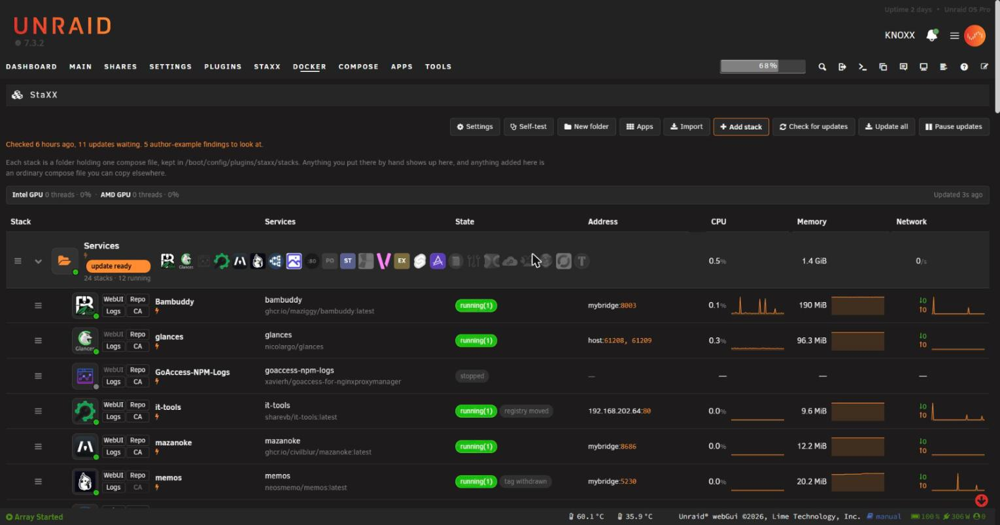

## What it does

- **Paste in a project's own compose file and it runs** — no retyping into a template, no
  conversion step.
- **Never read a line of it if you don't want to.** Twenty-odd groups of settings — ports, folders,
  variables, health checks, start-up order — as ordinary form fields, with the file beside them if
  you prefer. The author's own comments become the help text next to each box.
- **Change things without the fear.** There is an Undo button, every save is kept, and every image
  that has actually run is kept, so a bad decision is one click back.
- **Bring in what you already run.** One window lists your existing Unraid apps, Compose Manager
  projects and loose containers, and imports them as copies — the originals stay put, and one click
  puts them back.
- **Search 3,700 apps without leaving the page.** Community Applications, Docker Hub and the images
  already on your server; pick one and get a compose file to look over before anything starts.

## The 60-second start

Copy this address:

```
https://raw.githubusercontent.com/quadcom/Staxx/main/staxx.plg
```

In Unraid, go to **Plugins → Install Plugin**, paste it in, and press Install. That is the whole of
it. You get a plugin Unraid looks after like any other: it survives a reboot, it appears on your
Plugins page, and it will tell you when there is a newer version.

You do not need Community Applications for this, and StaXX is not in it — see
[Limitations](#limitations).

Open **Docker → Stacks**. The first thing it does is ask where it should keep its data — one folder
holding your stacks, the zips of any you remove, and its own settings. It suggests a sensible place
and explains the choice; take the suggestion if you are in a hurry.

After that, make a folder inside the `stacks` folder of the place you chose, drop a compose file in
it, and it is there. Or press **Apps** and pick something.

New to the page? The [user guide](docs/guide/README.md) explains what you are looking at.

To remove it again, use **Remove** on the Plugins page. Your settings and your stacks are left
alone; deleting the data store folder is a separate, deliberate act.

### Want the newest work, before it is a release?

Every push builds a bundle you can install by hand. It is how the author runs it day to day, and it
is ahead of the numbered releases — which also means it is less tested, and it does **not** survive
a reboot, so you will want to keep the folder around. Take the newest **main** build from
[Releases](https://github.com/quadcom/Staxx/releases) and run the script inside it:

```sh
cd /boot
tar -xzf ~/staxx-main.tar.gz          # wherever you put the download
bash /boot/staxx-main/dev-install.sh
```

`--remove` takes it off again and keeps your settings; `--purge` takes those too.

## Contents

- [The stacks page](#the-stacks-page) · [The editor](#the-editor) · [Secrets and passwords](#secrets-and-passwords) · [Settings that belong together](#settings-that-belong-together)
- [Adding an app](#adding-an-app) · [Importing what you already run](#importing-what-you-already-run) · [Updates](#updates) · [Running containers](#running-containers)
- [History and versions](#history-and-versions) · [Autostart](#autostart) · [Removing a stack](#removing-a-stack) · [Settings](#settings)
- [What it promises](#what-it-promises) · [Roadmap](#roadmap) · [Limitations](#limitations) · [Configuration](#configuration-optional) · [For contributors](#for-contributors)

---

## The stacks page

**Everything running on your server, on one page.** Drop a compose file into a folder and its row
appears; delete the folder and it goes. There is no database to fall out of step with.

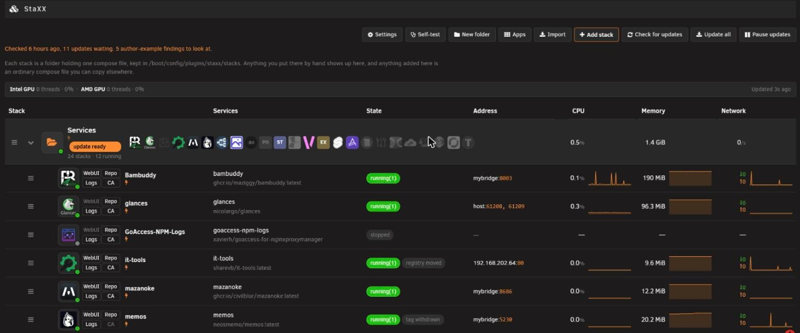

Every stack is a row, and each container inside it gets its own row.

- **Live figures** per container — processor, memory, network and graphics, each with a small graph.
- **State** per container, with uptime and what its health check says.
- **Four buttons** — web page, logs, project page, Unraid support thread.
- **Its address**, with Unraid's own address-and-port substitution.
- **Its logo**, kept — the picture is copied in beside the compose file and recorded there, so a
  stack keeps its look when the folder is copied to another machine, and a change to the icon
  collection cannot quietly alter how it appears.
- **Badges** for an update waiting, a withdrawn tag, an image that moved registry, a copy that has
  drifted from its source, a container built from an image the file no longer names.

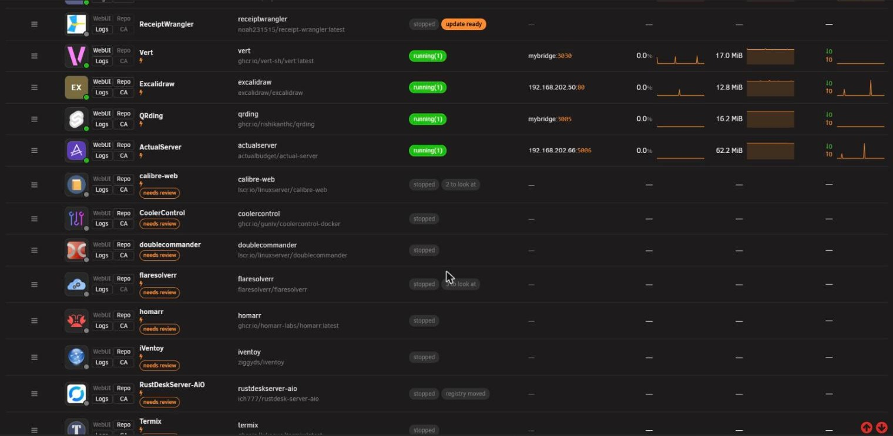

- **Folders** you create, one level deep. A folder row totals what is inside it, and can start, stop,
  check or update the lot.
- **Right-click a row** for everything it can do.

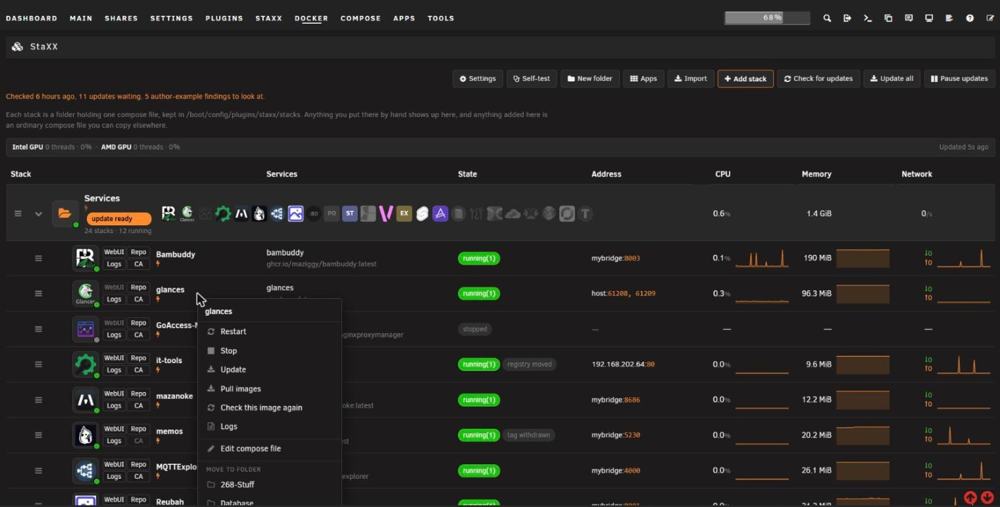

- **A container stopped elsewhere shows as stopped straight away** — the page follows Docker's own
  events rather than asking every few seconds.
- **Move a stack's folder and its containers still find it.**
- **Nothing runs all day for the sake of a graph.** The figures are sampled only while a page is
  watching; close the tab and it stops.

---

## The editor

**Three views of the same file** — the form, the file, or both side by side with the highlight
following you between them.

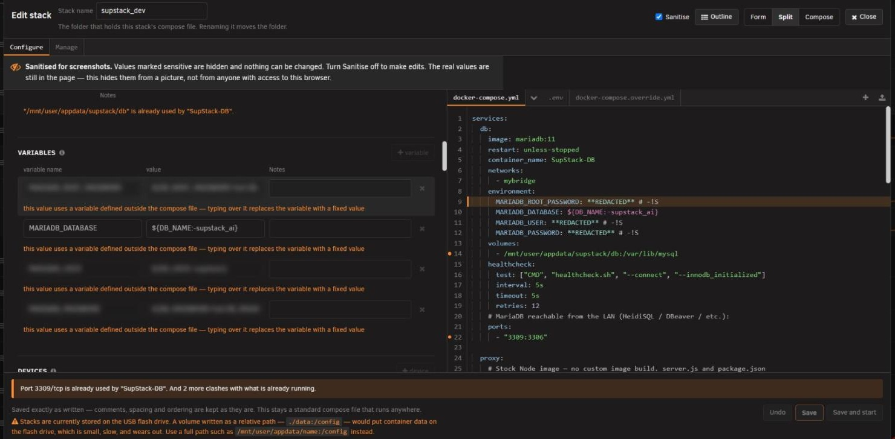

More than twenty groups of settings, from ports and folders to health checks, resource limits,
start-up order and logging, plus the file's own networks, volumes, secrets and configs. You pick
which groups are on screen, and anything the form cannot take apart appears in an **Advanced**
block — shown, never hidden.

**While you type**

- Key and value suggestions, and hover help on compose keys.
- Flags a value the field does not accept, a placeholder nothing will fill in, and a missing
  companion file.
- Checks the folders you name exist, and offers to create the ones that do not.
- Warns when a port is already taken.
- Runs the file past Docker itself.
- None of it blocks a save.

**The rest of the editor**

- **Undo covers the form and the file alike** — a change made in a box and the line it wrote go back
  as one step, not two.
- **Find and replace** in the file view, including replace-all.
- **The author's comments become the help text** beside each field, and help text you write becomes
  comments in the file. Two marks — **secret** and **required** — say how a value should be treated.
- **Pickers** for a folder on the server, a timezone off a world map, and a device from this
  server's hardware.
- **The network list includes the ones this server already has** — pick one and it is wired in for
  you.
- **Every file in the stack folder is a tab** — the compose file, `.env`, an override file, anything
  else. Create, rename, delete, download, or upload several at once.
- **Certificates and other binary files** get a download-and-replace panel, and a settings-shaped
  file is offered to be wired in.
- **A note offers to fill in a stack's own details** — description, logo, project page, support
  thread — naming which are missing. A button in Settings does every stack at once, and shows what
  it would change first.

---

## Secrets and passwords

**You should never have to invent a password, or paste one into a chat window to get it hashed.**

- **A password made up for you, in the box that needs it** — a passphrase or a random string, your
  choice of length and character mix. Nothing generated is written anywhere but the box it fills.
- **The hashed form, when a container wants that instead.** Four formats, each refused until a
  self-check has proved it works on this machine.
- **The hashing happens in StaXX's own tiny container** — built only when asked, with no volume, no
  port and no network, and the password handed to it privately rather than on a command line anyone
  listing processes could read.
- **Sanitise hides every value marked secret**, in the form and the file at once, so a stack can be
  shown to someone else without leaking it. The window locks while it is on, so nothing is changed
  by accident mid-screenshot.

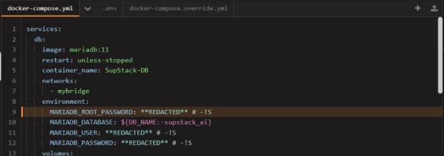

---

## Settings that belong together

**An app and its database have to agree on a password. Get one of them wrong and nothing works, and
nothing tells you why.**

- **StaXX notices when two containers share a value** — the same database password, the same folder
  — or when one names the other, and asks whether that is deliberate.
- **Say yes and the two stay in step.** Changing one side writes the other to match — both boxes and
  the file together, inside a single Undo.
- **The answer lives in the stack's own file**, so it travels with the stack.
- **It reaches across stacks.** Point a new app at a database living in another stack and StaXX
  offers to wire the two together rather than leaving you to copy the details across by hand.

---

## Adding an app

**The Apps button searches Community Applications, Docker Hub, and the images already on your
server** — about 3,700 apps between them.

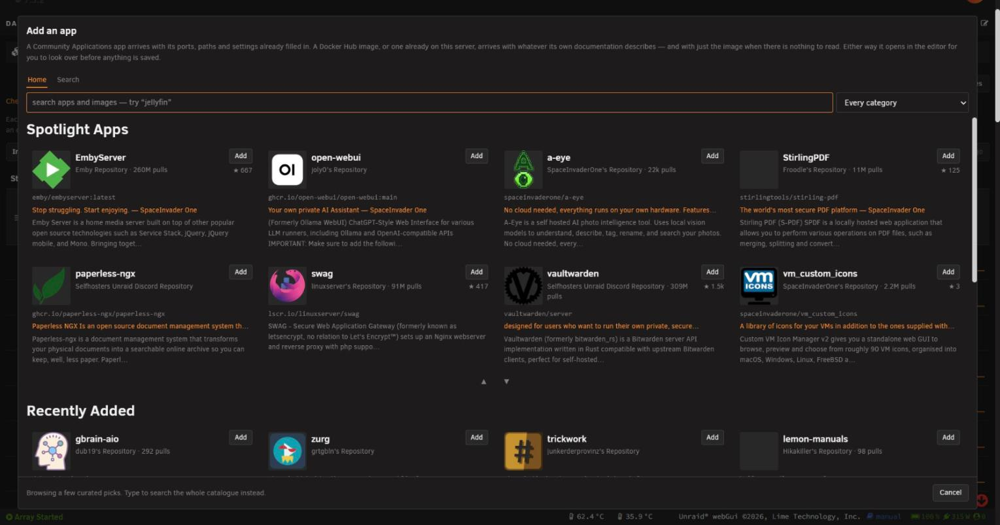

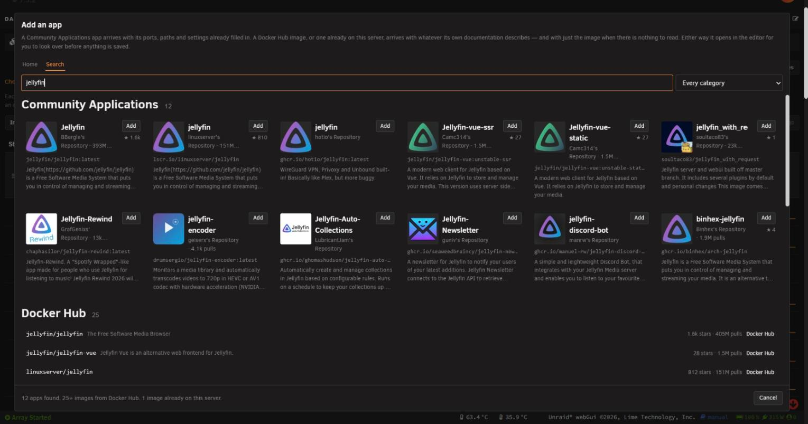

Pick one and it becomes an ordinary compose file, opened in the editor before anything is saved or
started.

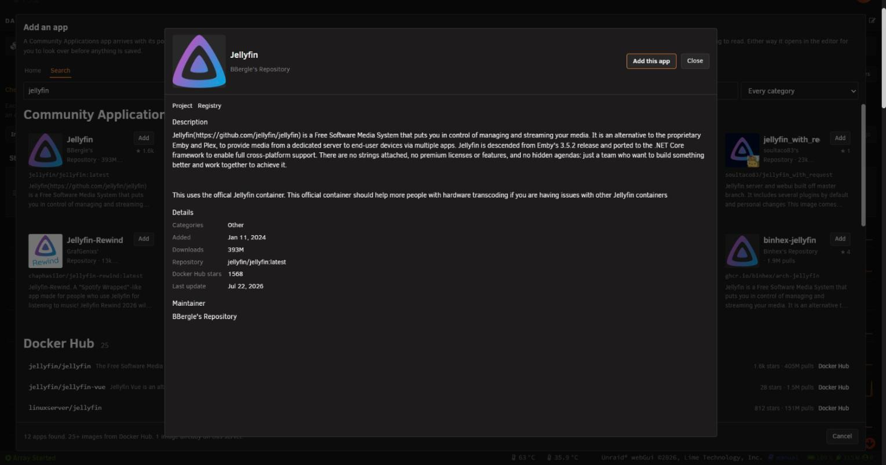

- Ports, folders, variables, devices, labels, extra arguments and the web address all convert, and
  each setting's description becomes the comment beside it. Anything StaXX could not convert or had
  to guess is named in a warning above the form.
- StaXX can also catch an app installed from Unraid's *own* Apps page and make it a stack — bring
  them in, ask first, or leave them to Unraid.

---

## Importing what you already run

**One window, everything you have.** StaXX sorts what is on the server into what it can bring in and
what it cannot: apps from an Unraid template, Compose Manager projects, containers with nothing
behind them, and things already imported.

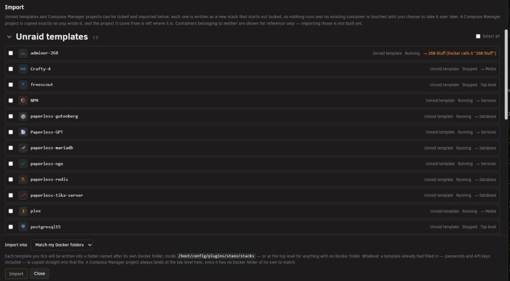

- **Every row says where it came from and where it will land** — one folder for everything, or
  **"Match my Docker folders"**, using the folders from FolderView.
- **Importing only copies.** Nothing at the source changes, and what arrives is locked until you
  have reviewed it.
- **Changed your mind?** One click puts the old app back, running.

---

## Updates

**Know what is waiting, and decide when it lands.**

- **Checking.** StaXX asks each image's registry whether a newer version of the same tag exists —
  nothing is downloaded. It tells an ordinary update from a locally built image whose base moved, a
  withdrawn tag, and an app that changed registry.
- **Watching the author.** Where an image points at a public project, StaXX compares your file with
  the example that project publishes and reports settings the author has added or dropped.
- **Applying.** Show it, wait for you to press Update, or install itself after a delay you set —
  with a countdown you can pause, a quiet time of day, a global pause, a queue, "skip this version",
  and release notes where the publisher provides them. Any stack or container can overrule the
  setting in its own file.
- **Rolling back.** Previous builds of each image are kept, so a bad update is one click undone.

Checks run daily or weekly at a time you pick, and Unraid's notifications report what was found.

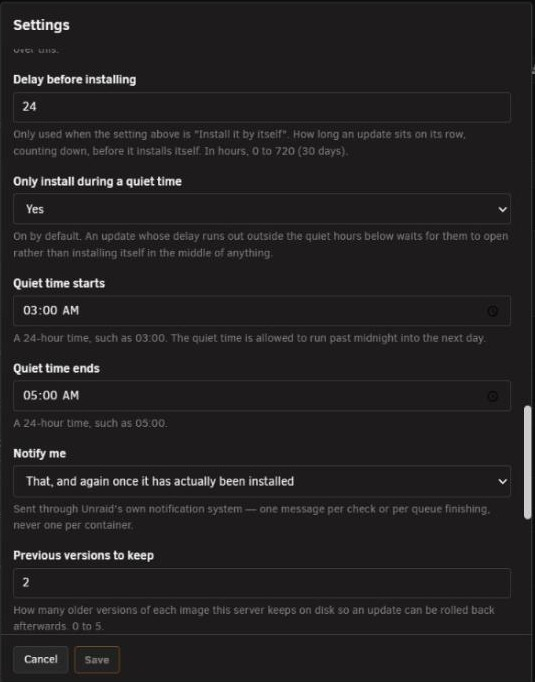

---

## Running containers

- **Start, stop, restart, update and remove** — a whole stack or one container. Long commands run
  detached, streaming their output as they go.
- **Restart applies your edits.** It rebuilds whatever no longer matches the file and restarts the
  rest.
- **A running stack whose file has moved on says so**, so you find out a restart is owed rather than
  wondering why an edit did nothing.

The **Manage** tab adds, per container:

- **A live log** you can search and download.
- **A root command line** inside the container — off until you turn it on.
- **A file browser** inside it that can read, edit, rename and delete.

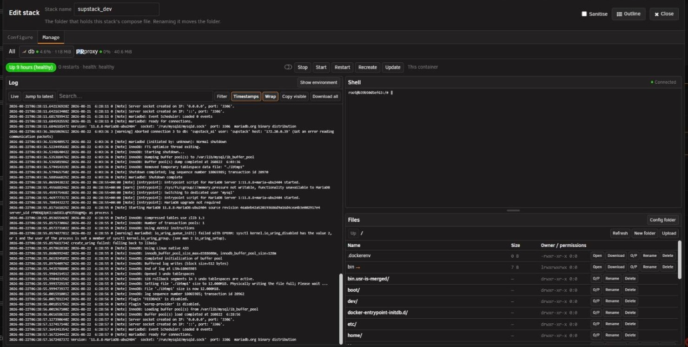

---

## History and versions

**Every save is kept, and so is every image that has actually run.** Two more tabs in the editor,
beside Configure and Manage.

**History** takes a whole copy of the compose file and its override before each save.

- **Open any of them read-only**, or put one back in a click.
- **Give one a name** and it stays for good. Twenty unnamed copies of each file are kept.

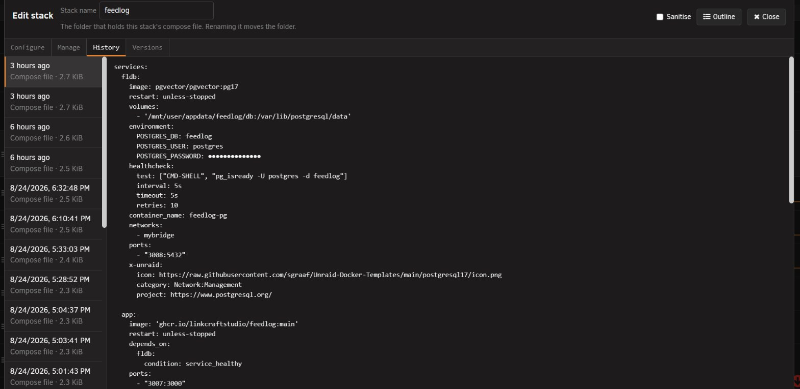

**Versions** lists, per container, the builds of its image that have actually run.

- **When each one ran, and where it came from**, with the publisher's release notes where there are
  any.
- **Put an earlier build back**, or **pin a container to a version** so updates leave it alone until
  you release it.

---

## Autostart

**Drag things into the order they should start in.**

- **Folders, stacks and containers all move**, and any entry can be followed by a pause in seconds.
- **A row warns you** when a stack's containers have ended up scattered through the list.
- **It is Unraid's own boot list**, written and read back, so a change made on Unraid's Docker page
  is picked up rather than overwritten.

---

## Removing a stack

**Nothing is deleted.**

- **The containers are removed**, then the whole folder is zipped into an archive folder outside the
  stacks tree.
- **The confirmation names where the zip will go**, and the settings panel lists everything that has
  been archived.

---

## Settings

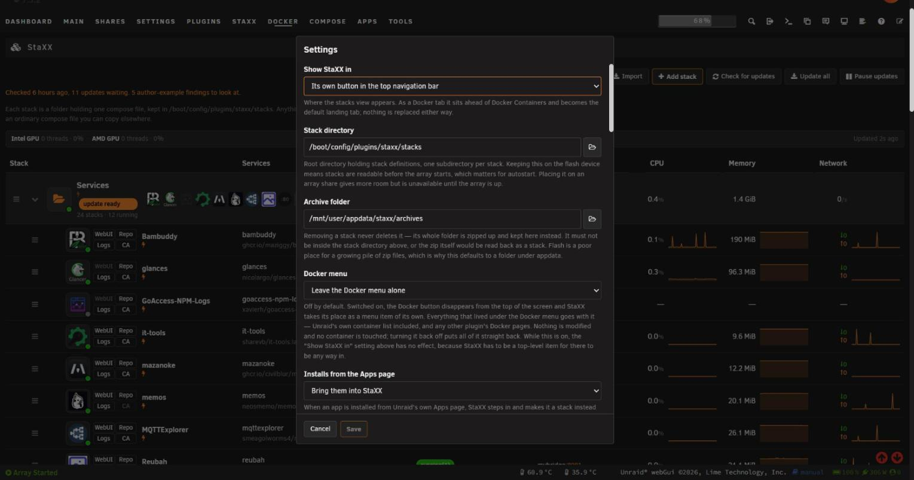

- **Where StaXX lives** — a tab under Docker, or its own button in the top navigation bar. It can
  also take the Docker menu over entirely; turning that off puts everything back.
- **Where stacks live**, and where removed ones are archived. StaXX offers once to move them off the
  flash drive, lists the pools it could use with their free space, and does the move for you.
- **What may leave the server** — one switch each for container logos, image documentation and the
  container command line.
- **Everything about updates.**

---

## What it promises

1. **Never require non-standard syntax.** A file StaXX writes runs unmodified anywhere Docker Compose
   does.
2. **Never lose what the author wrote.** Comments, shortcuts, values and intent survive an edit.
   A file that is genuinely wrong gets fixed, and you are told what changed.
3. **Degrade gracefully.** A file with no extras still produces a usable form.
4. **Own the render.** Layout and controls are drawn by StaXX, not injected into another page.

---

## Roadmap

Everything above works today. None of this does yet.

- Drawing a picture of how the containers in a stack connect. The warnings when an edit breaks that
  already work; the picture is what is missing.
- Showing what will change before a restart.
- Choosing which parts of a stack start.
- Explaining a file you did not write, in plain English.
- Marking a folder as real data, so destructive actions ask harder.
- Notices where a setting that matters has been left unset — a log with no size limit first,
  since that is the commonest way a self-hosted machine fills its disk.
- Clash warnings that can see the machine's own ports.
- Acting on several stacks at once.
- Exporting a stack as a shareable recipe, with the passwords blanked and your own paths and ports
  generalised — and importing one somebody else exported.
- Graphics figures for Nvidia cards.

---

## Limitations

- Pre-alpha. It is not in Community Applications, so you will not come across it there — you install
  it from its address. Once installed, Unraid does tell you when a newer version is out.
- Requires Unraid 7.2 or later, and Docker Compose already on the server — StaXX does not install it.
- Graphics figures cover Intel and AMD cards. Nvidia shows no figures, though a container given an
  Nvidia card is still labelled as such.
- Without a Docker Hub read-only token, update checks are limited to roughly ten images an hour
  rather than a hundred.
- A stack has to be started by hand once before it can start at boot.
- Getting an archived stack back means unzipping it yourself.

---

## Installing

See [The 60-second start](#the-60-second-start). Nothing installed that way survives a reboot —
Unraid rebuilds that part of the system at boot, so run the installer again. Your settings do
survive; they live on the flash drive. A published plugin does survive one, because the package is
kept on the flash drive and put back at every boot.

---

## Configuration (optional)

Everything here has a switch on the settings page, so this is reference only.

Your settings live in `staxx.cfg` inside the `config` folder of your data store — wherever you chose
to put it. Three lines stay on the flash drive, in `/boot/config/plugins/staxx/staxx.cfg`: where the
data store is, and the two settings deciding where StaXX appears in the menus. Those three have to be
readable before your array has started, or when StaXX itself is not working, which is also what makes
Unraid's own settings page for StaXX a reliable way back. See
[Where StaXX keeps its things](docs/guide/where-things-live.md).

**Where things live**

| Key | Default | What it does |
|---|---|---|
| `STORE_ROOT` | *(blank)* | The one folder StaXX keeps everything in. Your stacks sit in `stacks` inside it, and the zip of a removed stack in `archives`. Blank means you have not chosen yet, and StaXX asks before it puts anything anywhere. |

**Where StaXX appears**

| Key | Default | What it does |
|---|---|---|
| `HEADER_MENU` | `false` | `true` gives StaXX its own button in the top bar instead of a tab under Docker. |
| `TAKEOVER_DOCKER_TAB` | `false` | `true` replaces the Docker button entirely. No stock Unraid file is modified either way. |
| `CATCH_INSTALLS` | `true` | What happens when something is installed from Unraid's own Apps page: `true` brings it in as a stack, `prompt` asks first, `false` leaves it to Unraid. |

**What may leave the server**

| Key | Default | What it does |
|---|---|---|
| `ICON_FETCH` | `true` | Fetch container logos. Only the icon's name is sent. |
| `ICON_ADOPT` | `true` | Record a matched logo in the compose file so it travels with it. |
| `IMAGE_LOOKUP` | `true` | Read an image's documentation when adding it, for a fuller starting file. |
| `WATCH_EXAMPLES` | `true` | Compare your file with the publisher's own example during an update check. |
| `SHELL_ENABLED` | `true` | The root command line inside a container. `false` removes it everywhere. |

**Updates**

| Key | Default | What it does |
|---|---|---|
| `UPDATE_CHECK` / `UPDATE_CHECK_TIME` | `daily` / `04:00` | How often to look, and when. `off` never looks. |
| `UPDATE_MODE` / `UPDATE_DELAY_HOURS` | `notify` / `24` | `off` shows only, `notify` says so, `auto` installs after the delay. Any stack can overrule this in its own file. |
| `UPDATE_WINDOW` + `_START` / `_END` | `true`, `03:00`–`05:00` | Only install automatically inside a quiet window. |
| `UPDATE_NOTIFY` | `off` | Unraid notifications: `found`, or `applied` as well. |
| `UPDATE_RETAIN` | `2` | How many previous builds of each image to keep for a rollback. |
| `UPDATE_CLEANUP` | `off` | `weekly` removes images nothing uses and no history needs. |
| `HUB_USER` / `HUB_TOKEN` | *(blank)* | A Docker Hub read-only token. Without one, checks are limited to roughly ten images an hour. |

`CRYPT_MODE` decides whether the password-hashing helper stays running (`always`) or starts only
when needed (`ondemand`). The `PWGEN_*` keys are the password generator's own remembered choices,
set from its panel rather than here. Comments in this file must start with a semicolon.

---

## For contributors

- **One endpoint, POST only.** Every action is named in one list.
- **No client-side libraries.** Plain browser JavaScript, and every style class prefixed.
- **Nothing may hang.** Every external command is time-limited.

```
CHANGELOG.md                What changed, and the current version
docs/README.md              Plain-English overview
docs/glossary.md            Every term used in this project, defined
docs/feasibility.md         Whether this is possible, and the evidence
docs/x-unraid-schema.md     Format of the extras that make the form friendly
schema/                     Machine-readable definition of that format
examples/                   Worked compose files carrying that metadata
src/staxx/                  Mirrors the install paths on the server
completed-plans/            Every piece of work that has landed
```

---

## Direction

Ship as a community plugin first. Once that is proven, propose it to
[unraid/webgui](https://github.com/unraid/webgui) as the built-in Docker experience (Bold move, I know!). 

## Licence

GPL-2.0, matching `unraid/webgui`.

## Prior art

Studied while scoping this. None of their code is used here.

- [Compose Manager Plus](https://github.com/mstrhakr/compose_plugin) — compose engine, header-menu
  toggle
- [FolderView3](https://github.com/chodeus/folder.view3) — collapsible grouping
- [unraid-plugin-composerize](https://github.com/llalon/unraid-plugin-composerize) — template →
  compose conversion
