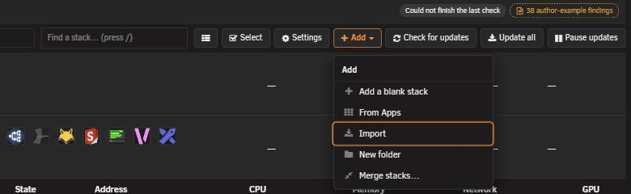
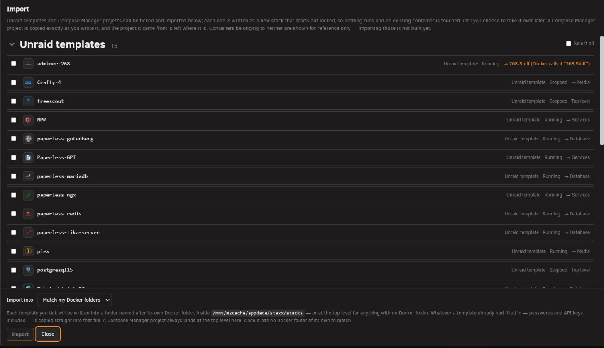
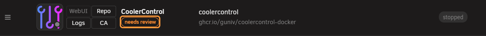
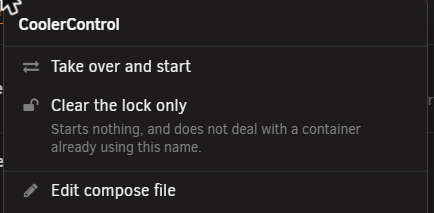
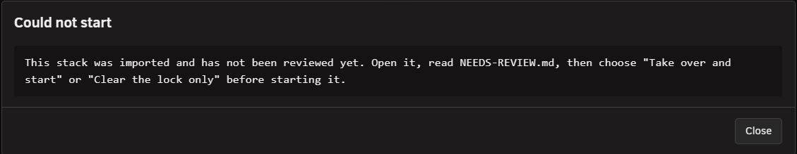

# Import an existing container

<!-- index: 65 | a walkthrough of Import, from pressing the button to opening the new stack and taking it over. -->

Import takes a container already running on your server and writes it out as an ordinary StaXX
stack. Nothing switches off, starts, or changes while it runs.

## Walkthrough

1. **Press Import**, in the row of buttons at the top right, between **Apps** and **Add stack**.

   

2. **Read the list.** A window opens with everything on the server sorted into groups.

   

   | Group | What is in it | Can it be ticked? |
   |---|---|---|
   | Unraid templates | Apps installed the Unraid way | Yes |
   | Compose Manager projects | Projects belonging to the Compose Manager plugin | Yes |
   | Containers with nothing behind them | Started by hand, belonging to neither | No — reference only |
   | Already imported | Name already taken by a stack in StaXX | No |
   | Left over from a removed container | No container behind them any more | No |

   The first three groups start open. The last two start collapsed — they are background
   information, not something to act on. Each row shows an icon, the name, where it came from, and
   what its container is doing: **Running**, **Stopped**, or **No container**.

3. **Tick what you want.** Only Unraid templates and Compose Manager projects can be ticked.

4. **Expand a template row** to check it first, if you want to. It shows the compose file StaXX
   would write, and two lists underneath: *"Could not be translated automatically:"* and *"Filled in
   for you — check these before starting:"*. This is a preview, not a certificate — it does not say
   the result is correct, only what StaXX could and could not work out.

5. **Choose where they land**, with the **Import into** picker at the bottom.

   | Choice | What it does |
   |---|---|
   | Match my Docker folders | Each template goes into a StaXX folder named after its Docker folder, or the top level if it has none. |
   | (top level) | Everything lands at the top level. |
   | Any existing StaXX folder | Everything lands in that folder. |

   A Compose Manager project always lands at the top level while matching is on — it has no Docker
   folder to match. Its own folder name is fixed to the project name, because Docker has to keep
   seeing it.

6. **Press Import.** Each ticked row becomes a new stack, marked **needs review**. Nothing starts.

7. **Open the new stack** — click its picture — and read what StaXX wrote before doing anything
   else with it.

   

8. **Right-click the row** to open its menu. Two items appear because it is locked.

   | Menu item | What it does |
   |---|---|
   | Take over and start | Switches the old container off, sets it aside under another name, starts this stack in its place, then asks whether it worked. |
   | Clear the lock only | Removes the lock and nothing else. Use this only when nothing else holds the container's name. |

   

   **Take over and start** is the normal choice — it deals with the running container for you.
   **Clear the lock only** leaves that container exactly as it is, so the new stack can then fail to
   start if the name is still taken. Do not delete `NEEDS-REVIEW.md` by hand instead — that lifts the
   lock without doing either of these, and the stack then fails against whatever still holds its name.

See [the row and its menu](the-stack-list.md) and [the stack editor](the-stack-editor.md) for what
you are looking at once it is open.

## The import lock

Each import becomes a stack folder holding a normal compose file — one that would run anywhere,
with no dependence on StaXX. A Compose Manager project is copied exactly as written, byte for byte.

Alongside it, StaXX writes `NEEDS-REVIEW.md` first, before the compose file exists. While it is
there, every Start, Stop and Restart on that stack is refused:

> This stack was imported and has not been reviewed yet. Open it, read NEEDS-REVIEW.md, then
> choose "Take over and start" or "Clear the lock only" before starting it.

The file itself says where the stack came from, whether a container of that name already exists,
what could not be brought across, and what StaXX filled in for you. See [what every mark
means](marks.md) for the **needs review** tag itself.

## Passwords carried over

Whatever a template already had filled in — passwords and API keys included — is copied straight
into the new file. A copy that dropped them would not run. This means the new file holds your
secrets in plain text, so treat it the way you treat the original.

## A dollar sign is written twice

An Unraid template passes a dollar sign through exactly as typed. A compose file does not — it
reads a dollar sign as the start of a variable name, and drops it. So StaXX writes each one twice on
the way in, and tells you where:

> **1 value changed.** Unraid passes a dollar sign through as typed; a compose file does not, so it
> has been written twice — the container still receives it exactly as before. Find it in that
> stack's own history if you want it back as it arrived.

Expanding a template's row before importing it shows the same thing in advance:

The app receives exactly what it received before. The first version in the stack's history is the
file exactly as the template had it, single dollar signs and all — the second, corrected version is
the one that runs. See [why a dollar sign is written twice](passwords-and-hashes.md).

This only happens to values from an Unraid template. A Compose Manager project is already a compose
file, so its dollar signs already mean what you meant, and nothing touches them.

## What is left untouched

- **Nothing is started, stopped, or deleted.** A running container stays running, including the
  one the new stack describes.
- **The Unraid template stays exactly where it is.** Not moved, edited, or removed.
- **A Compose Manager project stays in Compose Manager**, still listed and still working from
  there. Its file is copied, never taken.
- **Nothing overwrites an existing stack.** An import refuses outright if something already exists
  where it would write.

## Refusals you may run into

| What it says | Why |
|---|---|
| A stack called "…" already exists. Pick a different name, or delete the existing stack first. | The name is taken. Nothing is ever written over an existing stack. |
| No compose file could be found for this project. | StaXX could not find the file the project actually runs from. |
| This project's compose file holds no services — importing it would create an empty stack. | The file describes no containers. |
| Docker is currently running this project as "…", not "…" — importing it under this name would not line up with those containers. | Docker knows the running containers by a different project name, so the new stack will not control them. It can still be imported. |
| This project has an override file, which will be copied and used. | A second file adds to the first. StaXX renames it if it must, so Docker pairs the two. |
| This project's folder also holds: … — these will not be copied across. | Only the compose file, its settings file, and its override come over. |
| Another ticked row already writes to the same place. | Two ticked rows would land in the same folder under the same name. Untick one, or send them to different folders. |

If a Docker folder's membership is decided by a pattern rather than a plain list, StaXX cannot match
it and puts anything from it at the top level instead, rather than guess.

## Not built yet

- **Containers started by hand cannot be imported.** They are listed under **Containers with
  nothing behind them** and greyed out, so you can see they exist even though StaXX cannot write a
  stack for them yet. Build the stack yourself with **Add stack** instead, copying the settings by
  hand, then use **Take over and start** on it — that item is offered on any stack whose container
  name something outside StaXX is holding, not only on an imported one.
- **Several containers cannot be brought in as one combined stack.** Each ticked row becomes its
  own separate stack.

## Terms used here

Any word you are not sure of is in the [glossary](../glossary.md).

Back to [the StaXX guide](README.md).
