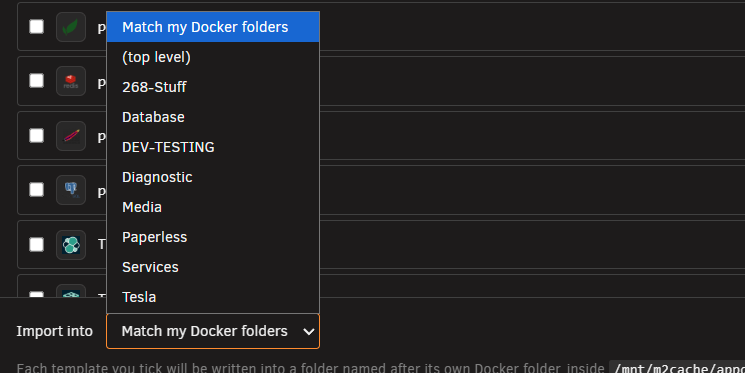

# Import an existing container

<!-- index: 65 | a walkthrough of Import, from pressing the button to opening the new stack and taking it over. -->

Import takes a container already running on your server and writes it out as an ordinary StaXX
stack. Nothing switches off, starts or changes while it runs.

## The short version

1. Press **Import** and read the list.
2. Tick the templates and projects you want, then choose where they land.
3. Press **Import**. Open each new stack and read what StaXX wrote.
4. Right-click the row and choose **Take over and start**.

## Open Import

Press **Import**, in the row of buttons at the top right, between **Apps** and **Add stack**.

## The list

A window opens with everything on the server sorted into groups:

| Group | What is in it | Can it be ticked? |
|---|---|---|
| Unraid templates | Apps installed the Unraid way | Yes |
| Compose Manager projects | Projects belonging to the Compose Manager plugin | Yes |
| Containers with nothing behind them | Started by hand, belonging to neither. A copy set aside by a takeover is not listed. | No, reference only |
| Already imported | Already a stack in StaXX, wherever it now lives | No |
| Left over from a removed container | No container behind them any more | No |

The first three groups start open; the last two start collapsed. A row lands in **Already
imported** when a stack of that name exists anywhere in StaXX, even inside a folder; when its
container is already running as one of your stacks under another name; or when a stack records
that it came from this very template. Its note says where: *Already in StaXX as
"Services/ReceiptWrangler".*

Stacks imported before StaXX recorded their source are matched up the first time you open this
window afterwards: where exactly one template fits, a note of which one is written into the
stack's file, the previous version is kept in its history, and a message lists every stack that was
touched. Each row shows an icon, the name, where it came from, and what its container is doing:
**Running**, **Stopped**, or **No container**.

## Tick and choose

1. Tick what you want. Only Unraid templates and Compose Manager projects can be ticked.
2. Expand a template row to check it first, if you want to. It shows the compose file StaXX would
   write, and two lists underneath: *"Could not be translated automatically:"* and *"Filled in for
   you — check these before starting:"*. This is a preview: it does not say the result is correct,
   only what StaXX could and could not work out.
3. Choose where they land, with the **Import into** picker at the bottom.

| Choice | What it does |
|---|---|
| Match my Docker folders | Each template goes into a StaXX folder named after its Docker folder, or the top level if it has none. |
| (top level) | Everything lands at the top level. |
| Any existing StaXX folder | Everything lands in that folder. |

A Compose Manager project always lands at the top level while **Match my Docker folders** is
chosen. Its own folder name is fixed to the project name.

If a Docker folder's membership is decided by a pattern rather than a plain list, StaXX puts
anything from it at the top level instead.

## Import and open

Press **Import**. Each ticked row becomes a new stack, marked **needs review**. Nothing starts.

Open the new stack and read what StaXX wrote before doing anything else with it. See [the row and
its menu](the-stack-list.md) and [the stack editor](the-stack-editor.md) for what you are looking
at once it is open.

## Take it over

Right-click the row to open its menu. Two items appear because it is locked.

| Menu item | What it does |
|---|---|
| Take over and start | Switches the old container off, sets it aside under another name, starts this stack in its place, then asks whether it worked. |
| Clear the lock only | Removes the lock and nothing else. Use it only when nothing else already holds the container's name. |

**Take over and start** is the normal choice. Clear the lock through this menu, not by deleting
`NEEDS-REVIEW.md` by hand.

The stack now runs in place of the container it replaced.

## The import lock

Each import becomes a stack folder holding a normal compose file that would run anywhere, with no
dependence on StaXX. A Compose Manager project is copied exactly as written, byte for byte.

Alongside it, StaXX writes `NEEDS-REVIEW.md` before the compose file exists. While it is there,
every Start, Stop and Restart on that stack shows this:

> This stack was imported and has not been reviewed yet. Open it, read NEEDS-REVIEW.md, then
> choose "Take over and start" or "Clear the lock only" before starting it.

The file itself says where the stack came from, whether a container of that name already exists,
what could not be brought across, and what StaXX filled in for you. See [what every mark
means](marks.md) for the **needs review** tag itself.

## Passwords carried over

Whatever a template already had filled in, passwords and API keys included, is copied straight
into the new file. Treat the new file the way you treat the original: it holds your secrets in
plain text.

## A dollar sign is written twice

StaXX writes each dollar sign in a template's values twice, and tells you where:

> **1 value changed.** Unraid passes a dollar sign through as typed; a compose file does not, so it
> has been written twice — the container still receives it exactly as before. Find it in that
> stack's own history if you want it back as it arrived.

Expanding a template's row before importing it shows the same thing in advance:

The app receives exactly what it received before. The first version in the stack's history is the
file exactly as the template had it, single dollar signs and all; the second, corrected version is
the one that runs. See [why a dollar sign is written twice](passwords-and-hashes.md).

This only happens to values from an Unraid template. Nothing touches a Compose Manager project's
file.

## Refusals you may run into

| What it says | What it means |
|---|---|
| A stack called "…" already exists. Pick a different name, or delete the existing stack first. | Choose a name that is not already in use, or delete the existing stack first. |
| No compose file could be found for this project. | StaXX could not find the file the project actually runs from. |
| This project's compose file holds no services — importing it would create an empty stack. | The file describes no containers. |
| Docker is currently running this project as "…", not "…" — importing it under this name would not line up with those containers. | Docker knows the running containers by a different project name. You can still import it. |
| This project has an override file, which will be copied and used. | A second file adds to the first. StaXX renames it if it must. |
| This project's folder also holds: … — these will not be copied across. | Only the compose file, its settings file, and its override come over. |
| Another ticked row already writes to the same place. | Untick one, or send them to different folders. |

## Terms used here

Any word you are not sure of is in the [glossary](../glossary.md).

Back to [the StaXX guide](README.md).
