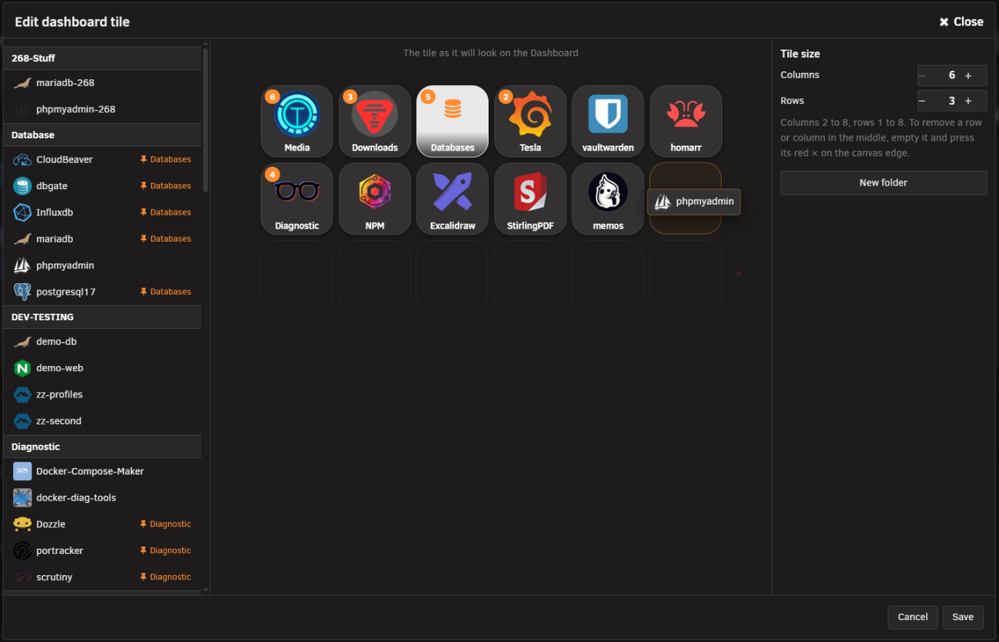
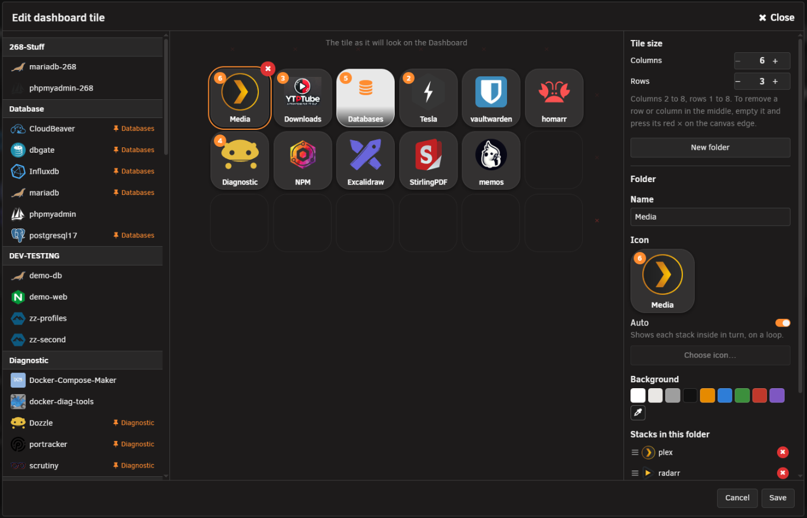
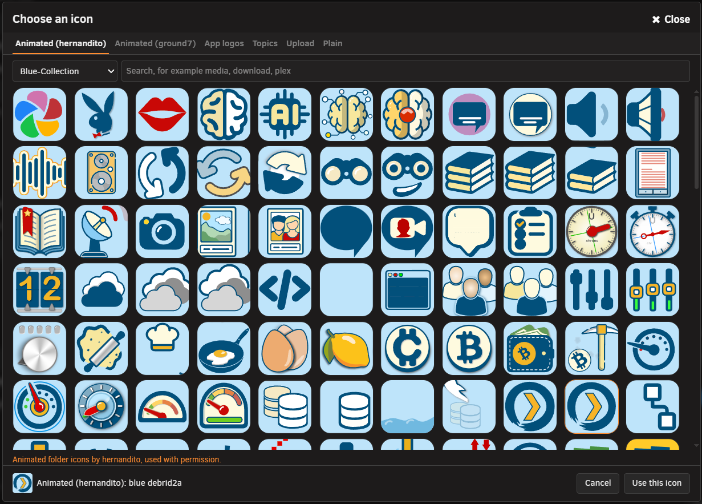
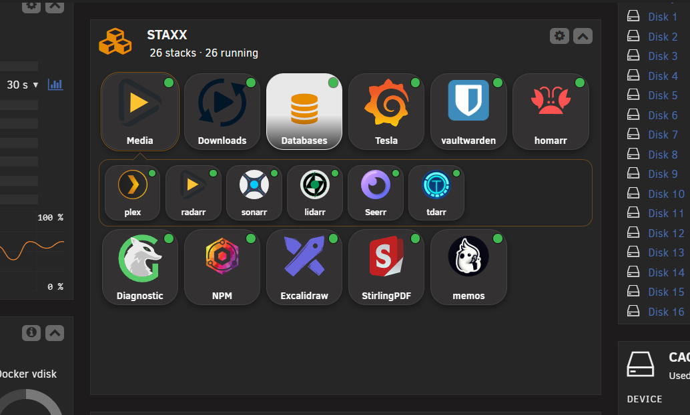
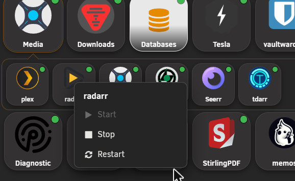

# Dashboard tile

<!-- index: 52 | putting a StaXX tile on Unraid's Dashboard: arranging folders and stacks on it, choosing folder icons, and using it. -->

The StaXX tile sits on Unraid's Dashboard among the other tiles. It shows a grid of rounded squares, like app icons on a phone. Each square is a folder or a single stack, and you decide which. Only what you place on the tile shows on it.

To reach the editor, open **Settings**, then **General**, and press **Edit dashboard tile…** in the **Dashboard tile** box. On the Dashboard, the gear in the tile's header opens the same editor.

The folders here belong to the tile alone. For folders on the Stacks page, see [Folders](folders.md).

## The short version

1. Open the editor and choose how many columns and rows the tile has.
2. Press **New folder**, or drag a stack from the list onto an empty square.
3. Drag stacks onto a folder, then choose its name, icon and background.
4. Press **Save**.

## Arranging the tile

The window has three parts. The list on the left holds every stack, grouped by its folder on the Stacks page. The canvas in the middle shows the tile as it will look on the Dashboard. The column on the right holds the tile's size, **New folder** and the settings of whatever you have selected.

**Save** writes your changes to the tile. **Cancel** and **Close** throw them away.

### Size

Under **Tile size**, use the − and + buttons for **Columns** and **Rows**.

| Setting | Range |
|---|---|
| **Columns** | 2 to 8 |
| **Rows** | 1 to 8 |

A row or column can only be removed while nothing sits in the last one. To remove one in the middle, move everything out of it, then press the red × on the canvas edge beside it.

### Adding folders

Press **New folder**. It appears in the first free square, named **New folder 1**, **New folder 2** and so on, and it is selected so you can name it straight away. When every square is full, **New folder** adds a row.

### Adding stacks

Drag a stack from the list onto the canvas.

| Drop it on | Result |
|---|---|
| An empty square | The stack sits on the tile by itself. |
| A folder | The stack goes inside the folder. |

A stack that is already on the tile shows a thumbtack in the list, with the name of its folder, or **On the tile** when it sits by itself. A stack is only ever in one place, so dragging it again moves it.

### Moving squares

Drag a square to another square to move it. Drop it on an occupied square and the two swap places. Drop a single stack onto a folder and it goes inside.

### Removing squares

Rest your mouse on a square, or select it, and a red circle with a white × appears on its top right corner. Press it to take the square off the tile. Removing a folder takes the stacks inside off the tile with it.

## A folder's settings

Select a folder to see its settings in the right column.

| Setting | What it does |
|---|---|
| **Name** | Sets the folder's name. The square shows it as you type. |
| **Icon** | Shows the folder as it will look on the tile. |
| **Auto** | On, the folder shows the icon of each stack inside it in turn. Off, it shows the icon you choose. |
| **Choose icon…** | Opens the icon picker. It is available while **Auto** is off. |
| **Background** | Sets the folder's colour. Pick one of the nine colours, or use the eyedropper to pick any other. |
| **Remove colour** | Puts the square back to its usual grey. It shows while a colour is set. |

**Stacks in this folder** lists the stacks inside, in the order they show when the folder is opened on the Dashboard. Drag a stack by its grip to reorder it. Press the red × on a stack to take it out of the folder and off the tile.

A folder with no stacks in it shows **Drag stacks onto this folder from the list on the left.**

## The icon picker

Press **Choose icon…** to open the picker. Choose a tab, find an icon, then press **Use this icon**.

| Tab | What it offers |
|---|---|
| **Animated (hernandito)** | Animated folder icons in several colour collections. Pick a collection from the menu. |
| **Animated (ground7)** | Animated icons that play on their own. |
| **App logos** | Logos of popular apps. Search also finds an app by its other names. |
| **Topics** | Simple line drawings of subjects such as media, downloads and security. Search also finds an icon by its tags. |
| **Upload** | Your own picture. Drop it in the box or choose a file. SVG, PNG or WebP work, and a square picture suits best. |
| **Plain** | A set of plain orange symbols such as a folder, a server and a film. |

On every tab except **Upload** and **Plain**, type in the search box to narrow the icons, for example **media**, **download** or **plex**. A picture from **Animated**, **App logos**, **Topics** or **Upload** fills the whole square.

The picker shows each set's credit under the grid:

| Tab | Credit line |
|---|---|
| **Animated (hernandito)** | Animated folder icons by hernandito, used with permission. |
| **Animated (ground7)** | Animated icons by ground7 (Josiah Hutchinson), MIT licence. |
| **App logos** | App logos from Dashboard Icons by homarr-labs, Apache-2.0. Logos are their owners' trademarks. |
| **Topics** | Topic icons from Tabler Icons by Pawel Kuna, MIT licence. |

Each credit links to the set's home page.

Topics icons are thin black lines. Give a folder that uses one a light background colour.

## Using the tile on the Dashboard

The tile's header reads **StaXX**, with a line under it counting the stacks you placed and how many are running. A small dot on each square shows its state. Green means everything in it is running, amber means part of it is, and red means something has failed. A square with no dot is stopped.

### Opening a folder

Click a folder to open it. Its stacks appear in a panel under the folder's row, in the order you set. Click the folder again to close it. Only one folder is open at a time.

### Start, Stop and Restart

Right-click a stack to open its menu.

| Item | What it does |
|---|---|
| **Start** | Starts the stack. It is unavailable while the whole stack is running. |
| **Stop** | Stops the stack. It is unavailable while nothing in it is running. |
| **Restart** | Restarts the stack. |

Right-click a folder to open a menu headed by its name. **Start all**, **Stop all** and **Restart all** act on every stack inside it.

### Statistics window

Click a stack to open its statistics window. It shows the stack's state, its address and its services. **Start**, **Stop** and **Recreate** control the stack. Four cards show CPU, Memory, Network and, when the stack has a GPU, GPU, each with a graph of the last two minutes.

Press the × at the top right to close it.

| Link at the foot | Where it goes |
|---|---|
| **Open web page** | Opens the stack's own web page. It shows when the stack has one. |
| **Logs** | Opens the stack's live log on the StaXX page. |
| **Open in StaXX** | Takes you to the stack's row on the StaXX page. |

## Terms used here

Any word you are not sure of is in the [glossary](../glossary.md).

Back to [the StaXX guide](README.md).
