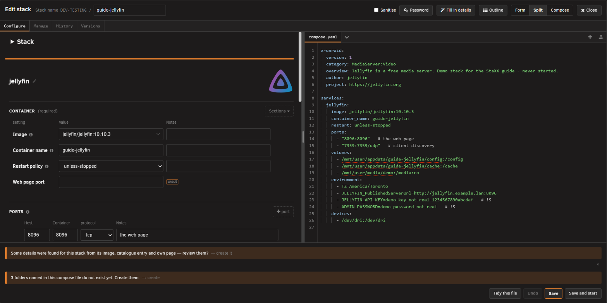
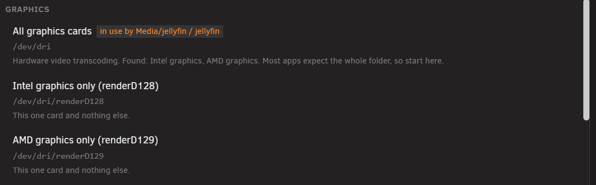
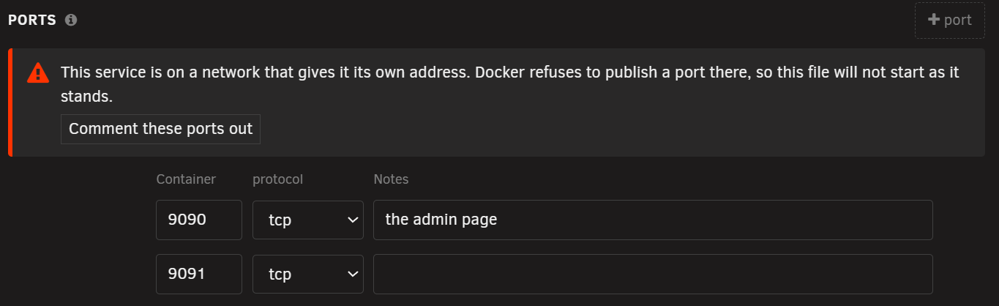
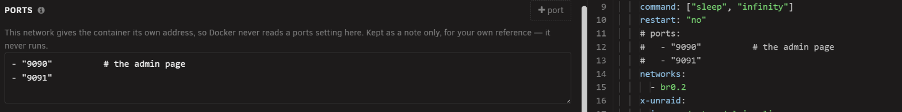
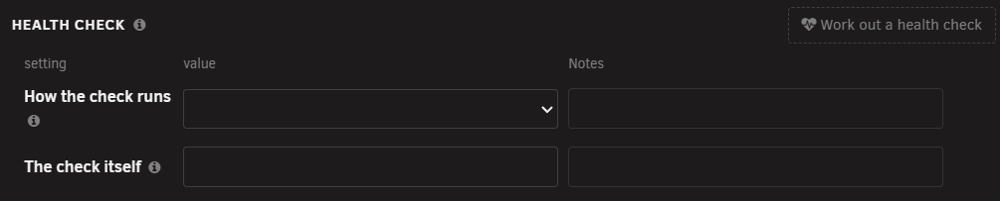
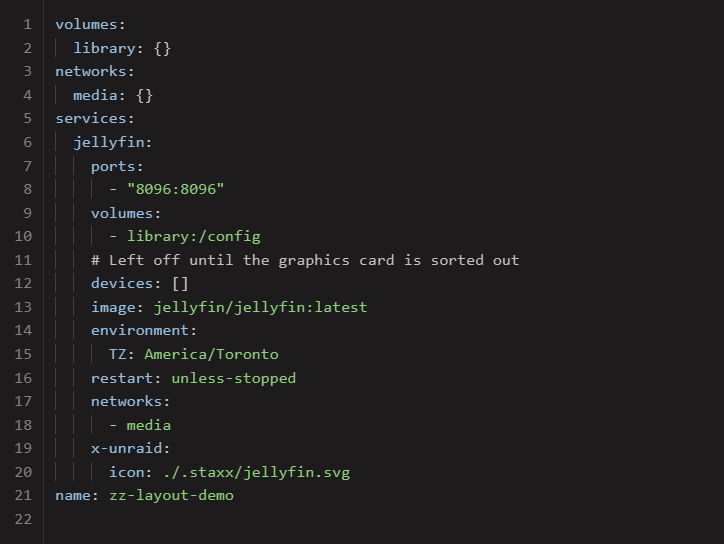

# Editing a stack

<!-- index: 40 | the form you get when you open a stack: the three ways to look at the same file, what the sections do, ports on a container with its own address, the note under each box, the two marks, and what saving does and does not change. -->

This is the screen you get when you open a stack: the file it runs from, drawn as a form so you can
change a setting without touching a line of it. Open it by clicking the stack in the list. It always
opens on the **Configure** tab, whatever tab you were last looking at — the other tabs (**Manage**,
for a live console into a running container; **History** and **Versions**, for what has changed
over time) sit alongside it, but this page is about Configure alone.

## The short version

1. Click the stack to open it. You land on Configure, looking at the form.
2. Change a box, tick a section on or off, or type a sentence under a box to leave a note about it.
3. A box outlined in red and named at the bottom of the screen is empty and must be filled in before
   you can save.
4. Press **Save**. The file is rewritten with only what you changed; everything else survives
   untouched.

## The three ways to look at the same file

A strip of three buttons switches how much of the file you see. All three are looking at the same
file at the same time — switching does not convert anything, and an edit made in one shows up in the
others the moment you switch.

| Button | Shows |
|---|---|
| **Form** | Only the form — boxes, ticks and notes, no raw text at all. What a phone or a narrow window falls back to, because two panes side by side would be too cramped to read. |
| **Split** | The form on one side, the actual file on the other, scrolling together. The usual view on a normal-sized window. |
| **Compose** | The file on its own, full width, for typing directly into it. |

An **Outline** button above the panes jumps straight to a block or a service in a long file, rather
than scrolling to find it.

## Sections and the fields inside them

The form is organised into groups — Ports, Volumes, Variables, Devices, Labels, and further ones
such as Health check, Resource limits, Networks, Secrets, Configs, DNS servers and more — each
holding the boxes for one part of the file. A group only appears once there is a reason to show
it: either the file already has something in it, or you have switched it on yourself.

Where a group has a handful of answers most people want, it offers them by name rather than leaving
you to type a path from memory.

**Switching a group off does not delete what was in it.** It sets it aside, kept exactly as
written — comments and all — so switching it back on later restores it precisely as it was. One
group, named **Container**, always shows: the image, and the handful of settings every container
has, which is why it is the one group with no switch to turn it off.

Anything the form cannot safely show as a box — a value spread over several lines, built from a
shared block, or written in a shape the form will not touch — is shown as read-only text with a
plain sentence saying why, rather than hidden or guessed at. Fixing it means switching to the
Compose view and editing the line yourself.

## Ports on a container with its own address

A service can be put on a macvlan or ipvlan network — the kind where the container gets an address of
its own on your LAN rather than sitting behind the server's. **Docker refuses to publish a port for
such a container**, and a compose file that asks it to will not start at all. There is nothing to
publish: the container is already reachable on its own address.

So if a service is on one of those networks and its file still lists ports, StaXX says so and offers
to put it right in one press:

**Pressing it keeps every port, as a note.** The `ports:` block is commented out rather than deleted,
so the file starts and nothing you wrote is lost — including the notes beside each port. Undo is at
the bottom of the editor if it was not what you wanted:

From then on, that group is a plain box you can type in — somewhere to record which ports the app
inside uses, for your own reference. "+ port" adds a line to it. Nothing in that box ever runs.

Two more things it does, both offered rather than done to you. **Moving a service onto one of those
networks** asks first, and keeps its ports as a note in the same step — decline and the switch does
not happen, because half of it would leave a file that cannot start. **Moving it back off** offers to
bring the ports back live, exactly as they were written.

## Working out a health check

The Health check group has its own **Work out a health check** button. Press it and StaXX tries to
work out a sensible check for that container — trying it out inside the running container first —
then shows you what it found and what that check actually proves before asking whether to add it.
Nothing is written until you say yes, and it will never touch a service that already has a check of
its own. See [what every mark means](marks.md#letting-staxx-work-out-a-health-check) for what a
health check is and how StaXX decides on one.

## The note under a box

Most boxes carry a smaller box underneath labelled **Notes**. That is not a caption the form
invented — it is the actual comment sitting on that line in the file, the same kind of note you
might scribble there yourself in a text editor. Type a sentence into it and that sentence is written
back as the comment on that exact line, nowhere else. Leave it blank and no comment is written at
all.

## The two marks

Two small facts about a box cannot be worked out just by looking at the value, so — and only these
two — are recorded, as two short marks at the end of that same comment:

| Mark | Means |
|---|---|
| Secret | The value is hidden whenever you turn on Sanitise (the button that blurs sensitive values so a screenshot is safe to share) — the rest of the time it shows in plain text like everything else. |
| Required | The box cannot be left empty. Clearing it outlines the row in red and names it at the bottom of the screen, and Save stays switched off until it is filled back in. |

Neither mark is ever guessed from a box's name. A password-shaped name is not treated as secret
unless the file actually says so, because a guess about a secret is exactly the kind of mistake
that shows up in someone else's screenshot rather than on your own screen first.

## Saving

Save writes the file back with only the lines your changes actually touched — nothing is
reformatted, and nothing you did not change moves. The dialog stays open afterwards, so a run of
small edits is one visit rather than a reopen after every single one; the Save button itself reads
"Saved" for a moment as the only sign anything happened.

**Saving is not the same as restarting.** A container already running keeps running on its old
settings until you restart it — saving only changes what the file says should happen next. If the
two have drifted apart, the row shows a "Restart to apply" mark once you close the editor; see the
[key to every mark](marks.md) for what that looks like on the list.

Save refuses to run in three situations, each for its own reason: a required box is still empty, so
there is nowhere safe to write to; Sanitise is switched on, so what you are looking at has values
hidden from you and saving over them would be a guess; or you have switched to look at a second
file belonging to the same stack, in which case Save is waiting for you to switch back to the main
one before it writes anything.

**Whatever the form flags — a gap, a mismatch, a suggestion — is a judgement call left to you.** The
form points things out; it never decides for you that something is safe, wrong, or fine to ignore.

## Tidying a file into StaXX's layout

Files arrive from different places — a Community Applications template, a Docker image, a project
already running on your server, or one you pasted in by hand — and each shapes its file a little
differently. Left alone, your stacks end up reading a dozen different ways. Laying every file out
the same way means the file teaches you the same shape the form shows you, whichever stack you open.

**It happens twice.** Once by itself, the moment a file first becomes a stack — you do not have to
ask for it. And on demand afterwards, with **Tidy this file**, beside Undo at the bottom of the
editor, for bringing an older stack into line. Ordinary editing is never affected either way — a
change you make still only touches the lines it is about.

Tidying puts the settings inside each container in one consistent order, matching the order the
form itself is drawn in, and does the same for the file's own top-level sections — the container
list, the network and volume lists, and so on. It also adds a blank line between sections and
between containers wherever one is missing, so the file has some air in it. A gap you left on
purpose is never touched — blank lines are only ever added, never taken away. **Containers
themselves are never reordered relative to each other**, since the order they are written in can
carry meaning.

Before, a file as it happened to arrive — the lists of volumes and networks above the containers, the
stack's own name stranded at the bottom, each container's settings in no particular order, and no
blank lines anywhere:

After, the same file with nothing added and nothing taken away — note that the comment has travelled
with the setting it was written above:

**Nothing you wrote is lost.** This only ever moves whole settings — and whatever is written beside
them — into a different order. No line of text is ever rewritten: your quoting, your spacing, your
comments and your values are all carried across exactly as you wrote them, and a comment always
travels with the setting it sits above.

**It refuses rather than guesses.** Where StaXX cannot be sure that moving something would leave the
file meaning exactly the same thing, it leaves that part alone and says so. That can happen because
part of the file is shared with another part of it, because something there was written in a shape
StaXX could not fully follow, or because a value's own blank lines are part of what it says rather
than just spacing. A refusal changes nothing — it is StaXX declining to guess, not a fault.

It changes nothing on disk by itself — pressing the button lands it as an ordinary unsaved change,
so Save keeps it and Undo puts it straight back. And because every file already goes through your
stack's own history before you can edit it, the version from before it was ever tidied — arrival or
button alike — is sitting there in the stack's history if you ever want to see it again.

## What this never does

- **It never reformats your file.** Whitespace, indentation, quoting style and line order all stay
  exactly as you wrote them, everywhere you did not touch.
- **It never loses a comment.** A comment on a line you did not edit travels with that line
  untouched, whether or not the form itself has any idea what the comment means.
- **It never changes a setting you did not touch.** A save only rewrites the exact spans that
  actually changed.
- **It is not a second copy of your file.** The form is a view drawn from the file itself, not a
  conversion into some other format — the file you started with is still the same file, in the same
  place, readable in any text editor, whether or not you ever open this screen again.

## Left out, for now

Some of what a stack records about the app itself — its description, its project links — has no box
on this form yet. There are two ways round that in the meantime. **Fill in details**, at the top of
the screen, goes and looks those up from the image, from the app's catalogue entry and from its own
page, and shows you what it found before writing any of it. Typing your own wording instead still
means switching to the Compose view and editing it by hand. That is an honest gap, not a hidden one.

## Where a stack's picture comes from

A stack does not have a picture of its own to set. **The picture on a stack's row is its containers'
pictures, shown together** — one container, one logo; several containers, several logos side by
side, collapsing to a single one where they all look alike. So the picture follows what is actually
in the stack rather than what the stack was once called, and a database container looks like a
database.

Each container finds its own picture: the one you have named for it, or failing that a search on the
image's name, or failing that its initials. If a container is showing initials and you would rather
it showed a logo, name one for that container — and **Keep icons with the stack**, in settings, will
do the naming for you wherever the match is unambiguous.

## Terms used here

Any word you are not sure of is in the [glossary](../glossary.md).
