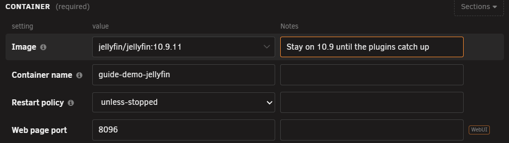
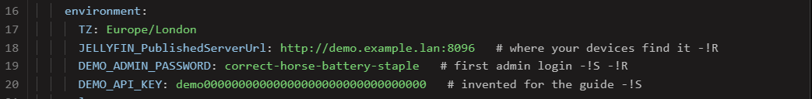
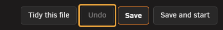
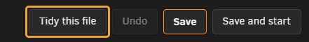
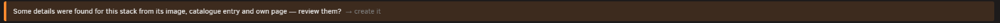
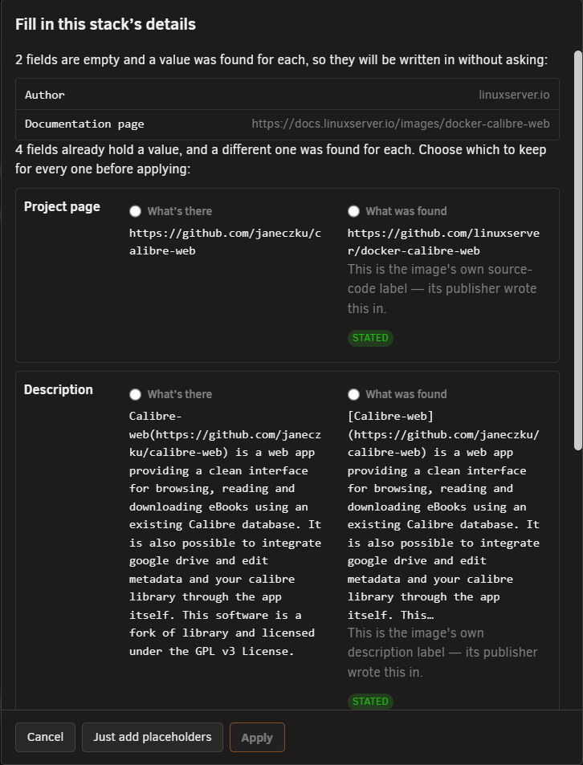

# Editing a stack

<!-- index: 40 | changing a setting and saving it, tidying a file into StaXX's layout, being offered a health check, and ports on a container with its own address. -->

This page covers the things you do inside the editor. For a tour of the screen itself — its
tabs, views and buttons — see [the stack editor](the-stack-editor.md).

## Changing a setting

1. Click the stack to open it.
2. Change a box, tick a section on or off, or type a note under a box.
3. Fill in any box outlined in red before you save — it is required.
4. Press **Save**. Only the lines you changed are rewritten; everything else survives untouched.

**Save** shows **Saved** for a moment, then returns to normal, and the dialog stays open for your
next change. The editor is a view of the file itself: the file you started with stays in the same
place, and you can still open it directly in a text editor.

Where a box has a handful of common answers, it offers them by name, each showing the value it adds
and a one-line explanation:

## The note under a box

Most boxes carry a smaller box underneath labelled **Notes**. That is the actual comment written on
that line in the file. Type a sentence and it is written back as the comment on that exact line,
nowhere else. Leave it blank and no comment is written at all.

## Secret and required

Two facts about a box are recorded as short marks at the end of its comment:

| Mark | Means |
|---|---|
| Secret | Hidden when you turn on Sanitise. See [hiding your values](hiding-your-values.md). |
| Required | Cannot be left empty. |

Neither mark is ever guessed from a box's name. A password-shaped name is not treated as secret
unless the file actually says so.

To generate a value rather than just add a mark, press **Password** — see
[passwords and hashes](passwords-and-hashes.md).

## When Save will not run

| Why | What to do |
|---|---|
| A required box is empty | Fill it in. |
| Sanitise is on | Turn it off before you save. |
| A second file for this stack is open | Switch back to the main file. |

Whatever the form flags — a gap, a mismatch, a suggestion — is a judgement call left to you. It
points things out; it never decides for you.

## Restart to apply

A container already running keeps running on its old settings until you restart it. Saving only
changes what the file says should happen next. If the two have drifted apart, the row shows a
"Restart to apply" mark once you close the editor — see [the stack list](the-stack-list.md).

To undo a save, see [recovery and redundancy](recovery-and-redundancy.md).

## Ports on a container with its own address

Some networks give a container an address of its own on your LAN, rather than sitting behind the
server's. A service on one of those networks cannot also publish ports: a file that lists both will
not start.

If a service is on one of those networks and its file still lists ports, StaXX warns you and offers
to fix it in one press:

1. Press **Comment these ports out**.
2. The `ports:` block is commented out, not deleted. Nothing you wrote is lost, including notes
   beside each port.
3. The file starts.

Undo is at the bottom of the editor if it was not what you wanted.

From then on that group is a plain box you can type in, a place to record which ports the app uses
for your own reference. Nothing in it ever runs.

**Moving a service onto one of those networks** asks first, and comments the ports out in the same
step. **Moving it back off** offers to bring the ports back live, exactly as they were written.

## Port and path clashes

If a port or a folder path this stack wants is already claimed by another container, StaXX warns you
in the form, naming which one holds it. The warning also checks the server itself: if the port is
already held by something running on the server rather than another container, it says so instead —
*Port 443 is already held by the server itself (nginx) — this will not start.* The name in brackets
is left out when StaXX cannot tell what is holding it. Either way this is only ever a warning: you
can still save, but the container is unlikely to start until the clash is fixed.

## Health check offer

Press **Work out a health check** in the Health check group. StaXX tries the check out inside the
running container first, then shows you what it found and what the check actually proves.

Nothing is written until you say yes. StaXX never touches a service that already has a check of its
own. See [what every mark means](marks.md) for what a health check is and how StaXX decides on one.

## Things the form points out

A few boxes carry a note when something common and costly has been left out, each offering the
sensible value in one press:

- **No restart policy.** *Without a restart policy this container stays down after a reboot or a
  crash. "unless-stopped" brings it back unless you stopped it yourself.* Press **Use
  unless-stopped** to set it.
- **No time zone.** *No time zone is set, so this container runs on UTC — its clock, schedules and
  log times will not match the server's. The server is on \<zone>.* Press **Add TZ=\<zone>** to add
  it.
- **A dependency with no health check.** Where one service waits on another that has no health
  check of its own, StaXX says so and offers to work one out — see Health check offer, above.

Every one of these is an offer, never something StaXX applies on its own. Press its button and the
box is filled in on the form; you still have to press **Save**. Press **Dismiss** instead and that
note stays gone in this browser, even after a reload.

## Tidying a file into StaXX's layout

Files arrive from different places — a Community Applications template, a Docker image, a project
already running, or one you pasted in by hand — and each shapes its file a little differently.
Tidying lays every file out the same way.

It happens twice:

| When | How |
|---|---|
| The moment a file first becomes a stack | Automatic — you do not ask for it. |
| Any time after that | Press **Tidy this file**, beside Undo at the bottom of the editor. |

Tidying puts each container's settings in the same order the form is drawn in, and does the same for
the file's own top-level sections. It adds a blank line between sections and containers wherever one
is missing; blank lines are only ever added, never taken away. Containers are never reordered
relative to each other.

Before — settings and sections in no particular order, no blank lines:

After — nothing added, nothing taken away, and the comment has travelled with the setting it was
written above:

Nothing you wrote is lost. This only ever moves whole settings — and whatever is written beside
them — into a different order. No line of text is rewritten: quoting, spacing, comments and values
are all carried across exactly as you wrote them.

Where StaXX cannot be sure that moving something would leave the file's meaning exactly the same, it
leaves that part alone and says so. This is StaXX declining to guess, not a fault.

Tidying lands as an ordinary unsaved change: Save keeps it, Undo puts it straight back. The version
from before it was tidied, arrival or button alike, is in the stack's history if you want it back
later; see [recovery and redundancy](recovery-and-redundancy.md).

What happened appears as its own message above the file, as well as on the status line below it.

## The icon

A service's icon field takes a name from the selfh.st icon collection, a picture kept with the
stack, or a web address. Paste a web address and StaXX downloads the picture once, keeps a copy in
the stack's own folder, and updates the file to point at that copy, with the address you pasted
kept in a comment beside it, so the picture survives a move, a restore, or the address going away.
The change is announced in the same notice that reports a matched icon.

You do not have to open the field at all: drag a picture, or drag a picture's web address across
from another browser tab, and drop it straight onto a service's own icon in the editor. The icon
glows while you are holding something over it. A picture dropped in from your own computer must be
under 512 KB; if the drop cannot be used for any reason, the icon glows red for a moment with a
short line underneath saying why, and nothing about the stack changes.

The field's selfh.st link opens that collection in a new tab. The first time you open a third-party
site from StaXX, Unraid asks whether you trust it; tick **Always allow** and it will not ask about
that site again.

## Fill in details

**Fill in details**, at the top of the screen, looks up your stack's icon, description, author and
project links from three places: the image's own labels, the app's Community Applications entry, and
the project's own page. Nothing is written until you have seen it.

When StaXX has already looked and found something, a bar at the foot of the editor says so:

Press the button or the bar's link and a window shows what was found:

| Part of the window | What it means |
|---|---|
| Fields that are empty | A value was found. It is written in without asking. |
| Fields that already hold a value | The found value differs from yours. Pick **What's there** or **What was found** for each one before **Apply** lets you go on. |
| **STATED** | The publisher wrote this value into the image itself. A value without that badge was read from a catalogue entry or a page, and is a good guess rather than the author's word. |
| **Just add placeholders** | Writes the field names in as comments, with nothing filled in, for you to complete by hand. |
| **Apply** | Writes your choices into the file in the editor. The stack is not saved until you press **Save**. |

A value identical to one already in the file is never offered again, and a link that is not a
secure `https` address is thrown away rather than offered. To type your own wording instead, switch
to the Compose view — see [the stack editor](the-stack-editor.md) for the three views — and edit it
by hand:

## Terms used here

Any word you are not sure of is in the [glossary](../glossary.md).

Back to [the StaXX guide](README.md).
