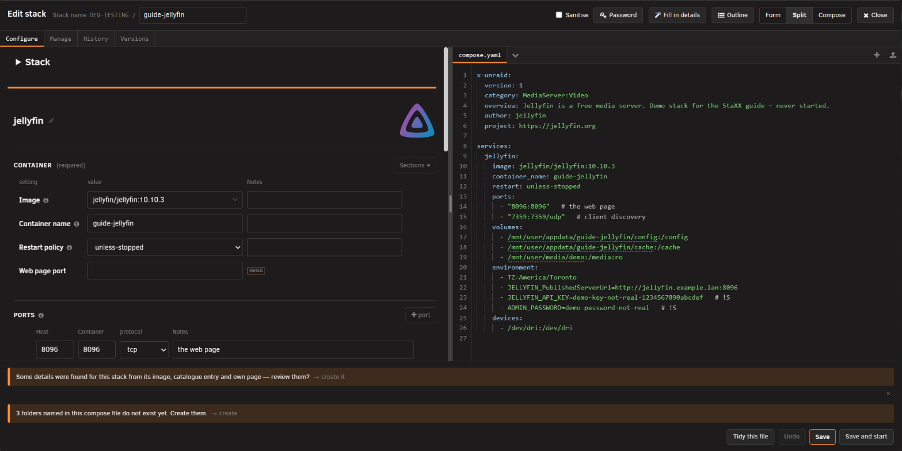
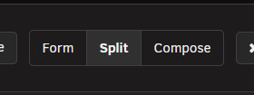
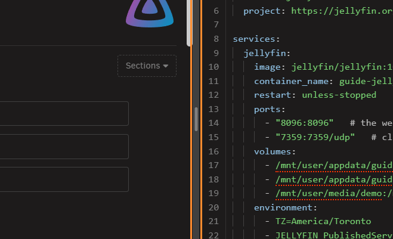
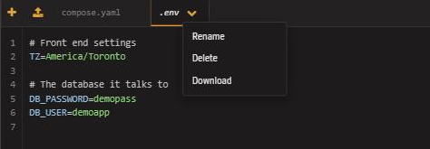
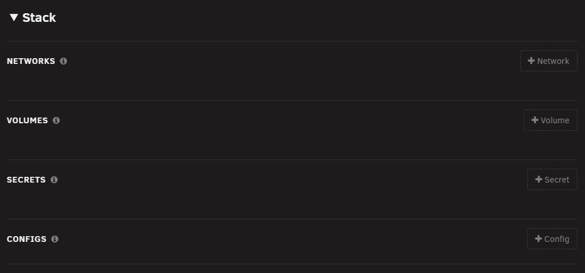
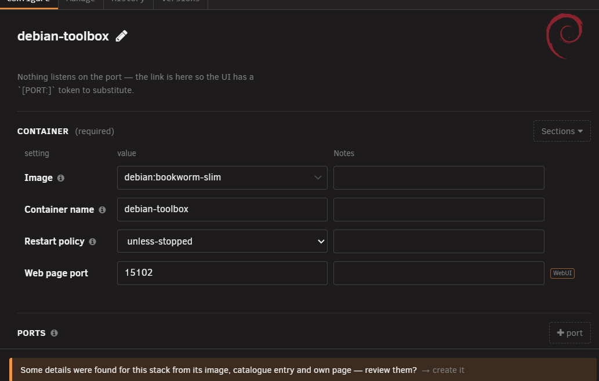
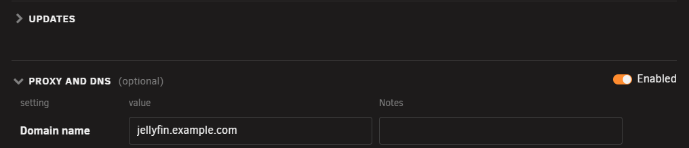
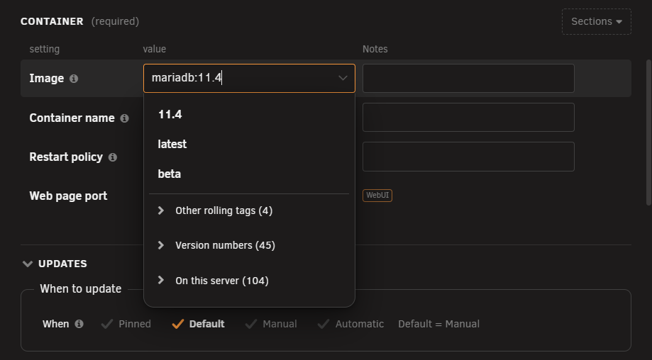
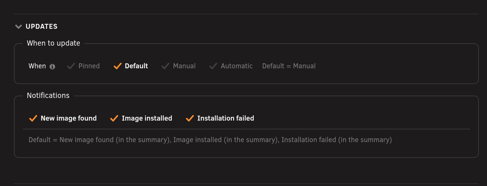
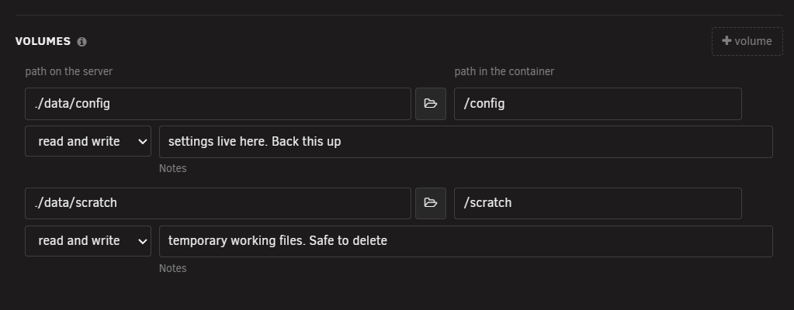

# Configure tab

<!-- index: 7 | the three ways to see a stack's file, the form's sections, and what sits on a row inside them. -->

The Configure tab is where you change a stack's settings, either as a form or as the raw compose
file itself. It opens by default when you open a stack; see [the stack editor](the-stack-editor.md)
for the header row above it and the buttons along the bottom.

## The three views

Three buttons switch how you see the same file.

| View | Shows |
|---|---|
| Form | Only the form. |
| Split | The form on one side, the raw compose file on the other. |
| Compose | Only the raw file, as text. |

In Split, drag the bar between the two panes to give one side more room, or double-click it to put
it back in the middle. Its position is remembered in your browser: the editor reopens where you
left it.

A file other than the compose file itself, such as a `.env` file, opens beside the form. With the
`.env` tab open, click a setting whose value uses one of its variables and the line that defines
that variable lights up, the same way the compose file's lines do.

Two orange buttons sit at the left of the file tab strip: **New file** adds a new, empty file to
the stack, and the upload button beside it adds a file from your computer. Every file's tab also
carries its own menu arrow. Press it to rename, download or delete that file.

## The form, section by section

The form opens with a **Stack** section — settings that belong to the whole file, not to one
service — then one section per service.

| Group | For |
|---|---|
| Networks | Named networks declared for the whole stack to share. |
| Volumes | Named volumes declared for the whole stack to share. |
| Secrets | Secrets declared for the whole stack to share. |
| Configs | Configs declared for the whole stack to share. |

Each service then gets its own set of groups. Press a service's **Sections** button to choose which
of them to show; a tick marks each one already showing.

Press the arrow beside a section's heading, or the heading itself, to fold the section away. Press
it again to open it. Every section except **Container** folds. StaXX remembers which kinds of
section you folded, in this browser, so folding **Ports** folds it on every stack you open.

| Group | For |
|---|---|
| Container | The image, the name and how it restarts. Always shown — every service must have it. |
| Updates | When to update this service, and who is told. Always shown. |
| Proxy and DNS | Shown only once Nginx Proxy Manager is set up in [Settings](settings-integrations.md). See [proxy and DNS](proxy-and-dns.md). |
| Networks | Which networks this service joins. |
| Ports | Which ports it publishes. On by default. |
| Volumes | Folders and files it shares with the server. On by default. |
| Variables | Environment variables. On by default. |
| Devices | Hardware devices handed to it. On by default. |
| Labels | Docker labels. On by default. |
| Health check | How Docker decides the container is working. |
| Resource limits | CPU and memory limits. |
| Build | Building the image here instead of pulling it. |
| Depends on | Which other services must start first. |
| Secrets | Secrets this service can read. |
| Configs | Configs this service can read. |
| Profiles | Which profiles start this service. |
| DNS servers | DNS servers to use instead of the server's own. |
| Extra permissions | Linux capabilities added. |
| Dropped permissions | Linux capabilities removed. |
| Internal ports | Ports open to other containers only, not published. |
| Variable files | Files environment variables are read from. |
| Logging | How this service's logs are kept. |
| Advanced | Anything else the file sets, with no better home. Always shown. |

## The Image box

Click the **Image** box, or start typing, to open its list. The usual choices sit at the top.
**Other rolling tags**, **Version numbers** and **On this server** are folded below them; click a
heading to open it. Type a colon and part of a tag to narrow every group. You can still type any
value yourself.

## The Updates box

Each service's **Updates** group carries a **When to update** choice: **Pinned**, **Default**,
**Manual** or **Automatic**, in that order. Choosing **Pinned** fixes this service to the exact
build it is running now, and it is never checked for an update again. See
[checking for updates](update-policy.md) for what each choice does and how a pin is released.

## What sits on a row

| Part | What it is |
|---|---|
| Note under a box | A sentence explaining what the file already says, or a warning about it. |
| Help mark | A small circled "i" beside a label. Click it for a sentence about that setting. |
| Remove | A cross at the end of a row. Removes that one entry. |
| Reorder grip | On a port row only. Drag it, or focus it and use the up and down arrow keys, to change the order ports are tried in. |
| "more settings" fold | A row's own extra, less common settings, folded away until opened. |
| Pickers | A small button beside a box, for choosing a value instead of typing it: **Choose a folder** browses the server, **Choose a timezone** picks one from a map, **Choose a device** lists the server's own devices. |

For how to change a setting and save it, see [editing a stack](editing-a-stack.md).

## Terms used here

Any word you are not sure of is in the [glossary](../glossary.md).

Back to [the StaXX guide](README.md).
