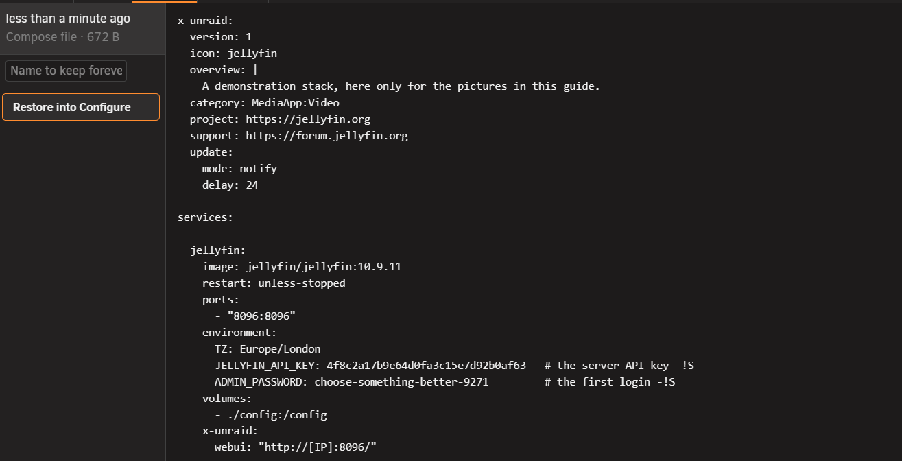
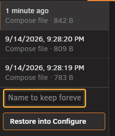
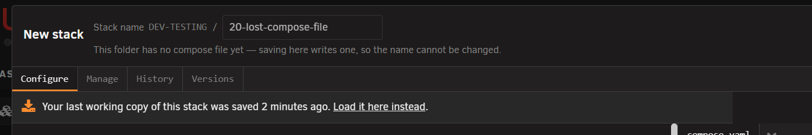

# History tab

<!-- index: 9 | undoing your own edits to a stack's file, what the list of kept versions holds, naming one to keep it for good, and what to do when the compose file is missing. -->

**History** undoes your own edits to a stack's file. It sits in the
[stack editor](the-stack-editor.md), beside **Configure** and [**Versions**](editor-versions.md).

## The short version

1. Open the stack. Click **History**.
2. Click a version on the left to read it.
3. Press **Restore into Configure** to load it into the form. Nothing is written until you save.
4. Press **Save** to keep it, or **Undo** to put the previous version back.

Every save keeps a copy of both what you replaced and what you just wrote, so the newest row is
always the file as it now stands. A save that changes nothing is not kept. A file you drop into the
folder yourself gets its first copy the first time you open or start it. That copy is named
**As StaXX first found it**, shows when the file was last changed, and is kept until you clear its
name.

## What the list shows

| On the row | What it is |
|---|---|
| A time | Relative if today, otherwise the full date. |
| A name, in bold | Only if you named that version. See below. |
| Which file | The stack's main file, or its override file. |
| A size | How big that version was. |

Click a row to read it on the right.

## Naming a version

| Kind | How long it is kept |
|---|---|
| Unnamed | Newest 20. Older ones are deleted as new saves arrive. |
| Named | Forever, and it does not count towards the 20. |

Type a name into **Name to keep forever** — "before I touched the ports" — to stop it ageing out.

Clear the name to put the version back in the queue of the last 20, where it can be deleted the
moment a newer one is saved.

## Missing compose file

If the compose file is deleted or lost, the row reads **"No compose file in this folder"**.

Click the row to load your last working copy, dated, the same way as restoring above.

Never saved or opened here at all? You get the blank starting file instead — see
[making a stack from scratch](making-a-stack.md).

## Restore limits

- An override version cannot be restored from here yet. Open its own tab and copy the text in by
  hand.
- Turn off **Sanitise** to bring **History** back. See [hiding your values](hiding-your-values.md).

## Terms used here

Any word you are not sure of is in the [glossary](../glossary.md).

Back to [the StaXX guide](README.md).
