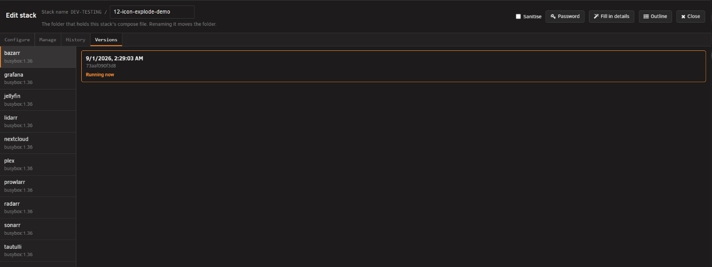
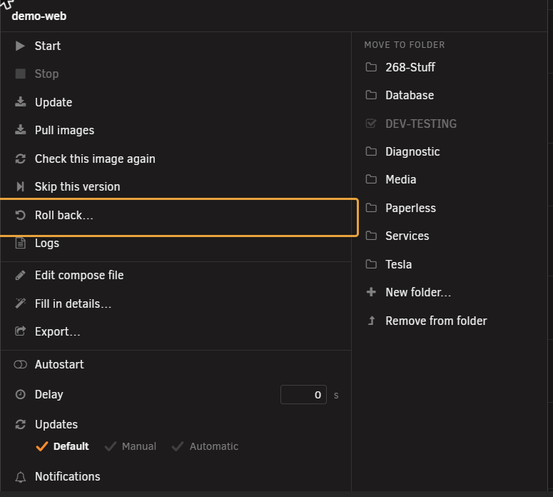
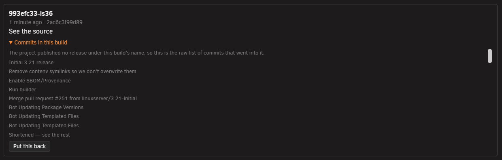
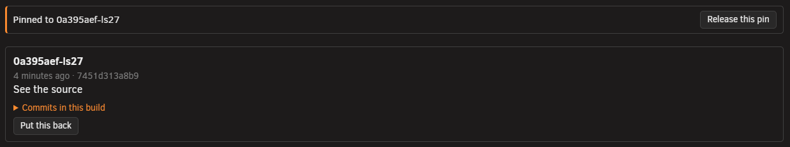
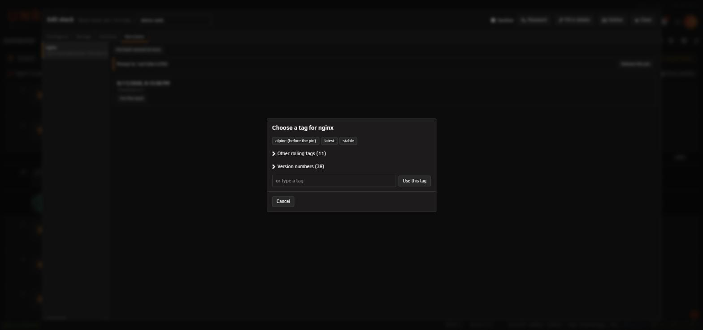

# Versions tab

<!-- index: 9.5 | undoing an app's own update, reading a build's row, pinning a service to one exact build and releasing it again. | parent: the-stack-editor.md -->

[StaXX guide](README.md) › [The stack editor](the-stack-editor.md) › Versions tab

**Versions** undoes an app's own update. It sits in the [stack editor](the-stack-editor.md), beside
**Configure** and [**History**](editor-history.md).

## The short version

1. Open the stack. Click **Versions**.
2. Pick a service on the left. Its recorded builds appear on the right.
3. Find the build you want and press **Put this back**.

A row on the [stack list](the-stack-list.md) offering an update it can undo carries **Roll back…**
on its menu, which opens **Versions** with the right service already picked.

## A build's row

| On the row | What it is |
|---|---|
| A heading | The build's version name, or its date where the publisher gave none. |
| Date and a fingerprint | Enough to tell two unnamed builds apart. |
| **See the source** | Where the image was published, when known. |
| What changed | The release notes, captured at the moment that build was pulled. |
| **Running now**, or **Put this back** | The build you're on has no button; every other one offers to return you to it. |

Where the publisher wrote no release notes, you get the raw list of commits that went into the
build instead.

## Put this back

Press **Put this back** and StaXX edits the compose file to name that exact build. The file it
replaced goes into **History**, so you can undo the change there.

The confirmation tells you a later pull will not move the service off this build on its own, and
that the version you are moving away from will not come back by itself.

Where the stack has an override file, read the confirmation carefully — an image set there can
override the pin. **Put this back** only ever writes the main compose file.

## Pinning and releasing

Naming an exact build is what "pinned" means — see the pin mark on
[the stack list](the-stack-list.md#row-marks). A pinned service shows **Pinned to …** with
**Release this pin** beside it, however the pin was made: **Put this back** above, the **Pinned**
choice in [choosing how a container updates](update-policy.md), or typed into the file by hand.

A pin is written into whichever file sets that service's image (the main file or its override), and
the value it replaced is kept in a comment on the same line, for example `# was nginx:1.25.3`.

Press **Release this pin** and StaXX opens a window listing the image's tags. The top row always
shows the tag it was pinned from, marked **(before the pin)**, together with any of **latest**,
**main**, **master**, **develop**, **dev**, **stable**, **beta**, **nightly** or **edge** the image
has. Below that, **Other rolling tags** and **Version numbers** each fold shut behind a count; tap
either heading to open it. Where no tags can be read, a box lets you type one instead.

Click a tag to put it into that service's image field on the **Configure** tab, and StaXX switches
you there. Press **Save** to keep it. Where an override file sets the image, the change is written
to that file at once instead.

The service keeps running on its current build until an update or a recreate brings the new tag in.

## Nothing recorded yet

A build is only recorded the first time StaXX updates that image. See [updates](updates.md).

## Rollback limits

Only a build StaXX itself recorded for a service can be restored to.

| Message | What it means |
|---|---|
| *"There is no earlier version recorded for this service, so it cannot be rolled back."* | Nothing has been recorded for it yet. |
| *"The previous version is no longer present on this server, so it cannot be rolled back to."* | Recorded, but the image has since been removed from the server while **Keep the images** is on. |
| *"This version is no longer available at the source, so it cannot be rolled back to."* | **Keep the images** is off, and the place the image came from no longer has that version. |

Two settings decide how much is available: how many
[previous versions of each image are remembered](settings-updates.md), and whether
[**Keep the images**](settings-storage.md) keeps them on the server or downloads them again when
you roll back.

## Terms used here

Any word you are not sure of is in the [glossary](../glossary.md).

Back to [the StaXX guide](README.md).
