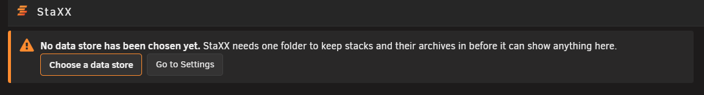
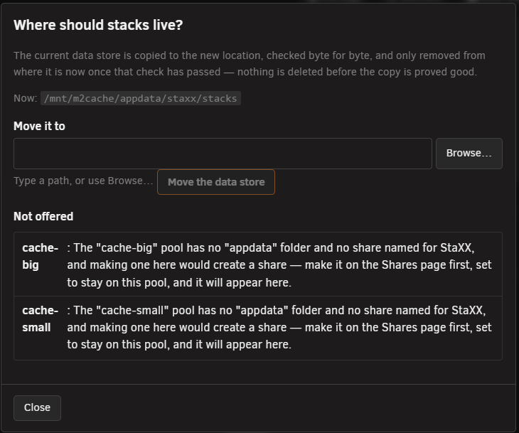

# Your first run

<!-- index: 1 | the one screen you see before anything else: choosing where StaXX keeps its data, and what the choice means. -->

The first time you open StaXX after installing it, there is no stack list yet. In its place is one
notice: **No data store has been chosen yet.** Nothing else works until you answer it, because
everything StaXX keeps, your stacks and the copies of ones you remove, lives in that one folder.

## Choosing the folder

1. Press **Choose a data store**.
2. Pick the place StaXX suggests, or type a path of your own.
3. Press **Move the data store**. The folder is made, and the stack list appears.

StaXX suggests a folder on one of your fast storage pools, inside appdata, because that is where
your other apps already keep their settings and it is backed up with them. Any place it will not
offer is listed underneath, with the reason in plain words next to it. If your server has no pool it
can use, it says so and offers the next safest place instead.

If you type a path of your own, StaXX shows how much free space it has and warns you if it is a
slower kind of path than it needs to be. With **Protect me from myself** on, which it is to start
with, the folder picker will not let you choose a place that could lose your data; see
[settings](settings.md#storage-tab) for what that covers.

**Go to Settings** opens the settings panel instead, where the same choice sits in the Storage tab.

## What happens next

Once the folder exists, the stack list opens and stays your landing page from then on. You can move
the data store later from the Storage tab of the settings panel; StaXX copies everything, checks the
copy, and only then removes the original. See [file locations and the data store](where-things-live.md) for
what goes in the folder.

## Terms used here

Any word you are not sure of is in the [glossary](../glossary.md).

Back to [the StaXX guide](README.md).
