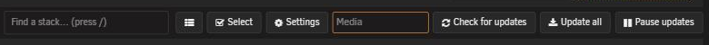
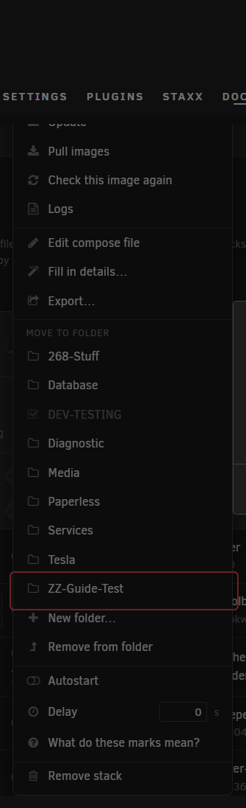
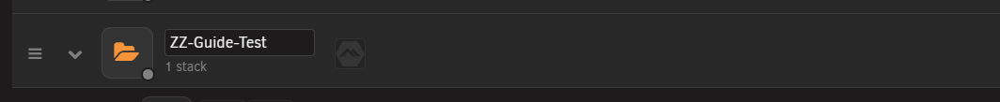

# Folders

<!-- index: 50 | grouping stacks on the list: making a folder, moving a stack in or out, running everything inside one at once, renaming, and deleting. -->

A folder groups stacks under one heading, and you can collapse it to hide the stacks inside. See
[the folder row and its menu](the-stack-list.md#folders) for what it looks like on the list.

Folders are one level deep. You cannot put a folder inside a folder.

## Making a folder

1. Open **Add** and choose **New folder**, or press **New folder…** on a stack's own menu to file
   that stack straight into it.
2. Type a name.

A folder is [a real directory](where-things-live.md) in your data store. The name must:

| The name must… |
|---|
| Not be empty |
| Be 63 characters or fewer |
| Use only letters, numbers, dots, dashes and underscores, and start with a letter or number |
| Not already be used by a folder or a stack at the top level |

## Moving a stack into a folder

1. Open the stack's own menu.
2. Choose **Move to folder**.
3. Pick the folder.

This moves the stack's files. It does not stop the stack, and does not touch its containers.

## Moving a stack out of a folder

1. Open the stack's own menu.
2. Choose **Remove from folder**.

The stack goes back to the top level. If something already there uses its name, rename the stack
first.

## Renaming a folder

1. Open the folder's own menu.
2. Choose **Rename folder**.
3. Type the new name.

The same naming rules above apply. Every stack inside moves with it, and nothing about how they run
changes.

## Folder icons

A collapsed folder's own row carries a picture for every app inside it:

A stack running several things at once keeps its pictures together as one group, with a count on
the end when there are more than will fit:

Rest your mouse on a group to open it into a grid showing every app separately:

Hovering a picture names the stack and service it belongs to. Click it to open the folder, if it
was collapsed, and jump to that stack's row.

A stack StaXX cannot read is drawn as a red warning triangle instead of a picture:

Click it to go to the editor, where you can fix the problem.

## Running everything in a folder

Open the folder's own menu:

| Item | What it does |
|---|---|
| Start everything | Starts every stack in the folder. |
| Stop everything | Stops every stack in the folder. |
| Check this folder | Checks every image in the folder for updates. |
| Update this folder | Installs every update waiting in the folder. See [updating everything at once](updates.md). |

Each stack runs its own outcome, and its row shows its own result. One stack failing to start does
not stop the others.

## Deleting a folder

1. Open the folder's own menu.
2. Choose **Delete folder**.
3. Confirm in your browser's own dialog, which looks different from StaXX's other windows. It states
   that the stacks inside move back to the top level rather than being deleted, and that nothing
   moves unless every one of them can.

Deleting a folder does not delete what is inside it: every stack moves back to the top level first,
and only once all of them have moved does the empty folder itself go.

Before a folder can be deleted:

| Requirement |
|---|
| No stack inside it may share a name with something already at the top level. StaXX names which stack clashes, so you can rename it and try again. |
| Move or remove anything inside the folder that is not a stack first. |

## Terms used here

Any word you are not sure of is in the [glossary](../glossary.md).

Back to [the StaXX guide](README.md).
