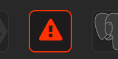

# Working with folders

<!-- index: 50 | grouping stacks on the list: making a folder, moving a stack in or out, running everything inside one at once, the row of app pictures a folder carries, and what deleting a folder does to what is inside it. -->

Once you have more than a handful of stacks, the list can get long. A folder groups the ones that
belong together — everything for one household member, everything to do with your media, a set of
containers you always start or stop as one — under a single heading you can collapse when you are
not looking at it. A folder is reached from the plus button above the stack list, and from every
stack's own menu.

## The short version

1. Press "New folder" above the list (or "New folder…" on a stack's own menu, which also files that
   stack straight into it) and give it a name.
2. Move a stack into a folder from its menu, under "Move to folder" — pick the folder, or "Remove
   from folder" to send it back to the top level.
3. Press the arrow beside a folder's name to collapse or open it.
4. Delete a folder from its own menu when you no longer want it — the stacks inside are kept and
   simply move back up to the top level.

## What a folder actually is

A folder is an ordinary directory on your server, sitting inside your data store, and a stack inside
it is an ordinary directory sitting inside that. There is no separate list of "which stacks belong to
which folder" kept anywhere — the folder a stack shows up under is simply which directory its files
are sitting in. Making a folder creates a real directory; renaming one renames that directory; moving
a stack into or out of one really does move its files from one place to another.

That has one consequence worth knowing: **a folder holds stacks, and nothing deeper.** You cannot put
a folder inside a folder. This is a deliberate limit, not an oversight — one level keeps "where is my
stack" a question with a short, certain answer.

## Making a folder

Press "New folder" and type a name. The name has to work as a real directory name, so it is checked
before anything is created:

| Refused when… | Because… |
|---|---|
| The name is empty | There is nothing to call the folder. |
| The name is longer than 63 characters | That is the same limit a stack's own name has to fit inside, since a folder is stored exactly the same way. |
| The name does not start with a letter or number, or uses characters other than letters, numbers, dots, dashes and underscores | It has to survive being turned into a real directory name — spaces, slashes and punctuation that mean something to the filesystem are refused rather than silently mangled. |
| Something else is already called that at the top level | A folder and a stack share the same list of names, so a folder cannot be created with the same name as an existing stack, or another existing folder (matched without regard to capital letters — "Media" and "media" count as the same name). |

An empty folder still shows up in the list once it is made, so you can see straight away that it
worked, and file the first stack into it whenever you are ready.

## Renaming a folder

Open the folder's own menu and choose "Rename folder". The same name rules above apply. Renaming
moves every stack inside it along with it — nothing about how those stacks run is disturbed, because
what Docker uses to keep a stack's containers together is the name of the stack's own directory, and
that is not what is changing.

## Moving a stack into or out of a folder

From a stack's own menu, under "Move to folder", pick the folder you want. If it is already sitting
in one, you can also choose "Remove from folder" to send it back up to the top level. This really is
a move: the stack's files are relocated on disk. Nothing about the stack's containers is disturbed by
this either, for the same reason a folder rename does not disturb them — the directory is moving, not
being renamed, so the name Docker knows it by is unchanged.

A move is refused when:

| Refused when… | Because… |
|---|---|
| Something is already using that name where the stack is headed | Two things cannot share one spot — a stack called "jellyfin" cannot land inside a folder that already has a stack (or a stray file) called "jellyfin". Rename one of them first. |
| The destination folder does not exist | You cannot file a stack into a folder that has since been deleted or never existed. |

## Collapsing a folder

Press the small arrow beside a folder's name to fold its stacks out of view, and again to open it
back up. This is purely a display choice — the stacks inside are entirely unaffected, running or not,
and nothing about them changes while their folder is collapsed. StaXX remembers which folders you
last left collapsed, and remembers it on the server rather than in your browser, so the list looks the
same however you get there — from your desktop, or your phone.

## The row of pictures on a folder

A folder's own row carries a picture for every app inside it, so a collapsed folder still tells you
what is in it:

A stack that runs several things at once keeps its pictures together as one overlapping group, like a
hand of cards, with a count on the end when there are more than will fit:

Rest your mouse on a group and it opens out into a grid with every app shown separately — all of
them, however many there are. Move away and it folds back up. Nothing else on the page moves while it
is open:

Each picture names the stack it belongs to when you hover it, along with the service inside that
stack it came from — useful when one stack runs several things. Clicking a picture takes you to that
stack: the folder opens if it was collapsed, the list scrolls to the stack's own row, and the row
lights up briefly so you can see where you landed.

A stack StaXX cannot read is drawn as a red warning triangle instead of a picture, in full colour
with a red outline while the pictures around it stay dimmed, because a stack with a problem in its
file is worth spotting rather than hiding:

Clicking one of those goes straight to the editor, which is where the problem can be fixed — unless
the folder has no compose file in it at all, in which case there is nothing to open and it behaves
like any other picture, taking you to the row that explains what is missing.

## Running a whole folder at once

A folder's own menu offers "Start everything" and "Stop everything", which does exactly what it
says to every stack inside that folder in one go. "Check this folder" and "Update this folder" do the same
for everything inside it in one pass. Each stack inside still runs its own outcome
independently and reports its own result — one stack failing to start does not stop the others in the
folder from being tried, and each one's own row shows what actually happened to it.

## Deleting a folder

Open the folder's own menu and choose "Delete folder". **This never deletes what is inside it.**
Every stack in the folder is moved back up to the top level first, and only once every one of them
has been moved does the now-empty folder itself get removed.

Deletion is refused, and nothing is moved at all, when:

| Refused when… | Because… |
|---|---|
| Moving a stack back to the top level would land on a name already used there | Two things still cannot share one spot. StaXX names exactly which stack would clash, so you can rename it and try again. |
| The folder holds something on disk that is not a stack (a stray file, for instance) | StaXX only knows how to move stacks, so anything else left in there has to be dealt with by hand first. |

Nothing is moved unless every single item inside can be — a folder left half-emptied would be far
more confusing than one that simply refuses to delete until the clash is sorted out.

## What this never does

- **Deleting a folder never deletes a stack, or touches its containers.** Everything inside is moved
  back to the top level, in full, before the folder itself goes.
- **Moving a stack into or out of a folder never stops it, and never changes its settings.** If it
  was running, it carries on running exactly as it was — StaXX simply now shows it filed somewhere
  else.
- **Renaming a folder never disturbs the containers inside it**, for the same reason.
- **Collapsing a folder is only ever about what you see.** It has no effect whatsoever on whether
  anything inside is running.

## Not built (yet, or at all)

Folders are one level deep, on purpose — you cannot nest one folder inside another. If you want a
finer grouping than that gives you, the stack's own name is the place to put it, the same way a
folder called "Media" holds a stack you might otherwise have called "media-jellyfin".

## Terms used here

Any word you are not sure of is in the [glossary](../glossary.md).
