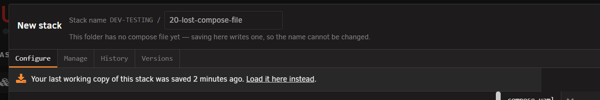

# Version history and rollback

<!-- index: 75 | how to return to an earlier version of a stack's file, or to an earlier build of one of its images, what each list holds, and why some things cannot be gone back to. -->

Two different things live here. **History** undoes your own edits to the file. **Versions** undoes
an app's own update. Both sit in the [stack editor](the-stack-editor.md), beside Configure.

## History tab

1. Open the stack. Click **History**.
2. Click a version on the left to read it.
3. Press **Restore into Configure**. This only loads it into the form — nothing is written yet.
4. Press **Save** to keep it, or **Undo** to put the previous version back.

Every save keeps a copy — both what you replaced and what you just wrote. So the newest row is
always the file as it now stands. A save that changed nothing is not kept. A file you dropped in
the folder yourself gets its first copy the first time you open or start it.

### What the list shows

| On the row | What it is |
|---|---|
| A time | Relative if today, otherwise the full date. |
| A name, in bold | Only if you named that version. See below. |
| Which file | The stack's main file, or its override file. |
| A size | How big that version was. |

Click a row to read it on the right. Nothing picked yet says *"Pick a version on the left to look
at it."* Nothing saved yet says *"No history yet. The next time this stack is saved, that version
starts being kept."*

### Naming a version

| Kind | How long it is kept |
|---|---|
| Unnamed | Newest 20. Older ones are deleted as new saves arrive. |
| Named | Forever, and it does not use up one of the 20. |

Type a name into **Name to keep forever** — "before I touched the ports" — and it stops ageing out.
Clearing a name asks first: *"A named version is kept forever. Clearing its name puts it back in
the ordinary queue of the last 20 saves, where it can be deleted the moment a newer one is saved —
possibly straight away."*

### Missing compose file

If the compose file is deleted or lost, the row reads **"No compose file in this folder"**. Click it
and StaXX offers your last working copy, dated. Loading it works exactly like restoring above.

Never saved or opened here at all? You get the blank starting file instead — see
[making a stack from scratch](making-a-stack.md).

### Restore limits

- **An override version cannot be restored from here yet.** Its button is switched off. Open its
  own tab and copy the text in by hand.
- **History is unavailable while Sanitise is on.** An old version holds real, unhidden values —
  see [hiding your values](hiding-your-values.md). Turn Sanitise off to get it back.

## Versions tab

<!-- SHOT: going-back-versions-tab | full frame | the Versions tab open, showing the list of services on the left and one service's recorded builds on the right -->

1. Open the stack. Click **Versions**.
2. Pick a service on the left. Its recorded builds appear on the right.
3. Find the build you want and press **Put this back**.

A row on the [stack list](the-stack-list.md) offering an update it can undo has **Roll back…** on
its menu — that opens Versions with the right service already picked.

### A build's row

<!-- SHOT: going-back-build-row | close-up | one build's row in the Versions tab, showing its heading, date and fingerprint, the "See the source" link, "What changed" notes, and its "Put this back" button -->

| On the row | What it is |
|---|---|
| A heading | The build's version name, or its date where the publisher gave none — the ordinary case. |
| Date and a fingerprint | Enough to tell two unnamed builds apart. |
| See the source | Where the image was published, when known. |
| What changed | The release notes, captured at the moment that build was pulled. |
| Running now, or Put this back | The build you're on has no button; every other one offers to return you to it. |

Where the publisher wrote no release notes, you may get the raw list of commits instead, prefaced
*"The project published no release under this build's name, so this is the raw list of commits
that went into it."*

### Put this back

**It edits the compose file so it names that exact build.** That is what makes it stick — a later
update has nothing vague left to move on to. The file it replaced goes into History, so it can be
undone from there.

The confirmation says: *"This edits the compose file so it names that exact version, which is what
makes it stick — a pull will not move off it. The file as it stands now is kept in History, so this
can be undone."* And: *"The version you are moving away from will not come back on its own."*

With an override file, it adds: *"This stack has an override file, though, and an image set there
can win over this pin and make it look as though nothing happened."* Worth reading — the one case
where the whole thing appears to do nothing.

### Pinning and releasing

<!-- SHOT: going-back-pinned-band | close-up | the "Pinned to …" band for a service, with the "Release this pin" button beside it -->

Naming an exact build is what "pinned" means — see the pin mark on [the stack list](the-stack-list.md#row-marks).
A pinned service shows **Pinned to …** with **Release this pin** beside it, whether the pin came
from here or was typed into the file by hand.

Releasing explains: *"The compose file will stop naming an exact build, so this service follows its
tag again. Nothing restarts now — it keeps running what it is running until the next update or
recreate moves it."*

### Nothing recorded yet

A build is only recorded the first time StaXX updates that image. A new or just-imported stack
shows *"Nothing has been recorded yet. A version is recorded the first time StaXX updates one of
this stack's images."* See [updates](updates.md).

### Rollback limits

**Only a build StaXX itself recorded for that service.** Anything else is refused: *"That version
is not one recorded for this service, so it cannot be rolled back to."* Without that check, a
request could point a service at any image on the server — not only one it has genuinely run.

| Message | What it means |
|---|---|
| *"There is no earlier version recorded for this service, so it cannot be rolled back."* | Nothing has been recorded for it yet. |
| *"The previous version is no longer present on this server, so it cannot be rolled back to."* | Recorded, but the image has since been removed from the server. |
| *"This service is not pinned to a version, so there is nothing to release."* | You asked to release a pin on a file that names no exact build. |

Two [settings](settings.md) decide how much is available: how many previous versions of each image
are kept, and whether images left behind by updating are removed automatically. That second one
only ever removes an image nothing is running and no recorded version still needs.

## What this never does

- Restoring a file never writes to disk until you press Save.
- It never deletes a named version — only clearing its name, after asking, puts it back in the queue.
- Releasing a pin never restarts anything.
- It never fetches release notes when you look at them — they were saved when the build was pulled.
- The record it keeps is not load-bearing. Delete it and everything still works; you just lose the history.

**None of this certifies that going back will fix anything.** An earlier file or build is just what
you had before — whether it still works alongside everything else that has changed is your call.

## Terms used here

Any word you are not sure of is in the [glossary](../glossary.md).
