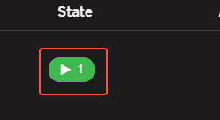
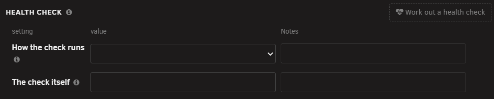
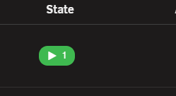
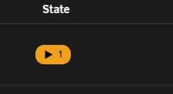
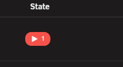

# Health checks

<!-- index: 41 | what a health check is, how to have StaXX work one out from the running chip or the editor, what the offer shows, and what the chip's colour says afterwards. -->

A health check is a question an app is asked again and again, to show it is working and not just
running. StaXX can work one out for a service that has none. You reach it from the running chip on
a row, or from the **Health check** group in [the stack editor](the-stack-editor.md).

## The short version

1. Press the green running chip on a row, or press **Work out a health check** in the editor.
2. Read the offer.
3. Press **Add it** to write the check into the file, or **Cancel** to leave the file alone.
4. Watch the chip. It changes colour as the check runs.

## From the running chip

A green running chip that nothing is checking is a button. Press it. On a stack with more than one
service, open the stack with its cubes button and press the chip on the service's own row. See
[the stack list](the-stack-list.md).

## From the editor

Tick **Health check** under the service's **Sections** button, then press **Work out a health check** in its top right
corner. The button works on that service, whether or not the group already holds a check.

## What StaXX looks for

StaXX looks at the service's image and works down this list, stopping at the first line that fits.

| What StaXX finds | What happens |
|---|---|
| The service already has a health check in its file, or its image checks itself | Nothing is offered. |
| StaXX recognises the image | A check taken from that app's own documentation. It uses the app's own tool to sign in and ask something real. |
| The project published its own example check, and it matches a shape StaXX recognises | That check. |
| The app has a web page StaXX can fetch | A plain check that the page answers. |
| None of the above | Nothing is offered. StaXX says so. |

Some checks need a setting from the file, such as a password. If it is empty, StaXX says the check
needs a setting that is not filled in yet.

Reading a project's own published example needs **Image documentation** on **Read it automatically**.
See [the Icons and images tab](settings-icons-and-images.md).

StaXX runs the check once inside the running container before it offers it. If it does not work
there, StaXX offers nothing and tells you.

## The offer

The window is headed **Add a health check for** and the service's name. It shows:

| Part | What it tells you |
|---|---|
| The first line | What the check proves, and anything it does not. |
| The command | The exact command the container will run. |
| The timing | How often it runs, how long it waits for an answer, how many tries it gets before the container is called unhealthy, and how long it is left alone after it starts. |
| A line about the trial | That a short command was run inside your container to work this out. |
| A line about another service | Shown only when another service in the file waits for this one to be healthy. |

Press **Add it** to write the check into the file and save it. Press **Cancel** and nothing is
written. When the editor is open, **Undo** at the bottom takes the change back.

A web page check proves only that the page answers. Read the first line of the window before you
accept.

## The chip afterwards

| Chip | Means | What to do |
|---|---|---|
|  | The check is passing. The chip pulses slowly. | Nothing. |
|  | The check has not decided yet. | Give it a moment. |
|  | The app inside says it is not working. | See below. |

On a stack with several services, the chip is red when any one of them is unhealthy and amber when
any one is still deciding. [What every mark means](marks.md) has the full list of chips.

## When a check fails

1. Hover over the red chip. It names the services that are unhealthy.
2. Press the stack's **Logs** button to read what the app says. See [the Manage tab](the-manage-tab.md).
3. To hear about it without watching the list, set **Health check failed** to **Straight away** on
   the Updates tab. See [the Updates tab](settings-updates.md).

## When nothing is offered

StaXX says why in a message.

| Message | What to do |
|---|---|
| This service already has a health check written into the file. | Nothing. |
| This image already checks itself. | Nothing. |
| StaXX knows a health check for this image, but it needs a setting that is not filled in here yet. | Fill in the setting, then try again. |
| StaXX could not look inside the container. | Start the container, then try again. |
| StaXX found a possible check, but it did not work when tried. | Write your own check in the **Health check** group. |
| StaXX has no health check to offer for this image. | Write your own check in the **Health check** group. |

For what the boxes in the **Health check** group mean, look up Docker health checks in Docker's own
documentation.

## Terms used here

Any word you are not sure of is in the [glossary](../glossary.md).

Back to [the StaXX guide](README.md).
