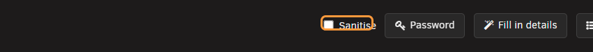
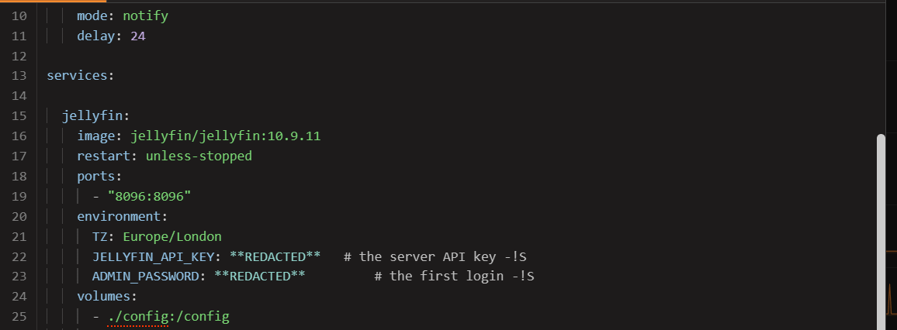
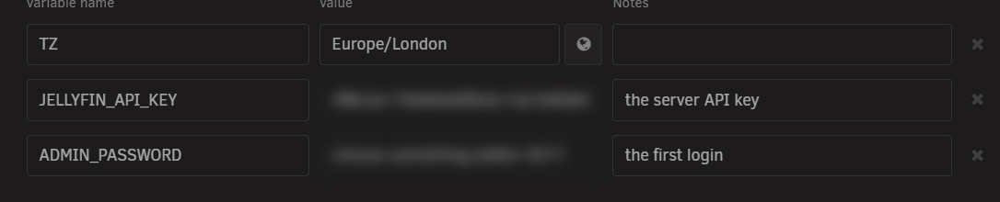
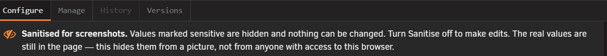

# Sanitise mode

<!-- index: 45 | the Sanitise tick that hides values marked secret while you photograph the editor, exactly what it leaves showing, what it switches off while it is on, and the one tab it cannot cover. -->

**Sanitise** hides the values you marked secret so you can take a screenshot. It sits as a tick box
on the top row of [the stack editor](the-stack-editor.md), beside the stack's name and just left of
the **Password** button. It always starts off.

Be blunt with yourself about what it does: it hides values from a picture. It does not hide them
from anyone using this browser.

## Steps

1. Open the stack you want to photograph.
2. Tick **Sanitise**. A banner appears and the editor locks.
3. Take your picture, then look at it yourself before you send it.
4. Untick **Sanitise** to get back to editing.

## What it hides, and where

| Where | What happens to a hidden value |
|---|---|
| The file, shown as text | Replaced on screen with `**REDACTED**`, in the exact spot the real value sat. |
| The form | The box is blurred, keeping its real width so the page's shape stays honest. |

It only hides a value the file itself marks **Secret**, described in
[editing a stack](editing-a-stack.md). Nothing is guessed from a name. Check your values carry the
mark before you photograph anything.

## What stays visible

| Still visible | Why |
|---|---|
| The **name** of a setting | Only the value goes. The name is usually what somebody needs to help you. |
| The **note** written beside a secret | The note is not the value. |
| The **container side of a port** | Not the secret half of the pair. |
| The whole **Versions** tab | An image name and a version are not values you wrote. |
| **Everything behind the dialog** | The stack list underneath is untouched. |

The real values are still in the page. They come straight back the moment the tick comes off.

## Second file tabs

A stack can hold more than a compose file — a settings file such as `.env`, or anything else kept
beside it. Those open as extra tabs, and opening one switches Sanitise off by itself. The tick
clears, everything is visible again, and the tick box goes dead with the note *"The compose file is
on the first tab."* You cannot turn it back on until you return to the first tab.

A screenshot taken on one of those tabs shows everything in that file, in full. A settings file is
usually where passwords actually live, so this is the easiest mistake to make on this page.

## What is switched off while it is on

The editor locks while Sanitise is on. That is the safety of it: the screen is full of
placeholders, so nothing may write one of them into your real file.

| Turned off | What that means |
|---|---|
| **Save** and **Save and start** | Nothing can be written while placeholders are on screen. |
| The file pane | Read-only. You can scroll and select, not type. |
| Every box and button on the form | All disabled. Anything already disabled stays that way when you switch back. |
| **Undo** | Nothing to undo, because nothing can change. |
| **Replace** in the find bar | Would edit the placeholder copy on screen, which is thrown away. **Find** still works. |
| **Fill** on the password generator | The panel and **Copy** keep working. Only writing into a box stops, with the note *"Sanitise is on, so writing to the file is turned off. Turn it off to fill a box."* See [password generator and hashing tool](passwords-and-hashes.md). |
| The **History** tab | Disabled, with the message *"Not available while Sanitised. An old version holds the real, unhidden values, so history is hidden until Sanitise is turned off."* See [recovery and redundancy](recovery-and-redundancy.md). |

History is closed because an old copy of your file holds the values from before you hid them. Left
open, it would undo the whole point in one click.

## What this never does

- It never changes your file. Nothing is written or saved.
- It never sends anything anywhere. No copy is made and nothing leaves your server.
- It never removes a value. Every value is still there, one tick away.
- It never tells you a picture is safe to share. Whether your screenshot is fit to post is your
  judgement, every time.
- It is not a way to send a stack to somebody else — that is Export, which writes a real file with
  `REPLACE-ME` in place of your values. See [sharing a stack](sharing-a-stack.md).

## Left out, for now

- Hiding a value for one screenshot without marking it secret first. That is what keeps Sanitise
  from ever guessing.
- Hiding the extra tabs at all.

## Terms used here

Any word you are not sure of is in the [glossary](../glossary.md).

Back to [the StaXX guide](README.md).
