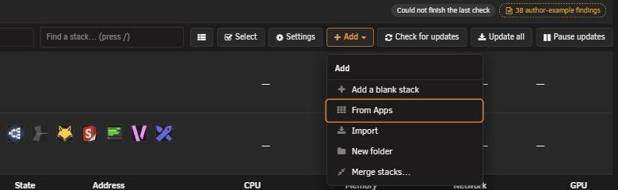
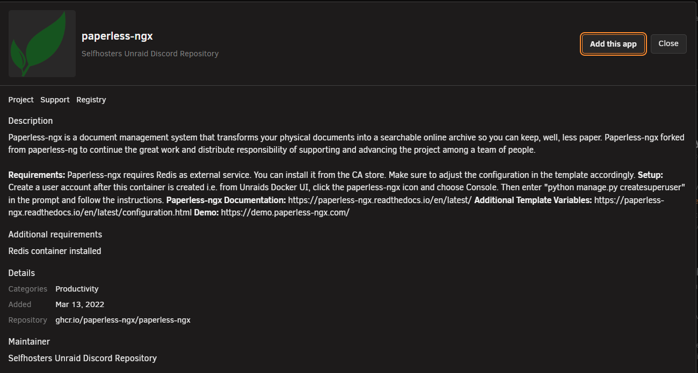
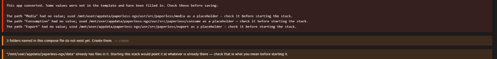
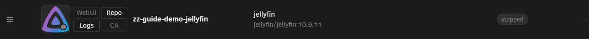

# Install an app from Community Applications

<!-- index: 60 | a step-by-step walkthrough of adding a catalogue app: what carries across, what needs checking before you start it, and why nothing exists until you save. -->

Community Applications is the catalogue of ready-made apps Unraid users already know. This turns
one catalogue entry into an ordinary compose file, ready for you to check before anything runs.

## Walkthrough

1. Press **Apps**, next to **Add stack**.

   

2. Read the window that opens. It shows a curated home page, **Spotlight**, **Recently Added** and
   **Top Trending**, with a search box and a category list above them.

   

3. Find the app you want. Browse the home page, pick a category, or type a name in the search box.
   Typing switches you to the **Search** tab on its own.

4. Press an app's card to open it.

   

5. Read the card. It shows an icon, a description, screenshots if the maintainer supplied any, its
   category, when it was added and last updated, its Docker Hub pull count and star rating where
   known, and links to the project's page, its support thread, its readme and its registry page. An
   app the maintainer has marked as no longer kept up shows that on its card, and you can still add
   it.

6. Press **Add this app**.

7. Wait. StaXX turns the catalogue entry into a compose file. Nothing is installed and nothing
   contacts your server's Docker yet.

8. Land in the stack editor. The new stack has a name already, but nothing has been saved.

   

9. Read the banner above the form, if one appears. It lists anything worth a look before you save:
   settings with no compose equivalent, values StaXX had to fill in, or a dollar sign written twice.
   See [what carries over](#what-carries-over) below.

10. Check the ports and folders StaXX filled in. Each keeps its own description of what it is for.
    Make sure none of them clash with anything else already using them on your server.

    

11. Press **Save**.

    

12. See the new stack on the list, stopped. Saving never starts it.

    

13. Press **Start** when you are ready to run it.

The editor you land in, and its buttons and tabs, are covered in
[the stack editor](the-stack-editor.md). The stack's new row, and what its marks mean, are covered
in [the stack list](the-stack-list.md).

The same search box also finds plain images: a Docker Hub search, or an image already on this
server. Those carry none of a catalogue entry's own settings. Adding one opens a bare starting file
with just the image name in it, for you to build up by hand.

Saving writes an ordinary compose file, already laid out in StaXX's own order and ready to run
wherever compose runs, with the catalogue app's own settings carried across as plain lines.

## What carries over

| From the original app | What happens |
|---|---|
| Ports, folders, devices, variables, labels | Copied across with their own descriptions. |
| Icon, description, category, web address, project and support links | Copied into the app-information block. |
| A network set to the default (or nothing stated) | Written out as the default network, explicitly. |
| Sharing another container's network entirely | Carried over. The container it shares with must already exist. |
| A named network | Carried over. The network must already exist on this server. |
| A fixed IP address | Kept only when there is a named network for it to sit on. Dropped otherwise, with a note saying so. |
| A fixed MAC address | Kept wherever there is any network interface at all. Dropped only when the container shares another container's network entirely. |
| Extra `docker run` options StaXX recognises (memory limits, restart policy, capabilities, health checks named as options, and others) | Translated to their compose equivalent. |
| Extra `docker run` options StaXX does not recognise | Left out, and named in the banner above the editor. |
| A value containing a dollar sign | Written twice. You are told which values changed; **Undo** puts it back. More in [making a password](passwords-and-hashes.md). |

Anything StaXX had to invent, such as a folder path the app never gave, a port with no host side
named, or a fixed address it is keeping unchanged, is filled in as a placeholder and named
separately. Check an empty setting too, even where nothing was flagged: StaXX fills gaps with its
own best guess. Check them against your network and your other containers.

## What cannot convert

A handful of `docker run` options have no compose equivalent, and StaXX says so rather than guessing:

| Cannot convert | Do instead |
|---|---|
| Old-style container linking | Put both containers in the same stack and refer to the other by name. |
| An alias on a named network | Nothing. The network has to already exist for this to mean anything. |
| Anything typed after a flag StaXX has never seen | Named exactly as typed, so you can decide whether it still matters. |

A catalogue entry describing more than one container becomes one service, not a multi-service
stack. Add each app on its own. An option with a value StaXX cannot make sense of, such as an
invalid address, is dropped rather than written in broken.

## Terms used here

Any word you are not sure of is in the [glossary](../glossary.md).

Back to [the StaXX guide](README.md).
