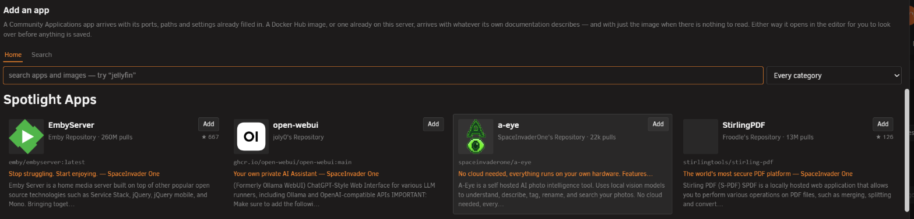

# Adding an app from Community Applications

<!-- index: 60 | turning a catalogue entry into an ordinary compose file: what carries across, what needs checking before you start it, and why nothing exists until you save. -->

Community Applications is the catalogue of ready-made apps Unraid users already know. StaXX has its
own way in to that catalogue — the **Apps** button beside "Add stack" — that turns a catalogue entry
into an ordinary compose file for you to review, rather than installing anything straight away.

## The short version

1. Press **Apps**. A window opens showing a curated home page — Spotlight, Recently Added, Top
   Trending — with a search box and category list above it.
2. Find the app you want, either by browsing or by typing a name, and open its card for the full
   description, screenshots and links.
3. Press **Add this app**. StaXX turns the catalogue entry into a compose file and opens it straight
   into the ordinary stack editor — nothing has been saved or started yet.
4. Read what StaXX flags above the editor, check the ports and folders it filled in, then press
   **Save** when you are happy. The new stack is created stopped, exactly like any other new stack —
   press Start when you want it running.

## What you see before adding anything

Opening a card shows the same kind of information Unraid's own Apps page would: an icon, a
description, screenshots if the maintainer supplied any, its category, when it was added and last
updated, its Docker Hub pull count and star rating where known, and links to the project's page,
its support thread, its read-me and its registry page. An app the maintainer has marked as no
longer kept up says so plainly, but is still offered — the choice stays yours.

The same box also finds plain images — a Docker Hub search, or an image already on this server.
Those carry none of a catalogue entry's own settings, so adding one opens a bare starting file with
just the image name in it, for you to build up by hand.

## What the conversion produces

The result is a normal compose file — nothing about it depends on StaXX to run. It arrives already
laid out in StaXX's standard order, the same tidying described in
[editing a stack](editing-a-stack.md#tidying-a-file-into-staxxs-layout). Every setting the
catalogue app declared becomes an ordinary line in that file: a port, a mounted folder, a variable,
a device, a label. Its description, its web address, its icon and its other links go into the block
compose itself ignores but StaXX reads to draw the form — delete that block entirely and the file
still runs with a plain `docker compose up`.

## What carries over, and what needs a check

| From the original app | What happens |
|---|---|
| Ports, folders, devices, variables, labels | Copied across with their own descriptions, so the form still explains what each one is for. |
| Icon, description, category, web address, project and support links | Copied into the app-information block. |
| A network set to the default (or nothing stated) | Written out as the default network, explicitly. |
| Sharing another container's network entirely | Carried over, with a note that the container it shares with must already exist. |
| A named network | Carried over, with a note that the network must already exist on this server. |
| A fixed IP address | Kept only when there is a named network for it to sit on; dropped, with a reason, when the app uses the default network or shares another container's network entirely. |
| A fixed MAC address | Kept wherever there is any network interface at all; dropped only when the container shares another container's network entirely. |
| Extra `docker run` options StaXX recognises (memory limits, restart policy, capabilities, health checks named as options rather than settings, and a good number of others) | Translated to their compose equivalent. |
| Extra `docker run` options StaXX does not recognise | Left out, and named plainly in the check-list above the editor so nothing goes missing unannounced. |
| A value containing a dollar sign | Each one is written twice, which is how a compose file carries a real dollar sign — the app still receives the value exactly as before. You are told which values were changed, **Undo** takes it back, and once you save, the original wording is the first version in the stack's history. There is more on why in [making a password](passwords-and-hashes.md). |

Anything StaXX had to invent — a folder path the app never gave a value for, a port with no host
side named, a fixed address it is keeping unchanged — is filled in as a placeholder and listed
separately, so you know it needs a look before you rely on it. An empty setting is still worth
checking even where nothing was flagged: StaXX fills gaps sensibly, but it does not know your
network or your other containers, so nothing here should be treated as already checked for you.

## What cannot come across at all

A handful of `docker run` options have no compose equivalent, and StaXX says so rather than guessing:
- old-style container linking (put both containers in the same stack and refer to the other by name
  instead)
- attaching an alias to a named network (the network has to already exist for this to mean anything,
  which StaXX has no way to arrange on its own)
- anything typed after a flag StaXX has never seen, which is named exactly as typed so you can decide
  whether it still matters

A catalogue entry that describes more than one container is not stitched into a multi-service stack
— each app becomes one service. And an option with a value StaXX cannot make sense of (an invalid
address, for instance) is dropped rather than written in broken.

## What this never does

Adding an app never touches the original catalogue entry, and it never contacts your server's Docker
in any way until you press Save. Nothing is installed, started, or written to disk the moment you
press "Add this app" — you are looking at a proposed compose file in the ordinary editor, free to
change anything in it, or to close the window and walk away, before anything exists. Saving creates
the new stack stopped, the same as building one from scratch; StaXX never starts a newly added app
on your behalf.

## Being honest about what's not built

Two things this dialog does not do:

- Adding several catalogue apps as one linked stack. Each addition is one app, one editor session,
  one save.
- Checking whether a port or folder the app wants is already used by something else on your server.
  That check belongs to a different part of StaXX, not to the conversion itself.

## Terms used here

Any word you are not sure of is in the [glossary](../glossary.md).
