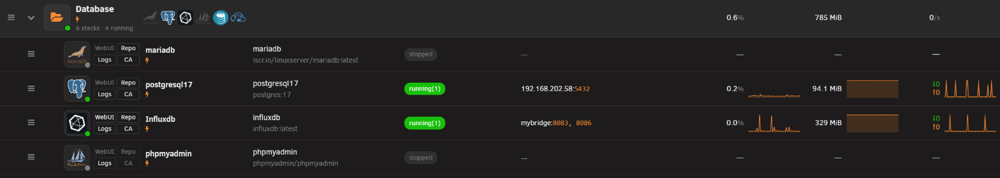
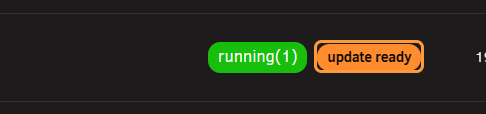
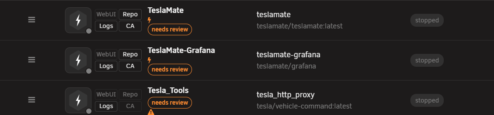
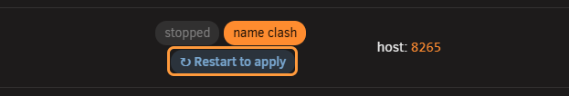
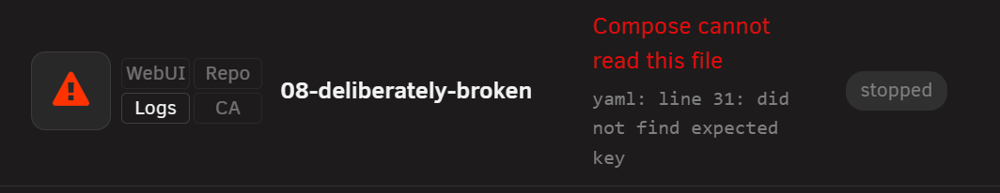
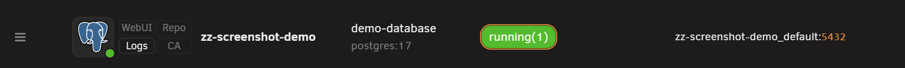

# Row marks and icons

<!-- index: 20 | a quick key to every mark on the stacks page: running state, update state, and the rest. -->

Every mark on [the stacks page](the-stack-list.md), in one place. Find it, read what it means, and
what to do about it.

## Running state

The first pill on a row.

| Pill | Meaning | What to do |
|---|---|---|
| Green, e.g. "Up 5 minutes" | Running. The words come straight from Docker. | Nothing. |
| Red, e.g. "Up 2 hours (unhealthy)" | Running, but the app inside says it is not working. | Worth a look. |
| Amber, e.g. "Up 5 seconds (health: starting)" | Running. Its own check has not finished deciding yet. | Give it a moment. |
| Grey, "stopped" | Not running. Nothing else wrong. | Start it when you want it. |
| Grey, "not created" | Never built from the file yet. | Start it. |
| Amber, "Restarting" or "paused" | Mid-way through something. | Usually settles on its own. |
| Red, "Dead" | Docker itself calls this broken. | Worth a look. Try restarting it. |
| "unknown", plain grey text | StaXX cannot ask the container service right now. | Clears up once that service answers again. |
| Dashed, "Starting…" or "Downloading image…" | A command you asked for is still running. On a first start, the image is being downloaded. | Wait. Click the pill to watch the log as it happens. |

Hover any pill to see whether it means "the container is going" or "the app inside says it is
working" — most images can only say the first. See [health checks](editing-a-stack.md) for how to
add the second kind.

## Update state

Sits beside the running pill. Empty most of the time, and empty is the good news — nothing newer
was found. See [update checking](updates.md) for the cadence, the countdown, and the author's own
published example.

| Wording | Meaning |
|---|---|
| *(nothing)* | Nothing newer found, or nothing checked yet. "Check this image again" in the row menu settles which. |
| `update ready`, or a version, e.g. `1.2.3 → 1.2.4` | Something newer exists. Press it to fetch and apply it. |
| `N updates ready` | More than one service here has one waiting. |
| `rebuild ready` | Built here, and its base image has moved on. Rebuild to pick it up. |
| `built here` | Built on this server. Nothing to compare it to. |
| `not installed` | Named in the file but never pulled. |
| `tag withdrawn` | This tag no longer exists at the registry. |
| `registry moved` | The image now lives somewhere else. |
| `N to look at` | The [author's own published example](updates.md) does something differently here. Open the stack to see what. |
| `could not check` | The last check failed. |

Only `update ready` (and its version forms) is a button. Everything else is a fact, not an alarm —
`update ready` and `rebuild ready` are shown in a stronger colour because they are the two worth
acting on.

### The hover card

Hover a pill — or press it, on a touch screen — for a small card in the page's own style: the
version running now, the version on offer, when it was last checked, when it is next due, and why
it is checked that often.

## Marks under the name

| Example | Mark | Meaning |
|---|---|---|
|  | Drawing pin | One or more services is fixed to one exact build. Hover it to see which. Never shows an update mark — there is nothing to compare it against. |
| Orange triangle | Drift since import | Only on a stack imported from Compose Manager. Its original file has changed since the day it was copied. Hover it to see what differs. |
| Orange triangle | Ports do nothing | A service is on a network that gives it its own address, so the ports in the file are ignored. Hover it to see which service. |

**These two triangles are the same glyph** — same shape, same colour, same size. Only the tooltip
tells them apart. A third, identical triangle sits beside the image name in the Services column —
see below.

A coloured GPU badge in its own column — Intel blue, AMD red, NVIDIA green — means the file asks for
a graphics card, and it stays even while the stack is stopped.

## Restart to apply marks

Shown when the running containers no longer match what the file on screen says — usually because it
was edited and saved but not yet restarted. **Nothing is broken until you restart.**

| Example | Where it sits | Meaning |
|---|---|---|
| Grey chip, "Restart to apply" | On the stack's own row, beside the State column | Press it to see why, in plain terms, before deciding whether to restart. |
| Orange triangle | Beside the image name, in the Services column | The file now names a different image than the one running. Same idea as the chip, drawn beside the image instead. |
| Small circular-arrow icon | On one service row, inside an expanded stack | See the reasons below. |

| Reason shown on a service | Meaning |
|---|---|
| Settings changed since this started | The file has been edited since this container last started. |
| Not started yet | In the file, never started. |
| No longer in the file | Removed from the file after its container started — still running, but orphaned. |

## Tags beside the name

| Example | Tag | Meaning |
|---|---|---|
|  | `needs review` | [Imported](bringing-in-a-container.md) and not checked over yet. Will not start or update itself until you confirm it from the row's own menu. |
| Orange outlined button | `waiting to confirm` | Shown right after a handover — an older container switched off and this one running in its place. Check the app still works, then answer in the row's own menu. |
| Small lightning bolt | *(no text; hover for detail)* | Starts at boot. Hovering says whether that is the whole stack, only part of it, or nothing, and whether a delay is set before the next one starts. |

## Broken stack marks

The strongest mark on the list — it replaces the app's own logo rather than sitting beside it.
It means Compose could not read that stack's file, or found no file at all. The row says which, in
red, with the reader's own complaint underneath.

Nothing about such a stack can run. Open the editor from the triangle and fix the file; the row
returns to normal on the next save. The same triangle appears on a [folder row](folders.md) too,
so a problem inside a collapsed folder is still visible from outside.

## Health check offer

Click a green running pill that says nothing has checked it, or use the button in the
[health check section of the editor](editing-a-stack.md), and StaXX looks for a real question to
ask the container — best answer first.

| What StaXX finds | What happens |
|---|---|
| The image already checks itself | Nothing offered — Docker is already watching it. |
| StaXX recognises the image | A check written against that database's own documentation, using its own tool to log in and ask something real. |
| The project published its own example, and it matches a shape StaXX recognises | That check instead. |
| The app has a web page StaXX can fetch | A plain check of that page. |
| None of the above | Nothing. StaXX says so. |

**Before offering anything, StaXX tries the candidate check once against the running container.**
If the command cannot run at all, StaXX offers nothing rather than handing you a check that would
sit there reporting "unhealthy" forever. Offering nothing is itself the correct answer sometimes —
a check that can only ever say yes is worse than no check.

## What this never does

- It never invents a check for an image StaXX does not recognise.
- It never adds a health check without you accepting it on screen first.
- It never overwrites a check a service already has, from the image or from your own file.
- A container going unhealthy never makes StaXX restart it.

## Terms used here

Any word you are not sure of is in the [glossary](../glossary.md).
