# Row marks and icons

<!-- index: 20 | a quick key to every mark and colour on the stacks page: what each one means and what to do about it. -->

Every chip on [the stacks page](the-stack-list.md) is built from two things chosen independently: a
colour and a mark. Learn the two rules below and you can read any chip on the page, including ones
this list does not spell out.

- **Colour says how much it wants from you.**
- **The mark says what it is about.**
- **Movement says something is happening right now, rather than a standing state.**

## The five colours

| Colour | Means |
|---|---|
| 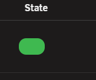 | Working. Nothing wanted. |
| 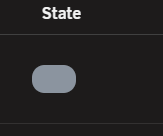 | At rest. Nothing wanted. |
|  | Worth knowing. Nothing to do right now. |
| 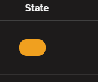 | Wants you, but nothing is broken. |
| 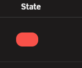 | Broken. |

## The marks

| Mark looks like | About |
|---|---|
| 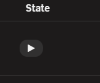 | The container is running. |
| 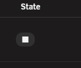 | The container is not running. |
| 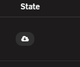 | There is an image to fetch. |
|  | The image has moved under a build. |
|  | A countdown, or something being held back. |
|  | Something needs restarting or rebuilding to take effect. |
|  | Something has gone wrong, or will. |
| 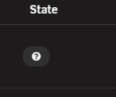 | The image or its tag is gone from the registry. |
| 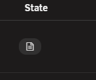 | The author's own published example. |

The warning triangle is the one mark used for more than a single subject: it always means
something has gone wrong, in three different places on the page. Where it appears more than once,
hover it: the text that pops up says which of the three you are looking at.

## Movement

Two things on the page actually move, and both mean something is live right now.

| Movement | Means |
|---|---|
| 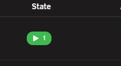 | A slow pulse. A health check the app runs on itself is passing right now. |
| 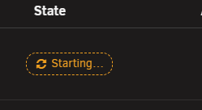 | A turning mark. A command you asked for is running right now. |
| 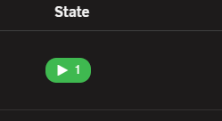 | Nothing moving. A standing state. Nothing is happening behind it. |

A dashed outline on its own is not movement. It is a shape more than one chip uses, some moving and
some not. Only the pulse and the turning mark mean something is live. If your system is set to
reduce motion, the movement stops, and only the words in this page and the chip's own hover text
tell a live chip from a still one.

## The state column

The first chip on a stack or container row.

| Looks like | Means | What to do |
|---|---|---|
|  | Running, and every check that exists says it is working | Nothing |
|  | Running, but nothing is checking it | Press it to see whether StaXX can work out a check |
| 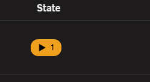 | Running, its own check has not finished deciding | Give it a moment |
| 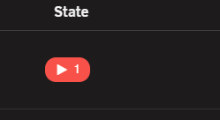 | Running, but the app inside says it is not working | Worth a look |
| 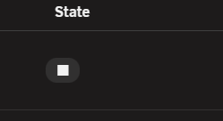 | Stopped, or never started from the file yet | Start it when you want it |
|  | A command you asked for is running right now | Wait, or press it to watch the log |
| 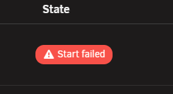 | That command failed | Press it to read what happened |

If a command's outcome is never seen by this page (most often because the browser tab was closed
or reloaded while it was running), the row shows no chip for it at all. It settles back to showing
whatever state the container is actually in.

## The update column

Sits beside the state chip, empty when there is nothing to report.

| Looks like | Means | What to do |
|---|---|---|
| 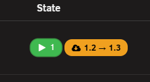 | A newer image has been published | Update when you are ready |
| 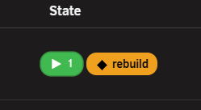 | Built here, and its base image has moved on | Rebuild when you are ready |
| 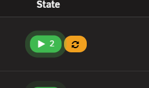 | The file has changed but the container has not been restarted to match | Restart to apply it |
| 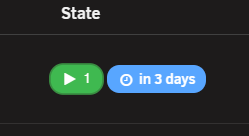 | An update is waiting and will install on its own; the chip says when | Nothing yet; the figure is when it happens |
| 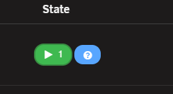 | The image or its tag is gone from the registry | Check the repository |
| 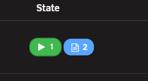 | The author's own published example does things this file does not | Open the stack to see what differs |
| 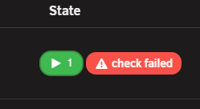 | The update check itself keeps failing | Worth a look |

Any of these shown with a stronger outline carries a full sentence behind it: hover, or press it on
a touch screen, to read it.

## Along the top of the list

Words, in their own colours, sometimes with the row's own mark for the same subject.

| Looks like | Means |
|---|---|
| 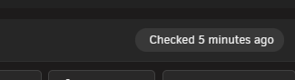 | When updates were last checked. This stays grey whether a check has just run, has never run, or did not finish. It is only ever a notice, never something you need to act on. |
| 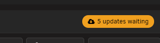 | How many updates are waiting to install, across every stack |
| 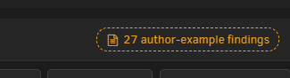 | How many author-example findings there are to look at |
| 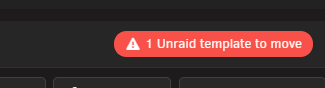 | Unraid still has old templates on flash that could rebuild a container StaXX has taken over, pushing its own container out |

When there is nothing to say about the author's example, or nothing waiting, that chip is left off
the bar entirely rather than shown empty or in red.

## Marks under the name

| Mark | Meaning |
|---|---|
| 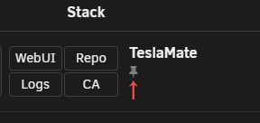 | One or more services is fixed to one exact build. Hover it to see which. |
| 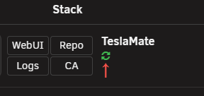 | This container installs updates on its own, whether from its own setting or the server's. See [choosing how a container updates](update-policy.md). |
| 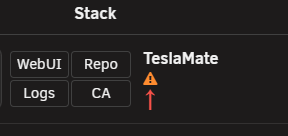 | Either the stack's file has drifted since it was imported, or a service is on a network that gives it its own address, so its ports do nothing. Hover it to see which. |

A coloured badge for a graphics card (blue for Intel, red for AMD, green for NVIDIA) means the
file asks for one. It stays even while the stack is stopped.

## Restart to apply

Shown when the running containers no longer match what the file on screen says. Nothing is broken
until you restart.

| Where it sits | Meaning |
|---|---|
| 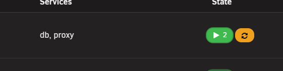 | Press it to see why, in plain terms, before deciding whether to restart |
| 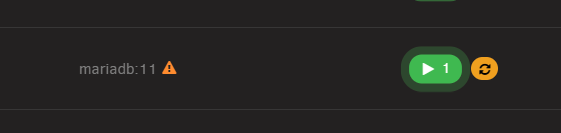 | The file now names a different image than the one running |
| 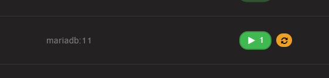 | See the reasons below |

All three reasons below show the same chip. Hover it to see which one you have.

| Reason shown on a service | Meaning |
|---|---|
| 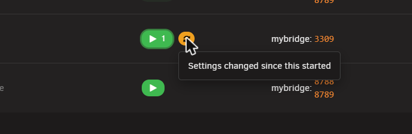 | The file has been edited since this container last started |
| 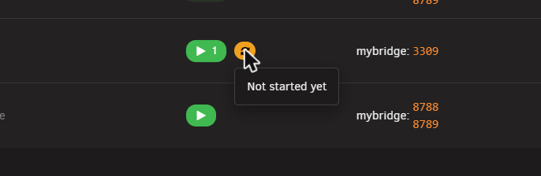 | In the file, never started |
| 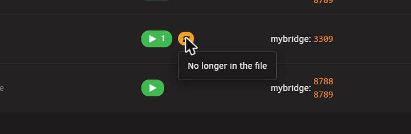 | Removed from the file after its container started; still running, but orphaned |

## Tags beside the name

| Tag | Meaning |
|---|---|
| 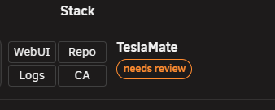 | [Imported](bringing-in-a-container.md) and not checked over yet. Confirm it from the row's own menu before it will start or update itself. |
| 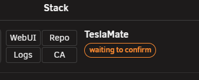 | Shown right after a handover, when an older container has switched off and this one is running in its place. Check the app still works, then answer in the row's own menu. |
| 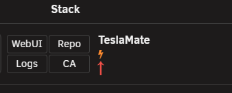 | Starts at boot. Hover it to see whether that is the whole stack, only part of it, or nothing, and whether a delay is set before the next one starts. |

## Broken stack marks

The strongest mark on the list: it replaces the app's own logo rather than sitting beside it. It
means the file could not be read, or none was found. The row states which, in red, with the
underlying complaint underneath.

Open the editor from this mark and fix the file. The row returns to normal on the next save. The
same mark appears on a [folder row](folders.md) when a stack inside it is broken.

## Health check offer

Press a green running chip that has nothing checking it and StaXX works out a health check for that
container. See [the health check offer](editing-a-stack.md#health-check-offer) for what happens next.

## Terms used here

Any word you are not sure of is in the [glossary](../glossary.md).

Back to [the StaXX guide](README.md).
