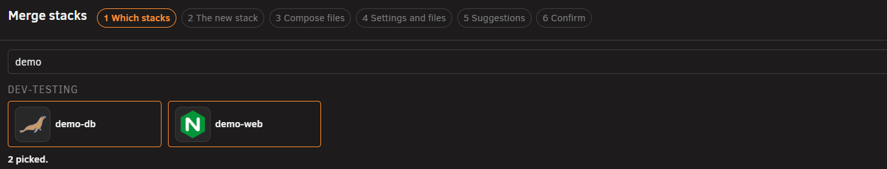
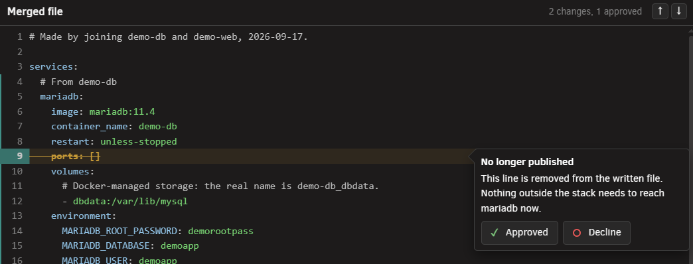
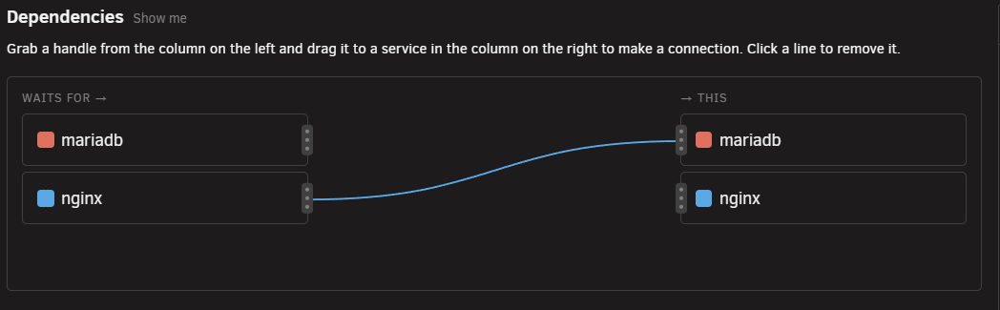

# Merging stacks into one

<!-- index: 65 | joining two or more stacks that are really one application into a single brand new stack: picking them, naming the new one, sorting out what changed, and reading the confirmation before anything is written. -->

An Unraid template describes one container. So an application that needs a database usually arrives
as two of them — installed separately, wired together by hand. Merging reads those stacks and writes
a new, third stack that holds all of them together. The two you started with are retired and kept to
one side until you decide to delete them, and are stopped only if you ask for it.

## Steps

1. Press **Merge**, in the top button row beside **Add stack**. Below a desktop-width window this
   button is not there at all — merging needs the room to show you the files side by side as you go.
2. **Pick two or more stacks.** Every stack is shown as a tile, grouped by folder. Click a tile to
   pick it, and it turns into a card showing its icon, name, folder, whether it is running, its
   image, its ports, how many folders and settings it carries, and its live figures such as memory
   and processor use. A stack that cannot be merged — its file will not read, it is under review, or
   it has a second settings file — is greyed out, with the reason in its place.

   <!-- PICTURE STILL TO BE TAKEN — uncomment once the screenshot exists:

-->

3. **Name the new stack and say where it lives.** Nothing is filled in for you, but a row of
   suggested names sits under the name box — click one to use it. Pick a folder from the ones you
   already have, **Loose stacks**, or make a new one on the spot. You cannot move on until both are
   filled in with something that is not already taken. Pick an icon and description from one of the
   stacks you are joining, or start blank.

   Beside the name box, the new file is already taking shape next to your original stacks. A line
   StaXX has changed carries a mark on its line number — hover it to read why, and to see the
   **Approve** and **leave it** buttons. Anything the finished file will drop rather than keep is
   shown with a line through it.
4. **Keep looking over the compose files.** Work on down the file the same way — hover a marked
   line for the explanation, then approve the change or leave it as it was. For example, StaXX may
   wire two containers to talk to each other directly now that they share a stack, instead of going
   out to your network and back in.

   <!-- PICTURE STILL TO BE TAKEN — uncomment once the screenshot exists:

-->

5. **Settle the settings, the files, and how the new stack behaves.** The same side-by-side view
   joins your stacks' settings lists into one. A setting both stacks already agree on is kept once;
   one they disagree on is kept separately, under its own name. Any file that would clash — two
   stacks each with a file of the same name, say — is flagged, and you choose to rename it, keep
   one, or leave it behind.

   Four boxes sit alongside this: **Dependencies**, for whether one container should wait for
   another to be ready before it starts; **Health checks**, for adding one so StaXX can tell when a
   container is actually working rather than merely running — a service whose image already
   declares its own health check says so here and needs nothing added; **Updates**, for whether the
   new stack updates manually or on its own; and **Notifications**, the same switches as everywhere
   else — see [choosing how a container updates](update-policy.md). Every choice you make appears in
   the file straight away, so you can see exactly what it adds.
6. **Choose what happens when you press Merge.** Two switches sit at the bottom of this step, both
   off to start: **Stop the original stacks** and **Start the new stack when done**. Turning on
   Start turns Stop on as well, since the old stacks and the new one cannot run at the same time.

   <!-- PICTURE STILL TO BE TAKEN — uncomment once the screenshot exists:

-->

7. **Read the confirmation, then press Merge.** Nothing has been written up to this point. The last
   screen shows the new stack's form and its file side by side, with a plain list of what pressing
   Merge will actually do.

   <!-- PICTURE STILL TO BE TAKEN — uncomment once the screenshot exists:

-->

Press **Merge** and the new stack is written and opened in the editor. Starting it is still your
decision, unless you switched on **Start the new stack when done** — StaXX starts it for you in that
case.

## Storage Docker looks after

Some containers keep their data in storage that Docker manages itself, rather than in a folder on
your array. That storage is named after the stack that made it, so a brand new stack would normally
get its own, empty storage under a new name — the database would look empty, not broken.

StaXX avoids this by pointing the new stack at the existing storage by its old name, so nothing is
copied and no data moves. The comment left in the file explains why the name still mentions the stack
you started with — it is a label, not a mistake.

## Files that came with your stacks

Anything sitting in a stack's folder besides the compose file — a certificate, a settings file, a
small folder of data — travels across into the new stack's folder too. If two stacks bring a file
with the same name, StaXX flags it and asks you to rename one, keep one, or leave it behind. If a
folder inside a stack holds more than a few files' worth of data, StaXX warns you about it rather
than copying it without a word.

## What happens to the stacks you merged

- **The originals are retired**, not deleted, whether or not you chose to stop them. They stay on
  your server, greyed out on the stack list, and cannot be started while they are in this state.
- **They are only stopped if you asked for it** — by switching on **Stop the original stacks**, or by
  switching on **Start the new stack when done**, which stops them for you first since the two
  cannot run side by side. Leave both switches off and the originals keep running until you deal
  with them yourself.
- **Each retired stack's row carries a Remove button.** Nothing is deleted until you press it.
- **The new stack starts its own history**, beginning with the file the merge wrote. The two
  originals keep their own history for as long as they exist.
- **Nothing is written until the last button is pressed.** Every step before Merge only decides what
  would happen; you can go back, change an answer, or cancel out of the whole thing at any point.

## What this never does

- It never keeps an original stack running once its containers move into the new one — Docker cannot
  move a container between stacks, so every one of them is rebuilt under the new name.
- It never deletes the stacks you merged. They survive, retired, until you press Remove yourself.
- It never guesses a connection between two containers it is not sure of. Anything it cannot place is
  left alone and said so.
- It never offers itself below a desktop-width window. There is no cut-down version of this tool.

## Not built yet

- Splitting a merged stack back into two separate ones is not built.

## Terms used here

Any word you are not sure of is in the [glossary](../glossary.md).

Back to [the StaXX guide](README.md).
