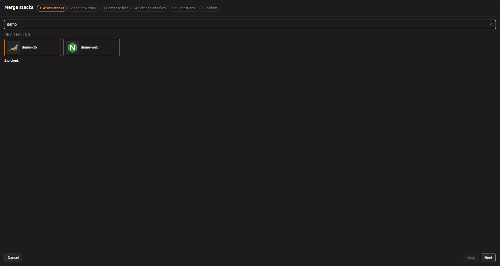

# Merging stacks into one

<!-- index: 65 | joining two or more stacks that are really one application into a single brand new stack, step by step through the six screens of the Merge tool: picking, naming, the compose files, the settings and files, the suggestions, and the confirmation. -->

An Unraid template describes one container. So an application that needs a database usually arrives
as two of them, installed separately and wired together by hand. Merging reads those stacks and
writes a new, third stack that holds all of them together. The originals are retired and kept to one
side until you delete them, and are stopped only if you ask for it.

Press **Merge**, in the top button row beside **Add stack**. The tool is a six-step window. Nothing is
written to your server until the last button on the last step, so you can go back, change an answer,
or cancel at any point. Every answer you give is kept when you go back.

The Merge button is not shown below a desktop-width window. The tool needs the room to show your
files side by side. If you make the window narrower while it is open, its panes hide behind a notice
until you widen the window again, and nothing is lost.

## The short version

1. Pick two or more stacks, then name the new one and choose its folder.
2. Answer every marked change in the joined compose file, then in the joined settings file.
3. Accept or ignore the suggestions: which container waits for which, health checks, updates and
   notifications.
4. Read the confirmation and press **Merge**. The new stack opens in the editor.

## Step 1 · Which stacks

1. Type in the **Search stacks…** box to shorten the list, or scroll.
2. Click a tile to pick it. Click it again to un-pick it.
3. Pick at least two. **Next** stays off until you have.

Tiles are grouped under their folder's name, with **Loose stacks** for those in no folder. Picking is
one tile at a time; a folder cannot be picked as a whole. The line under the tiles counts what you
have: **Nothing picked yet.**, **1 picked — pick at least one more.**, then **2 picked.** and up.

A tile that cannot be merged is greyed out, with the reason in place of its details:

| Reason shown | What it means |
|---|---|
| no compose file | The folder holds no compose file, so there is nothing to merge. |
| file cannot be read | The compose file is there but will not parse. Open it in the editor and fix it first. |
| under review | The stack came in through Import and has not yet been confirmed. |
| retired into … | This stack was already merged into another one. |

## Step 2 · The new stack

1. Type a name in the **Stack name** box, or click one of the suggested names under it.
2. Click a folder from the row, **Loose stacks**, or **New folder…** and type a name for it.
3. Check the cards on the right, one per stack you picked, then press **Next**.

The name may use letters, numbers, dashes and underscores. It becomes the folder the new stack lives
in and the name Docker stamps on its containers. The suggested names are made from the names you
picked: their shared beginning with **app** on the end, the shared beginning on its own, and the two
names joined. **Next** is refused while the name is empty, uses a character it cannot, or is already
taken in that folder. The message says which.

Each card on the right is a summary of one stack as it is right now: its icon, name, folder and
state; a line per service with its image and restart policy; then **Web address**, **Ports**,
**Folders**, **Settings** (how many are in its `.env` file), **CPU / memory** and **Network**.

There is no icon or description to choose here. A stack has no icon of its own; each service brings
its own, and they travel across untouched.

## Step 3 · Compose files

1. Read the joined file on the right. Every line carries a coloured stripe saying which stack it came
   from, and each stack's block opens with a comment naming it.
2. Find the changes: an amber line number marks a line StaXX changed. Use the **↑** and **↓** buttons
   above the file to step through them, or click **to answer** in the foot of the window to jump to
   the first one still waiting.
3. Click a marked line to open its card. Read the title and the reason, then press **Approved** or
   **Decline**.
4. Answer every change. **Next** stays off until you have.

The left pane shows one original file at a time. The strip above it lists the stacks you picked, one
numbered tab each, in their own colours. Click a tab to see that file, or use the **‹** and **›**
arrows to step through them one by one. Whenever you land on a change, the left pane switches to the
stack that change came from and both panes line up on it, so you can read what was written next to
what it became.

A line the finished file drops rather than keeps is shown struck through. Approving a change puts a
tick on its line; declining puts a ring on it and leaves the text exactly as it was written. A few
changes have no Decline button. These are renames the file cannot load without, and carrying a
database's storage across, which is explained below.

The kinds of change you can meet:

| Card title | What StaXX did |
|---|---|
| Now reaches *service* inside the stack | A setting pointed at another container by your server's address. It now names the service directly, since both live in one stack. |
| Now uses *service*'s own port | The same, for a port: the container's own port replaces the one that was published on your server. |
| No longer published | A port that only existed so the two stacks could reach each other is no longer opened on your server. |
| Two services publish port *N* | Both stacks open the same port on your server, which one stack cannot do. Approved moves one; Decline keeps both, and the stack will refuse to start until you change one yourself. |
| Moved off a clashing port | The port that was moved to make room. |
| Web address follows the moved port | The service's web page button now opens on the moved port. |
| Points at *stack*'s own storage | A database's Docker-managed storage is kept under its old name so no data moves. See below. |
| Path adjusted for the new stack's folder | A folder path written relative to the old stack now points at the same place from the new folder. |
| Joined the *network* network | The service joined a network the other service is on, so the two can reach each other. |
| Left on its own network | The two services share no network and StaXX will not invent one. Nothing changed; the line says so. |
| Renamed to keep it distinct | Two stacks used the same name for a service, a network, a volume or a reusable block. One was renamed so the file can load. |
| From the override file | A stack had a second compose file laid over the first. Its lines are folded in and marked. |
| The `version:` line is not carried | An old, ignored line is dropped. |
| This stack's own description is not carried | Two stacks each carried a stack-level description. The first is kept; the other is offered here. |

The foot of the window keeps the tally: **N decisions · N approved · N declined · N to answer**. The
last of those is a button. Press it and the window jumps to the first change still waiting, opens
its card, and after you answer, walks on to the next.

## Step 4 · Settings and files

1. Read the two **Settings** panes, one per stack, and **The joined settings file** on the right.
2. Answer each marked line in the joined file, the same way as on step 3.
3. Read the **Files** panes and answer any card about a file.
4. Check **The new stack's folder**, the tree at the bottom right, then press **Next**.

Every stack's `.env` settings file is joined into one, each stack's block under a comment naming it.
Two kinds of line are marked:

| Card title | The choice |
|---|---|
| Already set above, so not repeated | Both stacks set the same name to the same value. **Approved** keeps it once. **Keep both** keeps the second copy too. |
| Renamed — each stack meant a different setting | Both stacks used the same name for different things. StaXX renames the second one and rewrites the compose file to match. **Approved** takes that name. **Choose a name** lets you type your own. |

Click a setting's name on any pane and every line of that setting lights up on both sides, so you can
see where it is used.

Anything sitting in a stack's folder beside the compose file, such as an icon, a certificate or a
settings file, travels across into the new stack's folder. Each one says what will happen to it:
**Copied as …** for an icon renamed after its service, **not copied — points outside the stack** for
a link that leaves the folder, and a note that a copied key or certificate **will exist in two
places**. A folder over 10 MB is copied in full, with a warning so you know it is coming. Two file
cards can appear:

| Card title | Buttons |
|---|---|
| Same name from more than one stack | **Rename**, **Keep one**, **Leave it behind** |
| Not used by anything in the compose file | **Copy**, **Leave it behind** |

**The new stack's folder** shows the result as a tree: the merged file, the joined settings file, and
every file coming along, each with a note saying why it is named as it is. A file still waiting on an
answer says so in the tree.

## Step 5 · Suggestions

1. Read the **Dependencies** board. Press **Show me** to watch how a connection is drawn.
2. Drag a handle from a service on the left to a service on the right to say the first waits for the
   second. Click a line to remove it.
3. Under **Health checks**, switch **Add one** on for any service another one waits for.
4. Choose **Updates** and **Notifications** for the new stack, and watch **The new file** on the
   right take each change as you make it.

Nothing on this step is on by default, and nothing here can stop you pressing **Next**. Each box is
an offer; the file on the right stays as it was until you answer one.

| Box | What it does |
|---|---|
| Dependencies | A line from one service to another makes the first wait for the second to start. Lines StaXX drew from the changes you approved on step 3 are already there. **Show me** replays a short demonstration of the drag. |
| Health checks | A dependency line only waits for the other service to start, not to be ready. A database can be up for twenty seconds before it accepts a connection. A health check turns the wait into a real one. Each service says how many wait for it. **Add one** lets StaXX work a check out once the stack is running; **No — I want to add my own** opens the **Test**, **Every**, **Give up after** and **Retries** fields instead. A service whose image has a check built in says so and offers nothing. |
| Updates | **Default**, **Manual** or **Automatic** for the new stack. The line under it says what Default means on your server. Automatic adds **Immediately** or **After the delay**. See [choosing how a container updates](update-policy.md). |
| Notifications | The same three switches as everywhere else: **New image**, **Image installed**, **Installation failed**. |

## Step 6 · Confirm

1. Read the summary on the right. Every line is something pressing **Merge** will do.
2. Decide the two switches at the bottom: **Stop the original stacks** and **Start the new stack when
   done**.
3. Press **Merge**.

The left column is the new stack's form, read-only; the middle is its finished file. The summary says,
in order: the new stack's name and folder; that every container is built again, because Docker cannot
move a container between stacks; that the database keeps its data; how many changes you approved and
what they were; how many files come along and their size; that the originals are retired; and that
nothing is deleted.

Both switches start off. **Start the new stack when done** turns **Stop the original stacks** on as
well, because the new stack and the originals cannot run at the same time. They share ports and
storage. The sentence under the switches says exactly what your choice means:

| Switches | What happens |
|---|---|
| Both off | The originals keep running. Stop them yourself before starting the new stack, or the two will fight over the same ports and storage. |
| Stop only | The originals are stopped and retired; the new stack is written and opened in the editor for you to start yourself. |
| Start on | Starting the new stack stops the originals first. |

Press **Merge** and the new stack is written and opened in the editor. It is started only if you asked
for that.

## Storage Docker looks after

Some containers keep their data in storage that Docker manages itself, rather than in a folder on
your array. That storage is named after the stack that made it, so a brand new stack would normally
get its own, empty storage under a new name. The database would look empty, not broken.

StaXX points the new stack at the existing storage by its old name, so nothing is copied and no data
moves. The comment left in the file explains why the name still mentions the stack you started with.
It is a label, not a mistake.

## What happens to the stacks you merged

- **The originals are retired**, not deleted. They stay on your server, greyed out on the stack list
  with **retired into …** on the row, and cannot be started while they are in this state.
- **They are only stopped if you asked for it**, with either switch on step 6. Leave both off and
  they keep running until you deal with them yourself.
- **Each retired stack's row carries a Remove button.** Nothing is deleted until you press it.
- **The new stack starts its own history**, beginning with the file the merge wrote. The originals
  keep theirs for as long as they exist.

## What this never does

- It never keeps an original stack running once its containers move into the new one. Docker cannot
  move a container between stacks, so every one of them is rebuilt under the new name.
- It never deletes the stacks you merged. They survive, retired, until you press Remove yourself.
- It never guesses a connection between two containers it is not sure of. Anything it cannot place is
  left alone and said so.
- It never writes anything before the last button on the last step.
- It never offers itself below a desktop-width window. There is no cut-down version of this tool.

## Not built yet

- Splitting a merged stack back into separate ones is not built.

## Terms used here

Any word you are not sure of is in the [glossary](../glossary.md).

Back to [the StaXX guide](README.md).
