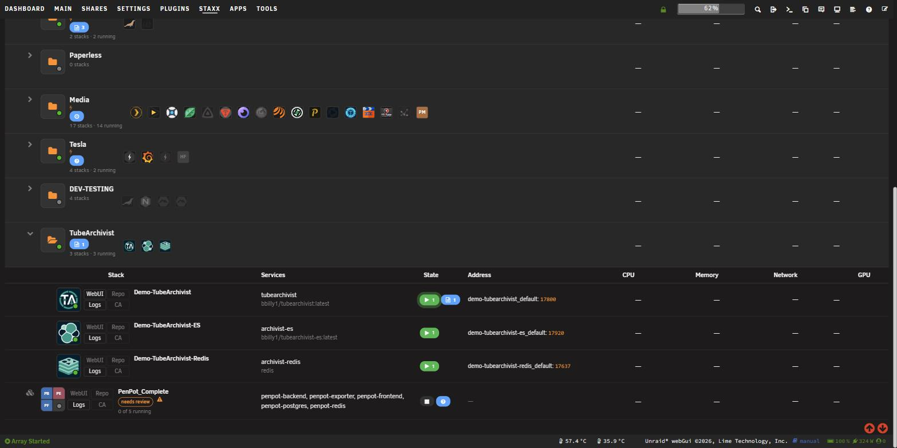
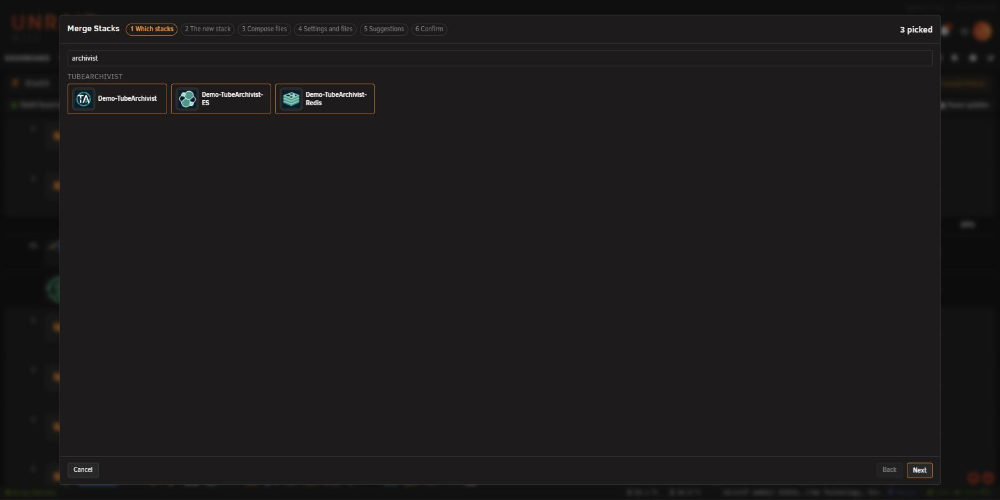
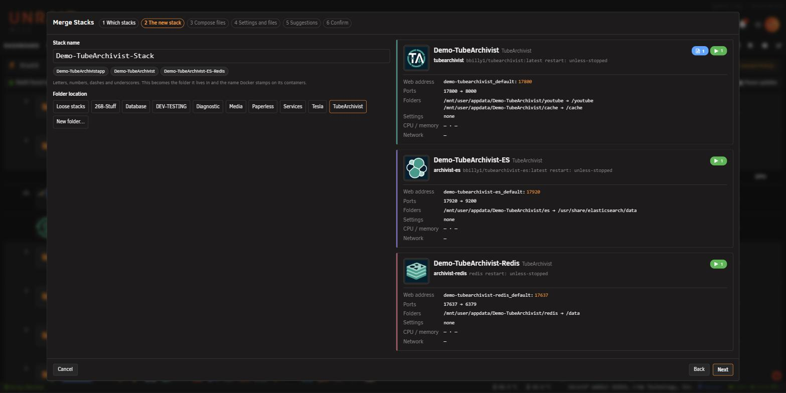
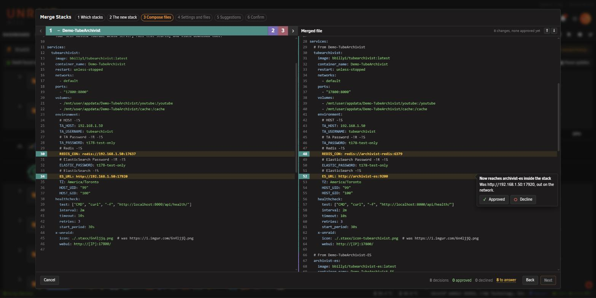
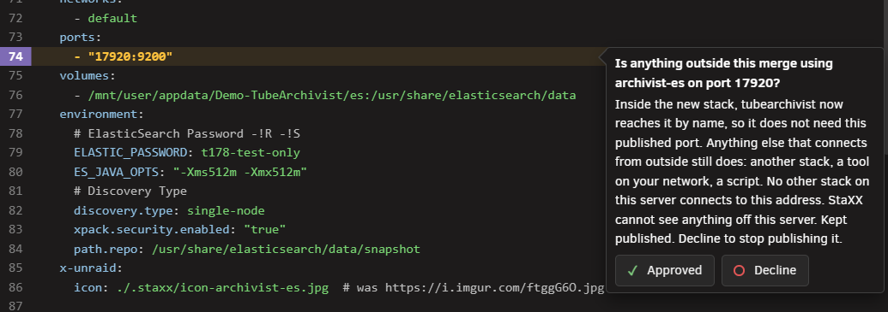
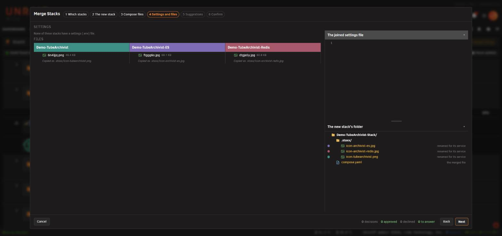
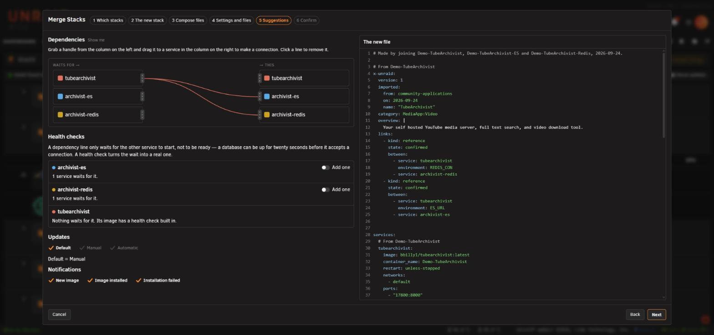
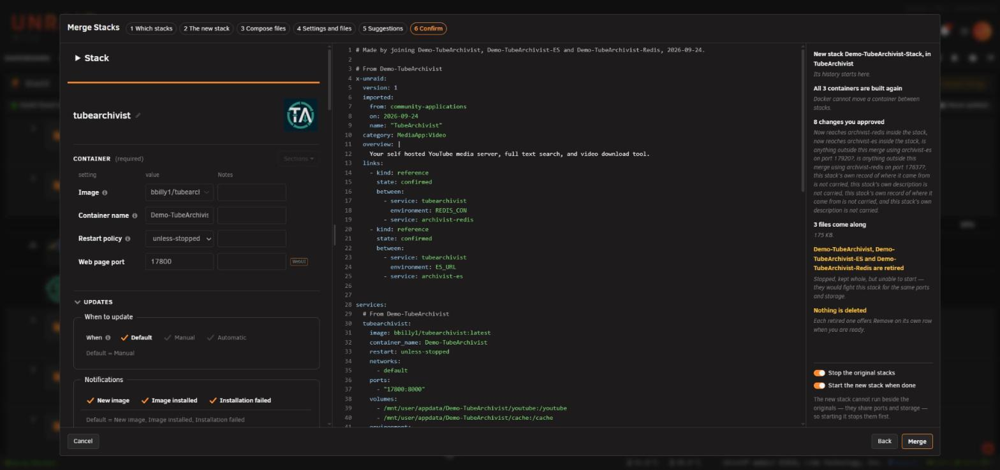
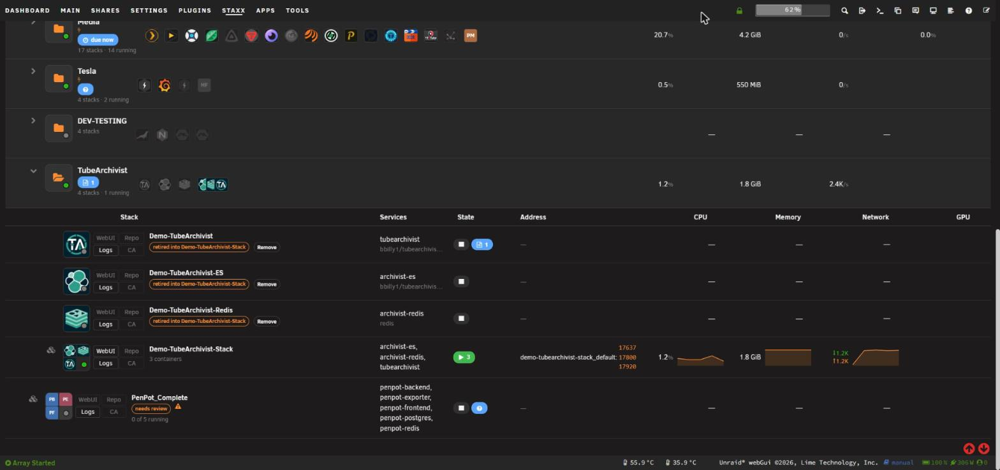

# Example: merging Tube Archivist

<!-- index: 66 | a worked example of the Merge tool: joining the three Tube Archivist apps from Community Applications into one stack, with every card you will see and the answer to give. -->

Tube Archivist comes from Community Applications as three separate apps: **TubeArchivist** itself,
**TubeArchivist-ES** for its search, and **TubeArchivist-Redis** for its cache. Installed that way,
the main app reaches the other two through your server's address. This page joins the three into
one stack, so they reach each other by name and start and stop together.

Each screen is covered in full on [Merging stacks into one](merging-stacks.md). This page shows only
what you meet with these three apps.

## The short version

1. Open **Add**, choose **Merge stacks…**, and pick the three Tube Archivist stacks.
2. Name the new stack and choose its folder.
3. Approve all eight cards.
4. Turn on **Start the new stack when done** and press **Merge**.

## Before you start

The three apps must already be StaXX stacks, and Tube Archivist must be working: its page opens and
you can sign in. Here they sit in a folder called **TubeArchivist**.

## Step 1 · Which stacks

Type `archivist` in the search box and click the three tiles.

## Step 2 · The new stack

Give the new stack a name and choose the folder it goes in. This example uses
**Demo-TubeArchivist-Stack** in the **TubeArchivist** folder.

## Step 3 · Compose files

The tool shows eight cards. Approve every one. The port numbers on your cards are the ones your
own stacks publish.

| Card | What it means for Tube Archivist |
|---|---|
| **Now reaches archivist-redis inside the stack** | The app's Redis setting named your server's address. It now names the Redis service. |
| **Now reaches archivist-es inside the stack** | The same for its search setting, which now names the search service. |
| **Is anything outside this merge using archivist-es on port 17920?** | Approve keeps the port open on your server. Decline closes it. |
| **Is anything outside this merge using archivist-redis on port 17637?** | The same for Redis. |
| **This stack's own record of where it came from is not carried** | Shown once for the search stack and once for the Redis stack. The new stack keeps the main app's record. |
| **This stack's own description is not carried** | The same for each stack's description. |

Approve on a port card keeps the port. Choose Decline only if nothing outside Tube Archivist connects
to its search or its Redis, and you want those ports closed.

## Step 4 · Settings and files

None of the three apps has a settings file, and their data lives in appdata, so there is nothing to
answer here. Press **Next**.

## Step 5 · Suggestions

The board shows **tubearchivist** waiting for **archivist-es** and **archivist-redis**. Keep both
lines.

## Step 6 · Confirm

Turn on **Start the new stack when done**. **Stop the original stacks** turns on with it. Press
**Merge**.

The new stack starts with all three apps inside it. Open Tube Archivist's page and sign in as
before; your settings and downloads are where they were. The three original stacks stay in the
folder, retired, until you remove them.

## Terms used here

Any word you are not sure of is in the [glossary](../glossary.md).

Back to [the StaXX guide](README.md).
