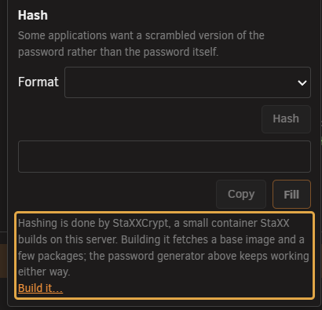

# Password generator and hashing tool

<!-- index: 42 | the Password button in a stack's editor: making a password or a passphrase, turning one into the scrambled form some apps ask for, and why a dollar sign is written twice in a compose file. -->

Some apps want a password. Some want it scrambled first. The **Password** button does both, in
[the stack editor](the-stack-editor.md), without the value ever leaving the page.

## The short version

1. Open the stack and press **Password**.
2. Click into the box you want filled.
3. Press **Fill** to put the password there, or **Copy** to take it with you.
4. For the scrambled form, choose a format, press **Hash**, then use that half's own **Fill** or
   **Copy**.

## Making a password

Two kinds, chosen with buttons at the top of the panel.

| Kind | Example | You can change |
|---|---|---|
| Characters | `k7#mQ-vp2Rz` | Length, and whether to include capitals, digits and punctuation |
| Words | `harbour-cedar-lantern-quiet` | How many words, and what goes between them |

Change any of these and a new password appears. **Regenerate** makes another one at any time.

You can also type or paste your own password in. Everything below works the same on it.

### Strength

A strength reading sits under the box, in bits: higher is harder to guess. Type your own password
over the top and the reading still shows, labelled an estimate.

### Dollar sign excluded

The character options leave the dollar sign out of a generated password. See
[doubling a dollar sign](#doubling-a-dollar-sign) for why that matters. No other character is held
back.

## Fill and Copy

The password and its hash each have their own **Fill** and **Copy** pair.

| Button | Does |
|---|---|
| Fill | Puts the value in whichever box you last clicked |
| Copy | Puts it on your clipboard |

**Fill** asks first if the box already holds something, and names what is there.

Filling a box counts as an edit. **Undo** takes it back, the same as any other change on
[the stack editor](the-stack-editor.md).

While [Sanitise mode](hiding-your-values.md) is on, **Fill** is switched off; the panel and **Copy**
still work.

The panel does not keep a password after you close it. Copy or fill it in before you do.

## Making the scrambled form

Some apps refuse a plain password and want it scrambled first, called a **hash**. Do that in the
**Hash** section, in the lower half of the panel.

The **Format** list only offers formats this server can produce:

| Format | Where you will meet it |
|---|---|
| bcrypt | Web apps, and anything using an Apache-style password file |
| SHA-512 crypt | Linux system accounts, and apps that borrow that format |
| SHA-256 crypt | The same, in a shorter form |
| argon2id | Newer apps, such as Vaultwarden |

Choose a format and press **Hash**. A format marked **(lighter check)** has had its shape confirmed
on this server, but not that it produces a working hash, and that note stays on it.

### The result

Once a hash is made, the result box holds it, with its own **Copy** and **Fill** underneath, and a
note about the dollar signs it always contains: see
[dollar signs in a hash](#dollar-signs-in-a-hash) below. If you lose the password itself, make a new
one and hash it again. A hash cannot be turned back into it.

### The hashing container

Hashing is done by a small container on your server called **StaXXCrypt**. If it is not built yet,
the Hash section shows a note and a **Build it…** button in place of the **Format** dropdown. The
password half of the panel works either way.

A hash takes a second or two to come back, and the panel shows a message while you wait. StaXXCrypt's
own state, and buttons to build, recreate or rebuild it, are on the [settings panel](settings.md).

## Doubling a dollar sign

In a compose file, a dollar sign starts the name of a variable: a value the file expects to be
defined somewhere else. Write `pa$$word` as a password and the app receives `pa`, with nothing to
say why.

Quoting it does not help. Write the dollar sign twice instead: `pa$$$$word` in the file delivers
`pa$$word` to the container.

### Dollar signs in a hash

Every hash starts with a dollar sign and holds several more, such as `$argon2id$v=19$...` or
`$2y$12$...`. Paste one straight in and most of it is lost.

So StaXX writes each one twice for you:

| Where | What happens |
|---|---|
| Fill | Always writes the doubled, compose-file form |
| Copy | Shows a message first, whenever there is a dollar sign in what you are copying. Press **I understand** to copy the doubled form; close it any other way and nothing copies |
| Under a hash you have made | A line notes that a hash always has dollar signs, and that both buttons double them |

The doubled form stays showing in the box afterwards: that is what the compose file has to contain.

If you are pasting somewhere else instead, such as a file of environment variables or an app's own
settings screen, a single dollar sign is what belongs there. Select the plain version shown in the
box and copy it by hand.

### A value already in your file

Open a stack holding a value written with a single dollar sign, whether pasted in from elsewhere or
written before StaXX doubled these for you, and you are told. A message names every value and which
setting it belongs to:

> A dollar sign is where Compose starts reading a variable name, so it deletes these before the
> container ever sees them. Writing each one twice is the fix, and the container still receives them
> exactly as they read above.

| Button | Does |
|---|---|
| Write each one twice | Corrects every value in one press. **Undo** takes the whole lot back |
| Leave them | Closes the message and changes nothing. Each value still carries its own note and its own fix, one at a time |

The message returns next time you open that stack until you act. Fixing it never needs a new
password: a scrambled value written this way is already the right one, only written in a way Compose
could not read.

Docker's own reference covers this in full:
[interpolation in a compose file](https://docs.docker.com/reference/compose-file/interpolation/).

## Terms used here

Any word you are not sure of is in the [glossary](../glossary.md).

Back to [the StaXX guide](README.md).
