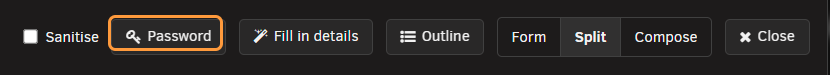
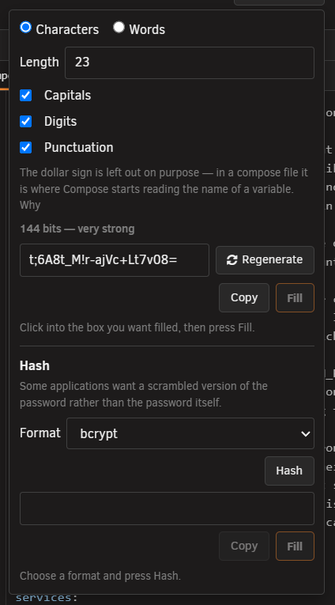
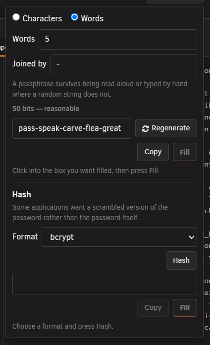
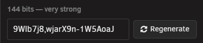
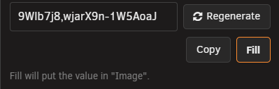
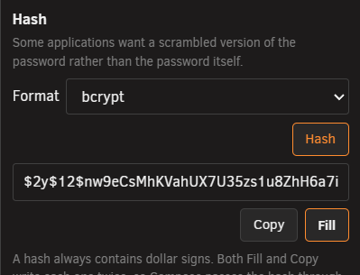
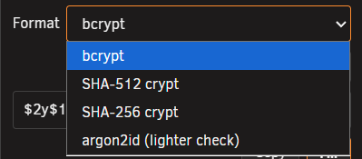
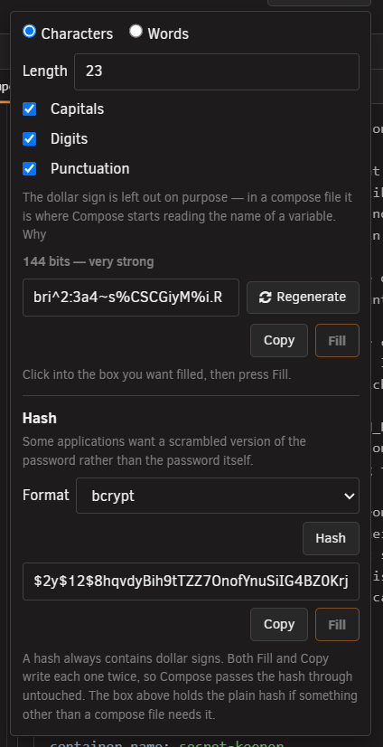

# Password generator and hashing tool

<!-- index: 42 | the Password button in a stack's editor: making a password or a passphrase, turning one into the scrambled form some apps ask for, and why a dollar sign is written twice in a compose file. -->

Some apps want a password. Some want it scrambled first. The **Password** button does both, in
[the stack editor](the-stack-editor.md), without the value ever leaving the page.

## Steps

1. Open the stack and press **Password**.
2. Click into the box you want filled.
3. Press **Fill** to put the password there, or **Copy** to take it with you.
4. For the scrambled form: choose a format, press **Hash**, then use that half's own **Fill** or
   **Copy**.

## Making a password

Two kinds, chosen with buttons at the top of the panel.

| Kind | Example | You can change |
|---|---|---|
| Characters | `k7#mQ-vp2Rz` | Length. Whether to include capitals, digits and punctuation |
| Words | `harbour-cedar-lantern-quiet` | How many words, and what goes between them |

Change any of those and a new one appears. **Regenerate** gives you a different one on demand.

You can type or paste your own password in at any time. Everything below works the same on it.

### Strength

A strength reading sits under the box, in bits. Higher is harder to guess. Type your own password
over the top and the reading still shows — but it is only ever labelled an estimate, because there
is no recipe behind a typed password to measure.

### The dollar sign is left out

The panel says so, under the character options:

> The dollar sign is left out on purpose — in a compose file it is where Compose starts reading the
> name of a variable.

[Why a dollar sign is special](#why-a-dollar-sign-is-special) explains what would otherwise happen.
Nothing else is held back.

## Fill and Copy

The password and its hash usually go to two different places, so each half has its own pair.

| Button | Does |
|---|---|
| Fill | Puts the value in whichever box you last clicked |
| Copy | Puts it on your clipboard |

**Fill asks first if the box already holds something**, and names what is there — a working
credential quietly replaced is a broken app.

Fill goes through the ordinary editing path. It lands in the stack's history, and **Undo** takes it
back like any other change.

While [Sanitise mode](hiding-your-values.md) is on, Fill is turned off — the panel and **Copy** still
work.

## Making the scrambled form

Some apps refuse a password outright and want it put through a one-way scramble first — a **hash**.
That is the **Hash** section, in the lower half of the panel.

Only formats this server has actually proved it can produce are offered:

| Format | Where you will meet it |
|---|---|
| bcrypt | Web apps, and anything using an Apache-style password file |
| SHA-512 crypt | Linux system accounts, and apps that borrow that format |
| SHA-256 crypt | The same, in a shorter form |
| argon2id | Newer apps, such as Vaultwarden |

Choose one, press **Hash**, and the value appears below it. A format may say **(lighter check)** —
this server could prove it makes the right shape, but not that it round-trips, so it says so rather
than hiding it.

### The result

Once a hash is made, the result box holds it, with its own **Copy** and **Fill** underneath, and a
note explaining the dollar signs it always contains — see [below](#where-this-bites-hardest).

### It needs a small container, once

Hashing is done by a small container on your server called **StaXXCrypt**. If it is not built yet,
the Hash section shows a note and a **Build it…** button instead of the Format dropdown. The
password half works either way.

Because the container starts and stops for one request, a hash takes a second or two — the panel
says so while you wait. StaXXCrypt's own state, and buttons to build, recreate or rebuild it, are
also on the [settings panel](settings.md).

## Why a dollar sign is special

In a compose file, a dollar sign is where Compose starts reading the *name of a variable* — a value
it expects defined somewhere else. A password of `pa$$word` is read as `pa` plus two variables that
probably do not exist, and the app receives `pa`. Nothing warns you; the app just says the password
is wrong.

**Quoting it does not help.** The substitution happens after the file is read, so quote marks make
no difference.

The fix is to write it **twice**. `pa$$$$word` in the file delivers `pa$$word` to the container. It
looks odd, and it is correct.

### Where this bites hardest

Every hash starts with a dollar sign and holds several more — `$argon2id$v=19$...`, `$2y$12$...`.
Paste one straight in and most of it is eaten.

So StaXX writes each one twice for you, and says so:

| Where | What happens |
|---|---|
| Fill | Always writes the doubled, compose-file form |
| Copy | Shows a message first, whenever there is a dollar sign in what you are copying. Press **I understand** to copy the doubled form; close it any other way and nothing copies |
| Under a hash you have made | A line explains that a hash always has dollar signs, and that both buttons double them |

The doubled form is left showing in the box afterwards, on purpose — it is what the file has to
contain.

**If you are pasting somewhere else** — a file of environment variables, or an app's own settings
screen — a single dollar sign is what belongs there. The box still holds that plain version; select
it and copy it by hand.

### A value already in your file

Open a stack holding a value written with single dollar signs — pasted in from elsewhere, or from
before StaXX did this for you — and you are told. A message names every value and which setting it
belongs to:

> A dollar sign is where Compose starts reading a variable name, so it deletes these before the
> container ever sees them. Writing each one twice is the fix, and the container still receives them
> exactly as they read above.

| Button | Does |
|---|---|
| Write each one twice | Corrects every value in one press. **Undo** takes the whole lot back |
| Leave them | Closes the message and changes nothing. Each value still carries its own note and its own fix, one at a time |

The message returns next time you open that stack, until you act — the file is still wrong until
then. Fixing it never needs a new password: a scrambled value is the right one already, only written
in a way Compose was eating.

### What the check stays quiet about

- `${LIKE_THIS}` — plainly meant as a variable, and treated as one.
- A dollar sign already written twice — that one is correct.
- A name the file's own environment-variable settings genuinely provide.

It does speak up about a dollar sign Compose cannot read as a name, a scrambled password, and a name
**nothing** provides — that last one is quietly replaced with nothing, ruining the value just as
badly as the others.

Docker's own reference is
[interpolation in a compose file](https://docs.docker.com/reference/compose-file/interpolation/).

## What this never does

- **Sends nothing anywhere.** Passwords are made in your browser. Scrambling happens in a container
  on your own server, built with no network access at all.
- **Never stores the password.** Closing the panel blanks both boxes. Copy it out first if you want
  to keep it.
- **Never turns a hash back into a password.** If you lose the password, make a new one and hash it
  again.
- **Never guesses which format your app wants.** That is on the app's own documentation.

## Not built yet

- Checking a password against a hash you already have. The tool behind argon2id has no way to check
  one, so this could only work for some formats, not all.
- Remembering a password between sessions. StaXX is not a password manager.
- Flagging a dollar sign as you type it. The check above runs when a stack is opened, not as you
  type, so something you have just typed is flagged next time you open that stack.

## Terms used here

Any word you are not sure of is in the [glossary](../glossary.md).
