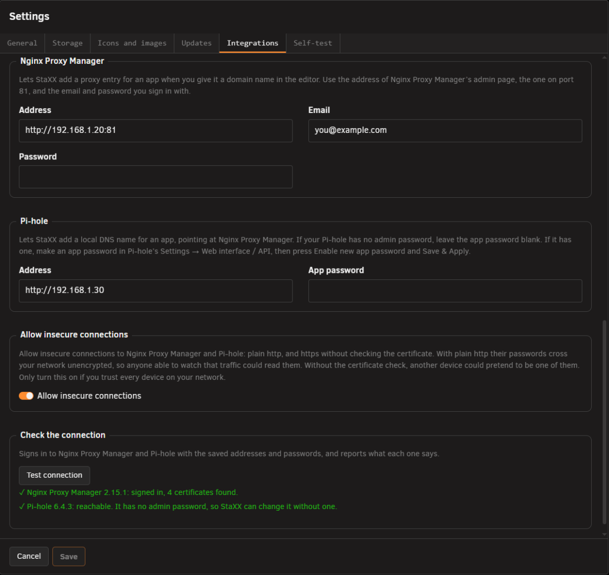
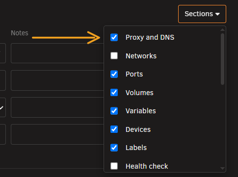
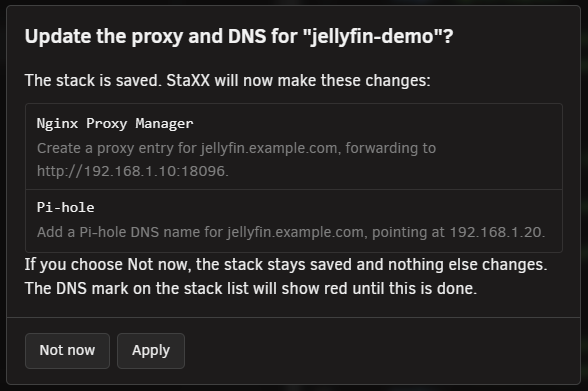
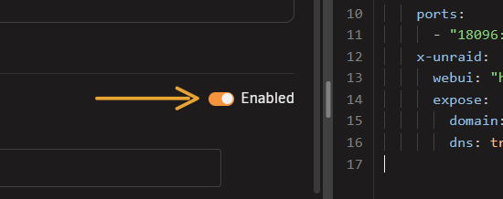
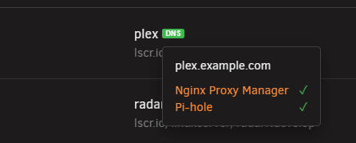

# Proxy and DNS

<!-- index: 47 | giving an app a web address through Nginx Proxy Manager and a local DNS name in Pi-hole, and what the DNS mark on the stack list means. -->

Give an app a domain name and StaXX creates its proxy entry in Nginx Proxy Manager. It can also add
the same name to Pi-hole, so devices on your network find the app by it. You need Nginx Proxy
Manager; Pi-hole is optional.

## The short version

1. Connect StaXX to Nginx Proxy Manager, and to Pi-hole if you use it, on the **Integrations** tab
   of Settings.
2. Open the app's stack, press its **Sections** button, and turn on **Proxy and DNS**.
3. Type a domain name, choose a certificate, and turn on **DNS name** if you want one.
4. Press **Save**, then **Apply** to write the entry into Nginx Proxy Manager and Pi-hole.

## Setting up the connection

Under **Settings**, on the **Integrations** tab, fill in the address of Nginx Proxy Manager's admin page
(the one on port 81) and the email and password you sign in with there. Fill in Pi-hole's address too if
you want local DNS names as well. Press **Save**, then **Test connection** to check both.

If either service only answers on plain http, or its certificate cannot be checked, turn on
**Allow insecure connections** first. Every setting on this tab is described in [Settings](settings.md).

**Pi-hole passwords.** If your Pi-hole has no admin password set, leave the **App password** box
blank. That Pi-hole ignores app passwords and reports any you try as incorrect. If
your Pi-hole does have an admin password, make an app password for StaXX instead of using the admin
one: in Pi-hole, go to **Settings → Web interface / API**, switch to **Expert**, open **Configure
app password**, press **Enable new app password**, then **Save & Apply**. Paste the app password
Pi-hole shows you into StaXX's Integrations tab. Pi-hole may also need **Permit destructive actions
via API** turned on, in the same place, before StaXX can add or remove names. This needs Pi-hole 6;
an older Pi-hole cannot be connected.

## Adding the section to an app

Open the stack, press the service's **Sections** button, and tick **Proxy and DNS**. The section
appears after **Updates**. Start the app at least once before you save a domain name for it.

## The Proxy and DNS section

| Row | What it does |
|---|---|
| **Domain name** | The address the app answers on, such as `sonarr.home.lan`. Typing one gives the app a proxy entry. |
| **Certificate** | Which certificate Nginx Proxy Manager uses for this domain, picked from the certificates already stored there. Leave it unset for a plain, unencrypted entry. |
| **WebSockets** | Whether the proxy allows WebSocket connections through to the app. On by default. |
| **DNS name** | Adds a matching name in Pi-hole, pointing at Nginx Proxy Manager. Only shown once Pi-hole is connected. |
| **Status** | Whether the entry in Nginx Proxy Manager and Pi-hole currently matches what is set here. |

The **Enabled** switch beside the heading switches the proxy entry on or off in Nginx Proxy Manager.
Its settings are kept while it is off.

## Saving and applying

Press **Save** as usual. If the Proxy and DNS group has changed, StaXX then shows what it is about
to do in Nginx Proxy Manager and Pi-hole, one line per change.

Press **Apply** to make the changes now, or **Not now** to leave the stack saved without applying
them yet. Left unapplied, the app's DNS mark on the stack list shows red until you apply it, from
here or from the mark itself.

## Taking over an entry you already have

If Nginx Proxy Manager or Pi-hole already has an entry for the domain you typed, the box after
**Save** offers to take it over. It lists anything that would change, or says **Nothing about it
changes.** Press **Apply** to take it over as it is.

- A proxy entry that answers for several domain names must be split in Nginx Proxy Manager first,
  one name per entry.
- Each app in StaXX needs a domain name of its own.

## Switching off and removing

Turn **Enabled** off to switch the proxy entry off. The Pi-hole name stays as it is.

Press **Remove from proxy and DNS** to take the app off both services. The proxy entry and the
Pi-hole name are deleted when you save.

If you clear the domain name or turn **DNS name** off instead, **Save** asks what to do with each
entry: switch the proxy entry off, delete it or keep it, and delete or keep the Pi-hole name.

## The DNS mark on the stack list

An app with a domain name shows a small **DNS** mark beside its service name: green when its
entries match, red when one is missing or changed, grey when switched off. Press a red mark to open
the editor at this app's Proxy and DNS section. The [marks page](marks.md) has the full key.

## Archiving a stack

Removing a stack that has proxy or Pi-hole entries asks what to do with each of them. See
[removing a stack](removing-a-stack.md).

## Terms used here

Any word you are not sure of is in the [glossary](../glossary.md).

Back to [the StaXX guide](README.md).
