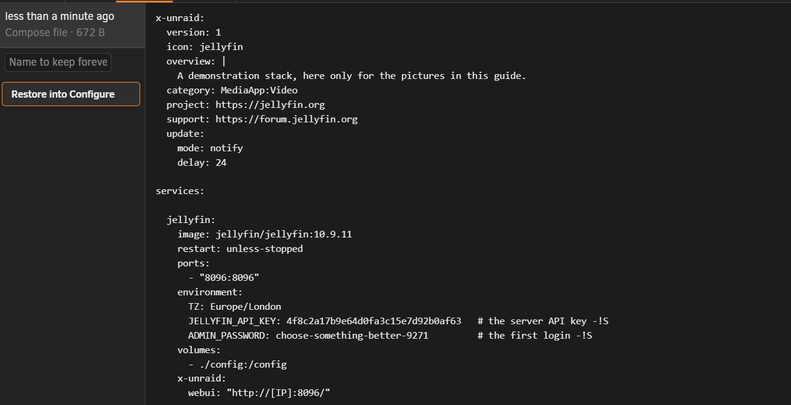
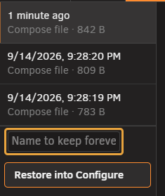
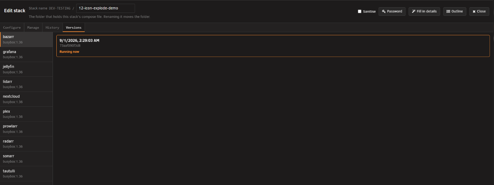
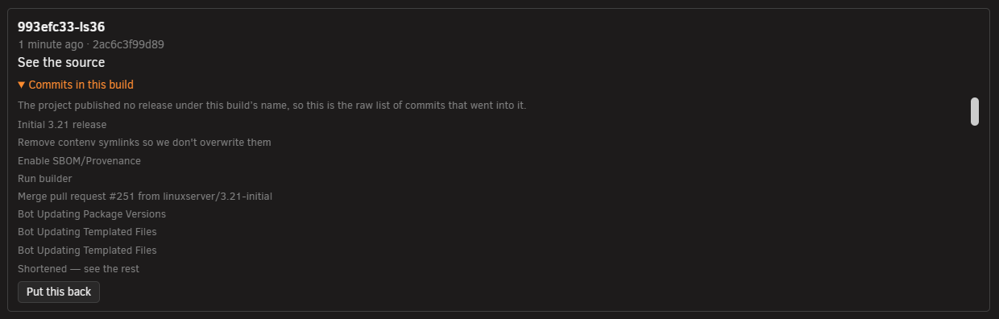
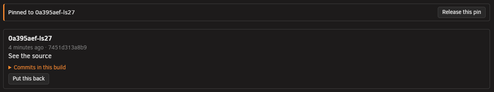
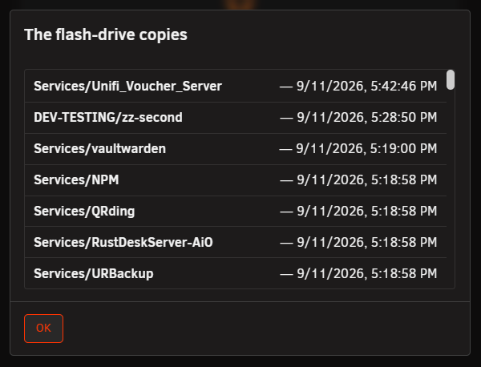

# Recovery and redundancy

<!-- index: 75 | how to return to an earlier version of a stack's file, or to an earlier build of one of its images, what each list holds, why some things cannot be gone back to, and bringing every stack back if the data store is lost. -->

**History** undoes your own edits to a stack's file. **Versions** undoes an app's own update. Both
sit in the [stack editor](the-stack-editor.md), beside **Configure**.

## History tab

1. Open the stack. Click **History**.
2. Click a version on the left to read it.
3. Press **Restore into Configure** to load it into the form. Nothing is written until you save.
4. Press **Save** to keep it, or **Undo** to put the previous version back.

Every save keeps a copy of both what you replaced and what you just wrote, so the newest row is
always the file as it now stands. A save that changes nothing is not kept. A file you drop into the
folder yourself gets its first copy the first time you open or start it.

### What the list shows

| On the row | What it is |
|---|---|
| A time | Relative if today, otherwise the full date. |
| A name, in bold | Only if you named that version. See below. |
| Which file | The stack's main file, or its override file. |
| A size | How big that version was. |

Click a row to read it on the right.

### Naming a version

| Kind | How long it is kept |
|---|---|
| Unnamed | Newest 20. Older ones are deleted as new saves arrive. |
| Named | Forever, and it does not count towards the 20. |

Type a name into **Name to keep forever** — "before I touched the ports" — to stop it ageing out.

Clear the name to put the version back in the queue of the last 20, where it can be deleted the
moment a newer one is saved.

### Missing compose file

If the compose file is deleted or lost, the row reads **"No compose file in this folder"**.

Click the row to load your last working copy, dated, the same way as restoring above.

Never saved or opened here at all? You get the blank starting file instead — see
[making a stack from scratch](making-a-stack.md).

### Restore limits

- An override version cannot be restored from here yet. Open its own tab and copy the text in by
  hand.
- Turn off **Sanitise** to bring **History** back. See [hiding your values](hiding-your-values.md).

## Versions tab

1. Open the stack. Click **Versions**.
2. Pick a service on the left. Its recorded builds appear on the right.
3. Find the build you want and press **Put this back**.

A row on the [stack list](the-stack-list.md) offering an update it can undo carries **Roll back…**
on its menu, which opens **Versions** with the right service already picked.

<!-- SHOT: recovery-and-redundancy-rollback-menu | close-up | a stack row's menu open, showing the "Roll back…" item -->

### A build's row

| On the row | What it is |
|---|---|
| A heading | The build's version name, or its date where the publisher gave none. |
| Date and a fingerprint | Enough to tell two unnamed builds apart. |
| **See the source** | Where the image was published, when known. |
| What changed | The release notes, captured at the moment that build was pulled. |
| **Running now**, or **Put this back** | The build you're on has no button; every other one offers to return you to it. |

Where the publisher wrote no release notes, you get the raw list of commits that went into the
build instead.

### Put this back

Press **Put this back** and StaXX edits the compose file to name that exact build. The file it
replaced goes into **History**, so you can undo the change there.

The confirmation tells you a later pull will not move the service off this build on its own, and
that the version you are moving away from will not come back by itself.

Where the stack has an override file, read the confirmation carefully — an image set there can
override the pin.

### Pinning and releasing

Naming an exact build is what "pinned" means — see the pin mark on
[the stack list](the-stack-list.md#row-marks). A pinned service shows **Pinned to …** with
**Release this pin** beside it, whether the pin came from here or was typed into the file by hand.

Press **Release this pin** and the compose file stops naming an exact build, so the service follows
its tag again. Nothing restarts until the next update or recreate moves it.

### Nothing recorded yet

A build is only recorded the first time StaXX updates that image. See [updates](updates.md).

### Rollback limits

Only a build StaXX itself recorded for a service can be restored to.

| Message | What it means |
|---|---|
| *"There is no earlier version recorded for this service, so it cannot be rolled back."* | Nothing has been recorded for it yet. |
| *"The previous version is no longer present on this server, so it cannot be rolled back to."* | Recorded, but the image has since been removed from the server. |
| *"This service is not pinned to a version, so there is nothing to release."* | You asked to release a pin on a file that names no exact build. |

Two [settings](settings.md) decide how much is available: how many previous versions of each image
are kept, and whether images left behind by updating are removed automatically.

## If the data store is lost

StaXX keeps a plain copy of every stack's compose file on the flash drive (see
[where things live](where-things-live.md)). If the data store itself is ever lost, StaXX offers to
bring every stack back from those copies.

If the data store's folder is missing, press **Choose a new place for the data store** to pick
somewhere new, the same dialog as a first install. Press **Show me the copies** first to list what
the flash drive holds.

If the data store exists but is empty, press **Bring back *N* stacks** to write every stack on the
flash drive into the store. Press **Show me what is there** to list them first, with the date of
each copy, or **Put the data store somewhere else first** to point the store elsewhere before you
restore anything.

Neither option starts anything — a restored stack sits ready to open and start when you choose to,
exactly like an imported one, and begins a fresh history of its own. Whether an earlier file or
build still works alongside everything else on your server is for you to check.

## Terms used here

Any word you are not sure of is in the [glossary](../glossary.md).

Back to [the StaXX guide](README.md).
