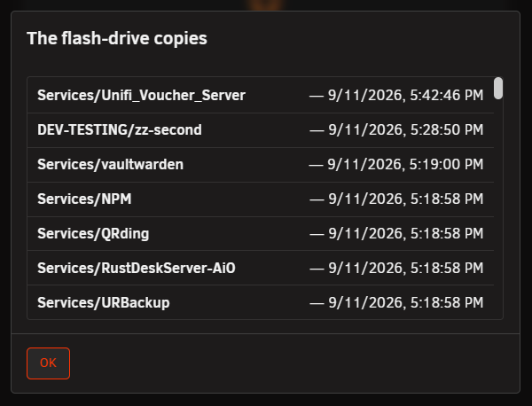

# Recovery and redundancy

<!-- index: 75 | undoing your own edits or an app's own update from the stack editor's History and Versions tabs, and bringing every stack back if the data store is lost. -->

**History** undoes your own edits to a stack's file. See [History](editor-history.md). **Versions**
undoes an app's own update, including pinning a service to one exact build and releasing it again.
See [Versions](editor-versions.md). Both sit in the [stack editor](the-stack-editor.md), beside
**Configure**.

## If the data store is lost

StaXX keeps a plain copy of every stack's compose file on the flash drive (see
[where things live](where-things-live.md)). If the data store itself is ever lost, StaXX offers to
bring every stack back from those copies.

If the data store's folder is missing, press **Choose a new place for the data store** to pick
somewhere new, the same dialog as a first install. Press **Show me the copies** first to list what
the flash drive holds.

If the data store exists but is empty, press **Bring back *N* stacks** to write every stack on the
flash drive into the store. Press **Show me what is there** to list them first, with the date
each one last changed, or **Put the data store somewhere else first** to point the store elsewhere before you
restore anything.

Neither option starts anything — a restored stack sits ready to open and start when you choose to,
exactly like an imported one, and begins a fresh history of its own. Whether an earlier file or
build still works alongside everything else on your server is for you to check.

## Terms used here

Any word you are not sure of is in the [glossary](../glossary.md).

Back to [the StaXX guide](README.md).
