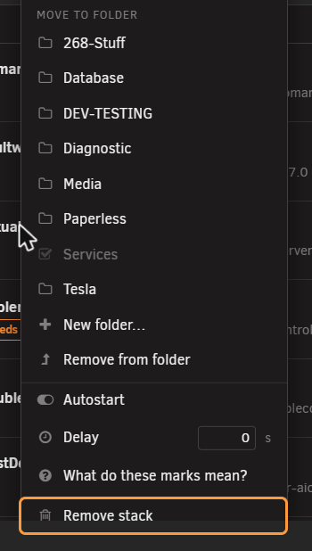
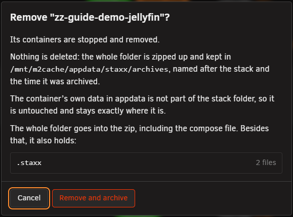
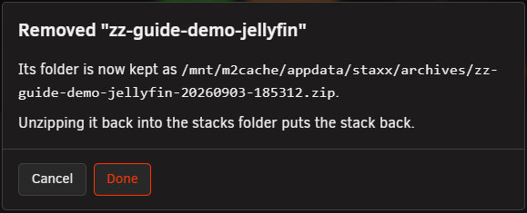
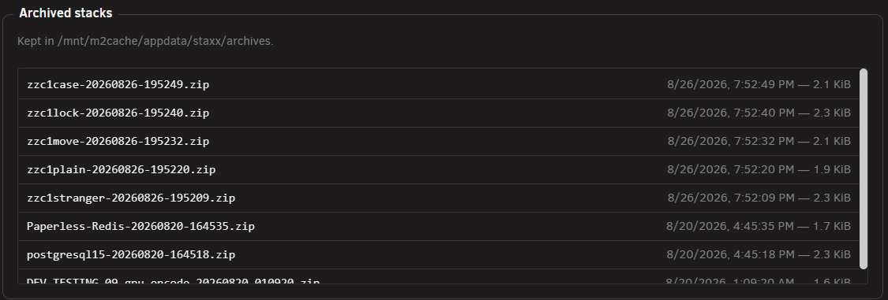

# Removing a stack

<!-- index: 67 | taking a stack off the list, what actually happens to it, and how to get it back. -->

Removing a stack takes it off the list without deleting anything. Its containers stop, and the
whole folder is zipped up and kept safely out of the way. The container's own data — anything it
wrote to appdata — is never touched.

## The short version

1. Open the stack's own menu.
2. Choose **Remove stack**.
3. Read what the dialog says, then press **Remove and archive**.
4. StaXX stops the containers, zips the folder, and tells you where the zip landed.

## Remove stack

Open the stack's own menu and choose **Remove stack**, near the bottom, on its own below a
separator.

## The confirmation dialog

The dialog is titled **Remove "\<name>"?** and says, in order:

- Its containers are stopped and removed.
- Nothing is deleted — the whole folder is zipped up and kept in the archive folder, named after
  the stack and the time it was archived.
- The container's own data in appdata is not part of the stack folder, so it is untouched and
  stays exactly where it is.
- What else is going into the zip, besides the compose file itself. If the folder holds nothing
  more than that, the dialog says so plainly instead.

Press **Remove and archive** to go ahead.

## What happens

Stopping the containers can take a little while — StaXX waits for it before it starts zipping, so
the button can sit busy for longer than most actions on this page. Once it is done:

- Every container the stack's compose file made is stopped and removed.
- The whole folder — compose file and everything beside it — is packed into one zip file, named
  after the stack and when it was removed, and written into the archive folder under your data
  store.
- The folder is then gone from the stacks list, because there is nothing left there to show.
- Appdata is never touched. Whatever the container wrote while it ran stays exactly where it was.

If the stack shares its running name with another stack, StaXX leaves those containers alone
rather than risk stopping the wrong ones, and says so in the result — only the folder is archived
in that case.

## The result

Once it is done, the dialog changes to say the stack was removed, names the archive it was kept as,
and reminds you that unzipping it back into the stacks folder puts the stack back. Press **Done**
to close it.

## The archive list on Settings

Every stack you have ever removed is listed on the Settings page, under **Archived stacks** — its
file name, when it was archived, and its size. This is a read-only view: it just shows you what is
there, it does not offer to do anything with it from that page.

## Getting a stack back

There is no restore button. Unzip the archive file back into the stacks folder yourself, and the
stack reappears on the list exactly as it was — same compose file, same folder, same containers
waiting to be started again.

## What this never does

- It never deletes anything. The folder is packed away, not thrown out.
- It never touches appdata. A container's own data is not part of the stack folder, so removing
  the stack cannot reach it.
- It never removes the folder outright — what is left on disk is the zip, sitting in the archive
  folder, not a gap where the stack used to be.
- It never stops or changes another stack, even one that happens to share a running name with the
  one you removed.

## Not built yet

- A restore button. Getting a stack back is a manual unzip, on purpose, for now.
- Emptying the archive folder automatically. Removed stacks build up there until you clear them
  out yourself.

## Terms used here

Any word you are not sure of is in the [glossary](../glossary.md).
