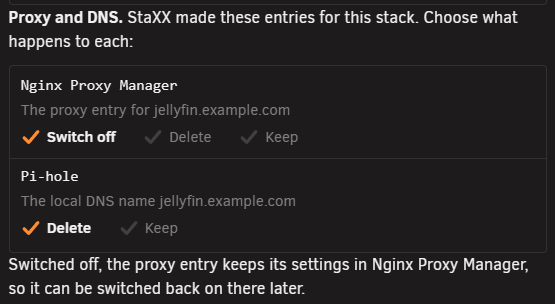

# Removing a stack

<!-- index: 67 | taking a stack off the list, what actually happens to it, and how to get it back. -->

Removing a stack takes it off the list. Its containers stop, and the whole folder is zipped up and
kept in the archive folder. Open it from the stack's own menu.

## The short version

1. Open the stack's own menu.
2. Choose **Remove stack**.
3. Read what the dialog says, then press **Remove and archive**.
4. StaXX stops the containers, zips the folder, and tells you where the zip landed.

## Step 1 · Remove stack

Open the stack's own menu and choose **Remove stack**, near the bottom, on its own below a
separator.

## Step 2 · The confirmation dialog

1. Read what the dialog titled **Remove "\<name>"?** lists.
2. Press **Remove and archive**.

The dialog lists, in order:

- Its containers are stopped and removed.
- The whole folder is zipped up and kept in the archive folder, named after the stack and the time
  it was archived. Nothing in the folder is deleted.
- Appdata is not touched.
- If the stack kept earlier versions of its images for rolling back, how many and how much space
  they take. They are removed too, unless another stack still uses them.
- Anything else going into the zip, besides the compose file itself — or, if the folder holds
  nothing more, a line saying so.
- Every folder and named volume the compose file uses: folders by their path on your server, named
  volumes by name marked *(a volume Docker manages)*, or **none**. None of these are moved or
  changed. A named volume is removed only by Docker's own clean-up, never by StaXX.

### Proxy and DNS entries

If StaXX made a proxy entry or a Pi-hole name for the stack, the dialog also asks what to do with
each. See [Proxy and DNS](proxy-and-dns.md).

| For | Choices | Chosen unless you change it |
|---|---|---|
| The proxy entry | **Switch off**, **Delete** or **Keep** | **Switch off** |
| The Pi-hole name | **Delete** or **Keep** | **Delete** |

A switched-off proxy entry keeps its settings and can be switched back on in Nginx Proxy Manager.

## What happens

Removing a stack can take a little while. Once it is done:

- Every container the compose file made is stopped and removed.
- The whole folder — compose file and everything beside it — is packed into one zip, named after
  the stack and when it was removed, and written into the archive folder under your data store.
- The folder no longer appears on the stacks list.
- Appdata is not touched. Whatever the container wrote while it ran stays exactly where it was.

When another stack shares this one's running name, only the folder is archived and that stack's
containers are left running.

The dialog then names the archive the stack was kept as. Press **Done** to close it.

## The archive list on Settings

Open Settings and check **Archived stacks** to see every stack you have removed: its file name,
when it was archived, and its size.

## Getting a stack back

Unzip the archive file into the stacks folder. The stack reappears on the list exactly as it was —
same compose file, same folder, same containers, ready to be started again.

## Terms used here

Any word you are not sure of is in the [glossary](../glossary.md).

Back to [the StaXX guide](README.md).
