# Sending feedback

<!-- index: 90 | How to report a bug, suggest a feature or suggest an improvement from inside StaXX, and what is sent with it. -->

A speech-bubble button sits in the bottom right corner of every StaXX screen, the stack editor and
**Settings** included. Press it to report a bug or suggest an idea. Your report goes to StaXX's
feedback board, where the StaXX team reads it.

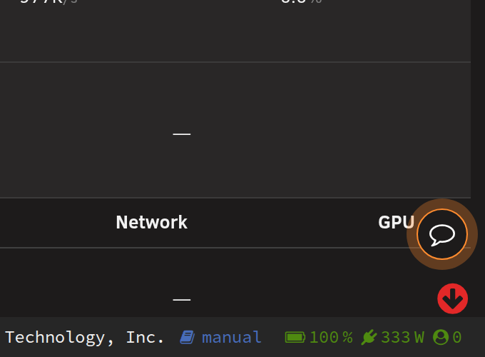

## The short version

1. Press the speech-bubble button.
2. The first time, press **Connect** and allow StaXX on the feedback board.
3. Choose the kind of report, give it a title and write what you want to say. Paste screenshots with Ctrl+V.
4. Press **Send**.

## Connect to the feedback board

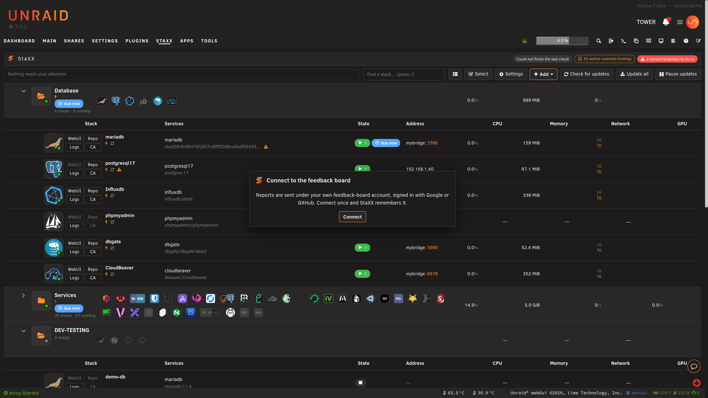

The first time you press the button, a small window asks you to connect. Reports go under your own
feedback board account. You do this once.

1. Press **Connect**.
2. The board opens in a new tab. If it does not, press **Open the board**.
3. Sign in with Google or GitHub and check the board shows the same code as the StaXX window.
4. Allow StaXX.

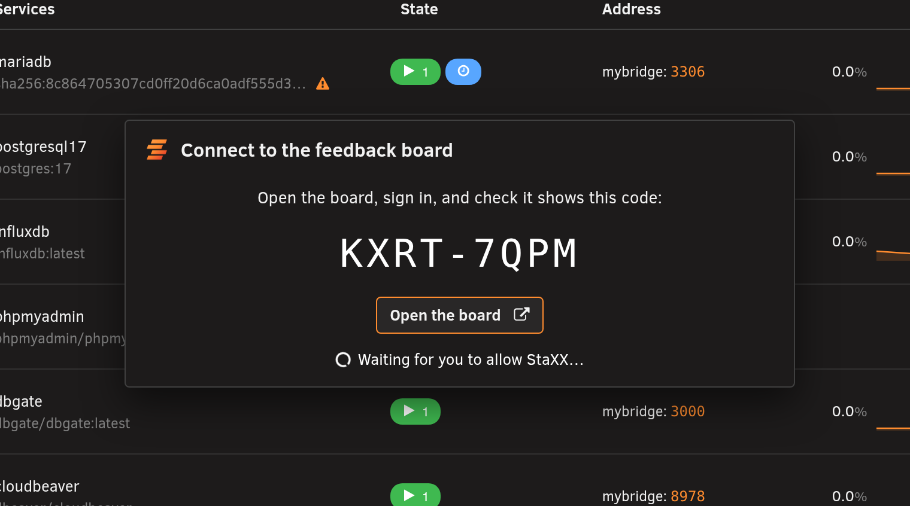

StaXX then tells you that you are connected. Press **Write your report** to carry on.

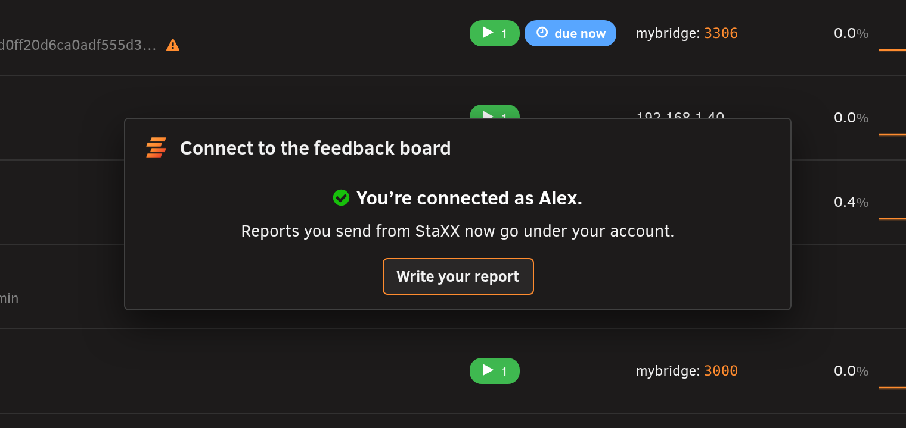

## Write your report

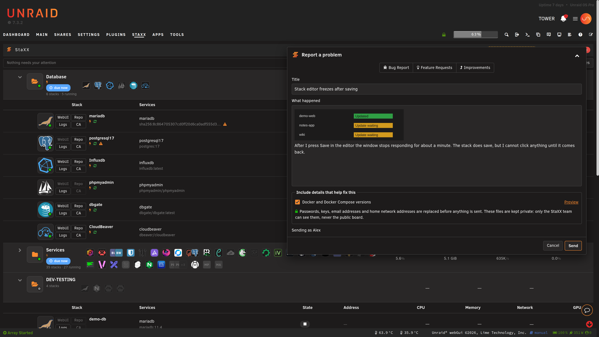

Choose what you are sending at the top of the window. Each kind goes to its own section of the board.

| Kind | Use it for |
|---|---|
| **Bug Report** | Something that is broken or behaves wrongly. |
| **Feature Requests** | Something StaXX does not do yet that you would like it to. |
| **Improvements** | Something that works but could work better. |

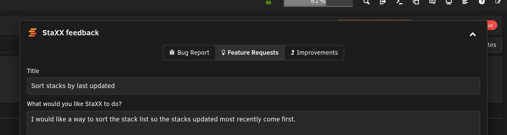

Give the report a title
and write what you want to say in the box. Press Ctrl+V to paste a screenshot into it.

The window floats above the page. Drag it by its top bar to move it. Press the up arrow at the top
of the window to roll it up to the top of the screen while you take a screenshot of the page
underneath. Press the down arrow to bring it back.

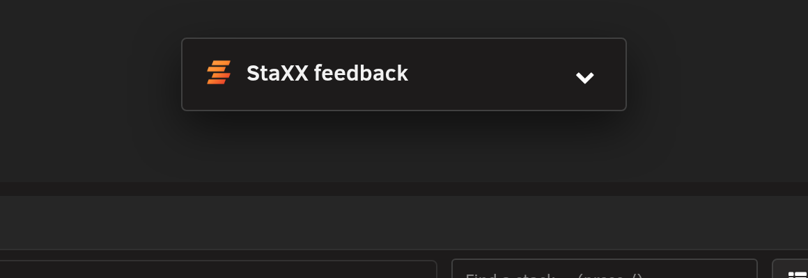

**Cancel** asks before throwing the report away. **Keep writing** takes you back to it.

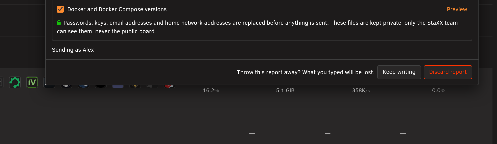

## Details that help fix a bug

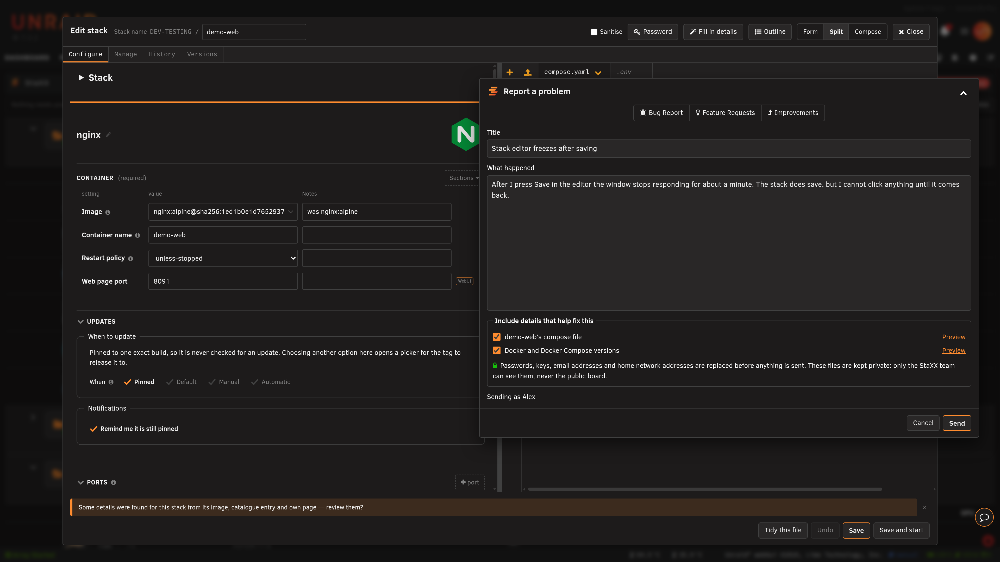

A **Bug Report** has an **Include details that help fix this** box under the text. Tick the files
you want to send. Which files are offered depends on where you are. On a stack's editor, for
example, the stack's own files are offered. If you have used **Import** in the last week,
**What happened the last few times you used Import** is offered too, on any screen.

Passwords, keys, email addresses and network addresses on your home network are replaced before
anything is sent. These files are private. Only you and the StaXX team can see them, and they
are deleted after 90 days.

### Preview a file

Press **Preview** beside a file to see exactly what will be sent.

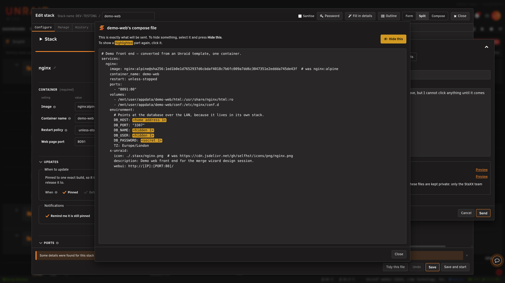

- To hide something else, select the text and press **Hide this**.
- To show a highlighted part again, click it. It then shows everywhere it appears.
- Select a value to hide it, not a setting name.

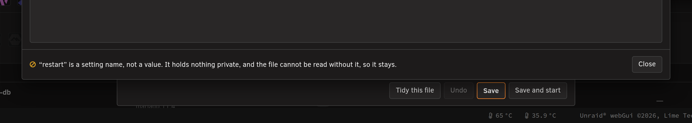

StaXX asks you to confirm when you hide something that would make the problem much harder to find,
and when you show a part it hid on its own.

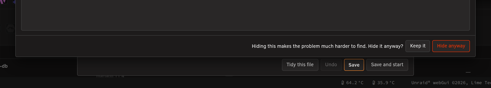

### Check this file

A file marked **Check this file** holds a number that may be a network address or a version
number. StaXX hides it until you decide. Press **Preview**, click any highlighted number you want
sent as it is, then press **Approve**. Approve every marked file, or untick it, before you press
**Send**.

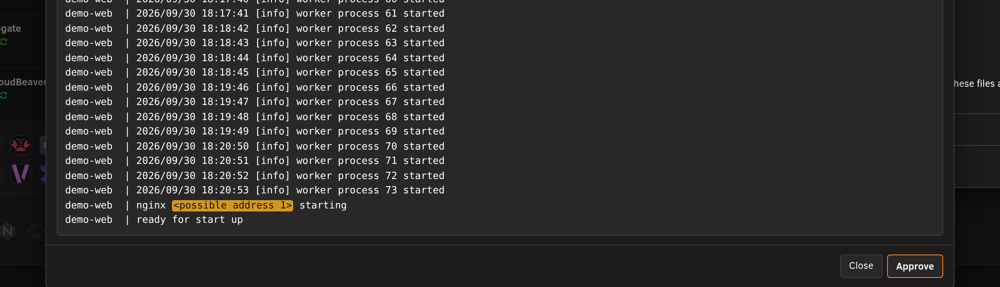

## Send

Give the report a title, then press **Send**. Every report carries the StaXX and Unraid versions
and the screen you were on.

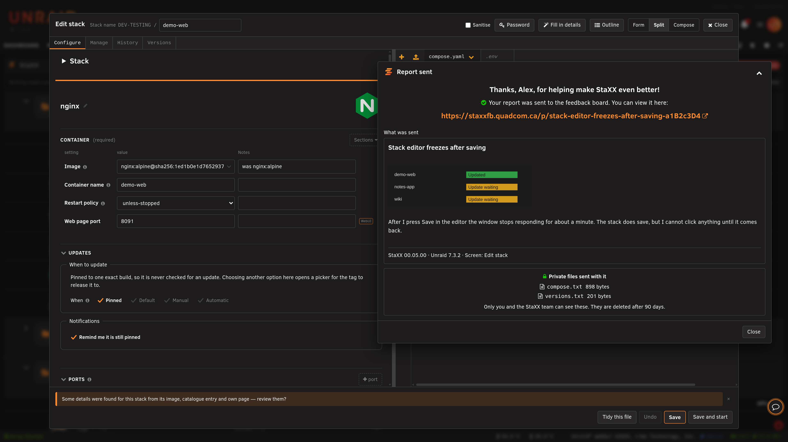

The window then shows:

- a thank-you line;
- a link to your report on the board, which opens in a new tab;
- a copy of what you sent, with the versions line;
- **Private files sent with it**, listing each file and its size.

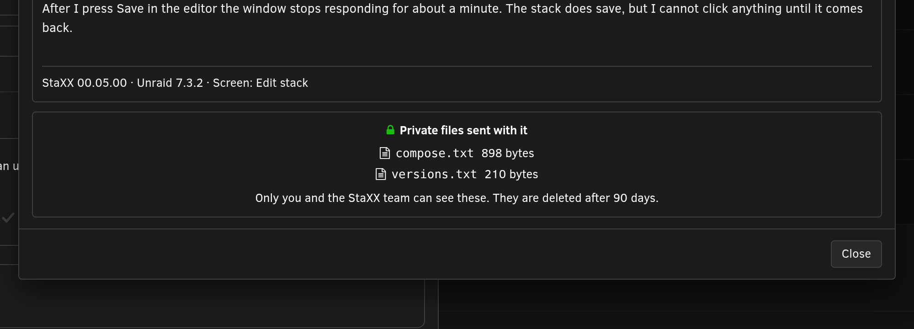

Press **Close** when you are done.

## Disconnect

To disconnect, open **Settings**, choose the **Integrations** tab and press **Disconnect** on the
**Feedback board** line. To connect again, press the speech-bubble button and press **Connect**. See
the [Integrations tab](settings-integrations.md).

## Terms used here

Any word you are not sure of is in the [glossary](../glossary.md).

Back to [the StaXX guide](README.md).
