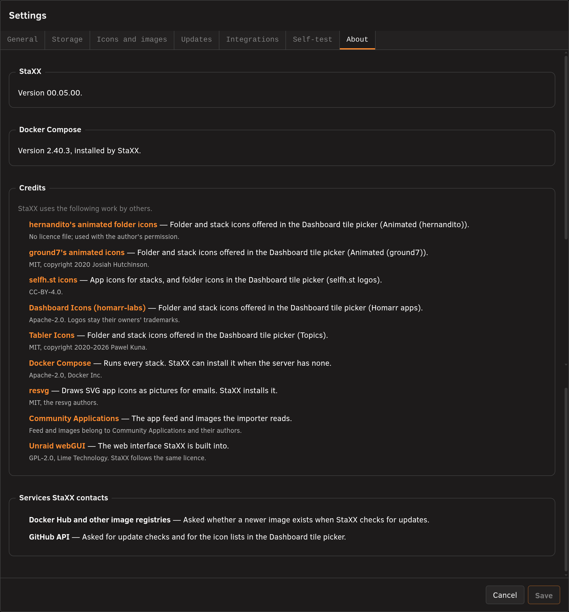

# About tab

<!-- index: 87 | the version of StaXX and Docker Compose you are running, the work by others StaXX uses, and the services it contacts | parent: settings.md -->

[StaXX guide](README.md) › [Settings](settings.md) › About tab

**About**, the last tab in **Settings**, shows which version you are running, who made the work StaXX
uses, and which outside services StaXX talks to. Nothing on this tab changes a setting.

## What the tab shows

| Section | What it shows |
|---|---|
| **StaXX** | The version of StaXX you are running. A copy that was not installed from the plugin manifest says so here instead of showing a version. |
| **Docker Compose** | The version of Docker Compose on your server, and whether StaXX installed it or found it already there. If the server has none, the line says so. |
| **Credits** | The icon collections, apps and projects StaXX uses, each with a link to its home, what StaXX uses it for and its licence. |
| **Services StaXX contacts** | The outside services StaXX asks for information: Docker Hub and other image registries when it checks for updates, and the GitHub API for update checks and for the icon lists in the Dashboard tile picker. |

## Terms used here

Any word you are not sure of is in the [glossary](../glossary.md).

Back to [the StaXX guide](README.md).
