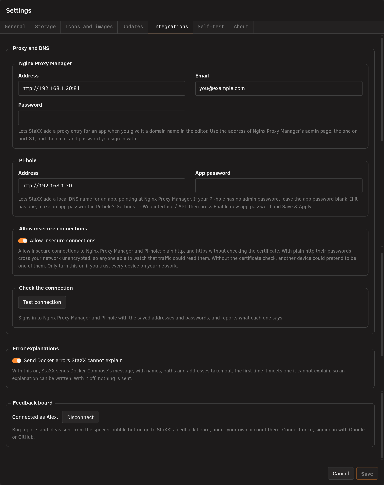
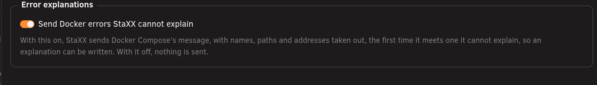

# Integrations tab

<!-- index: 85 | Docker Hub sign-in, your own registries, StaXXCrypt, and connecting to Nginx Proxy Manager and Pi-hole. -->

This tab, in **Settings**, holds sign-in details for Docker Hub, your own image registries, the
StaXXCrypt hashing container, and Nginx Proxy Manager and Pi-hole.

## Docker Hub access

| Setting | What it does |
|---|---|
| Docker Hub username | Signs StaXX in to Docker Hub when it checks your images for updates. Signed out, Docker Hub allows this server about ten checks an hour; signed in, about a hundred. Leave it blank to stay signed out. |
| Docker Hub access token | The second half of signing in. Make one in Docker Hub's own account settings, under Security → Personal access tokens, choosing the **read-only, public repositories** permission. Even a leaked token could only look, never change or delete anything. It is stored in StaXX's settings inside the data store, where only the server's administrator can read it. Leave both boxes blank to sign out. |

## Registries you run yourself

If you run your own image registry at home, add its address here so StaXX can check it for
updates even though it has no public security certificate, or none at all. Only ever add a
machine you control. Type its address the way it appears in an image name and press **Add**;
remove one with its cross. A password is never sent to a registry reached without encryption.

## StaXXCrypt hashing container

| Setting | What it does |
|---|---|
| StaXXCrypt hashing container | With **Keep it running**, making a password hash is instant. With **Only while hashing**, the container starts when you need it and stops after; each hash then takes a couple of seconds longer. |

Under the dropdown you can see whether the container is built and running, which password
formats it has proved it can make, the recipe number, a plain list of what is inside it, and a
**Show the recipe** link that reveals exactly how it is built. The recipe number changes if the
recipe itself changes, so matching numbers tell you the running container matches the recipe
StaXX ships today. When an update to StaXX brings a new recipe, the number changes, the container
is rebuilt from it, and the old one is removed. See [making a password hash](passwords-and-hashes.md).

## Nginx Proxy Manager

| Setting | What it does |
|---|---|
| Nginx Proxy Manager address | The address of Nginx Proxy Manager's admin page, the one on port 81. With it filled in, you can give an app a domain name in the editor and StaXX adds its proxy entry. |
| Nginx Proxy Manager email | The email you sign in to Nginx Proxy Manager with. |
| Nginx Proxy Manager password | The password you sign in to Nginx Proxy Manager with. |

## Pi-hole

| Setting | What it does |
|---|---|
| Pi-hole address | The address of your Pi-hole. With it filled in, StaXX can add a local DNS name for an app, pointing at Nginx Proxy Manager. |
| Pi-hole app password | An app password made in Pi-hole's own Settings → Web interface / API, under Enable new app password. Leave this blank if your Pi-hole has no admin password. |

## Error explanations

| Setting | What it does |
|---|---|
| Send Docker errors StaXX cannot explain | With this on, StaXX sends Docker Compose's message, with names, paths and addresses taken out, the first time it meets one it cannot explain, so an explanation can be written. With it off, nothing is sent. |

New explanations reach StaXX once a day, whichever way this is set.

## Feedback board

| Setting | What it does |
|---|---|
| Feedback board | Shows the account you are connected as. **Disconnect** ends the connection. When you are not connected it shows **Connect** instead. See [sending feedback](sending-feedback.md). |

## Allow insecure connections

With this on, StaXX is allowed to reach Nginx Proxy Manager and Pi-hole over a plain,
unencrypted connection, or over an encrypted one without checking that the address really
belongs to them. Anyone able to watch your network traffic could then read their passwords, and
another device could pretend to be one of them. With it off, StaXX only connects to them when the
connection is both encrypted and verified.

## Test connection

Press **Test connection** to sign in to Nginx Proxy Manager and Pi-hole with the addresses and
passwords you have saved, and see what each one says. Save your changes first.

See [Proxy and DNS](proxy-and-dns.md) for using Nginx Proxy Manager and Pi-hole with your stacks.

## Terms used here

Any word you are not sure of is in the [glossary](../glossary.md).

Back to [the StaXX guide](README.md).
