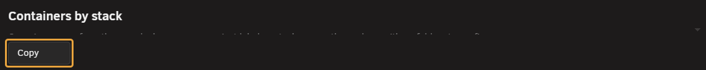
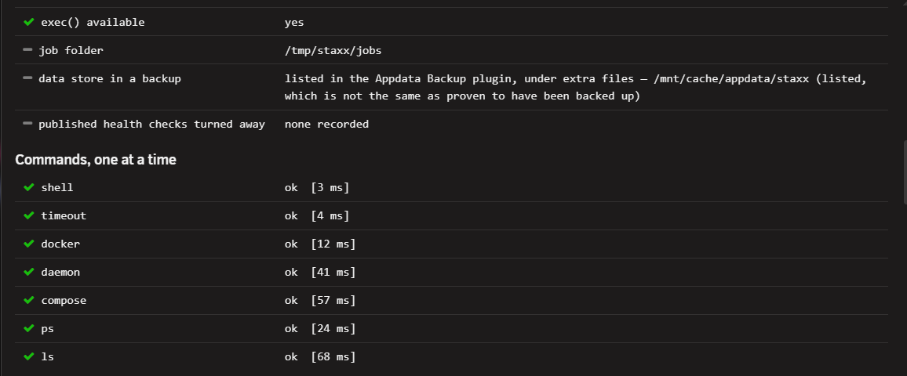

# Self-test tab

<!-- index: 86 | the health check on the Settings panel, and what its backup line does and does not tell you | parent: settings.md -->

[StaXX guide](README.md) › [Settings](settings.md) › Self-test tab

**Self-test**, the last tab in **Settings**, runs the moment you open it, fresh every time — there
is nothing to press first.

## The short version

1. Open the **Self-test** tab.
2. Read the first list, answered without running anything.
3. Read the list of commands, run one at a time.
4. Press **Copy** to put the whole report on the clipboard as plain text.

## First stage: answered without running a command

This list covers where your stacks live, whether that folder exists and is writable, free
space, how many stacks and folders there are, how many are waiting to be reviewed, and whether
Docker and compose are on disk. Read this stage first when Docker itself seems to be hanging:
nothing in it can hang.

Where something genuinely cannot be seen — the stacks folder is on a pool that has not mounted
yet, say — the answer is **UNKNOWN** rather than 0.

## Second stage: the commands, one at a time

This list runs the simplest possible command, then each piece Docker depends on in turn, then
Docker itself, then listing your containers and stacks. They run in order: the last line printed
is the last thing that worked.

StaXX checks for the compose command at install and at every boot. If your server already has
one, it is left exactly alone. If not, StaXX installs its own copy, kept on the flash drive. If
that copy ever cannot be put in place, the **compose responds** line says why, in plain words.

## The backup line

The backup line reports whether your data store folder is *named in* the Appdata Backup
plugin's list of extra files. **Being listed is not the same as having been backed up.** Whether
a backup has ever run, finished, or reached a destination that still exists is something StaXX
cannot see. If the line says the folder is not listed, act on that straight away; if it says it
is, whether you really have a backup is still your call. See
[Check your backup](settings-storage.md#data-store-links) on the Storage tab.

## Terms used here

Any word you are not sure of is in the [glossary](../glossary.md).

Back to [the StaXX guide](README.md).
