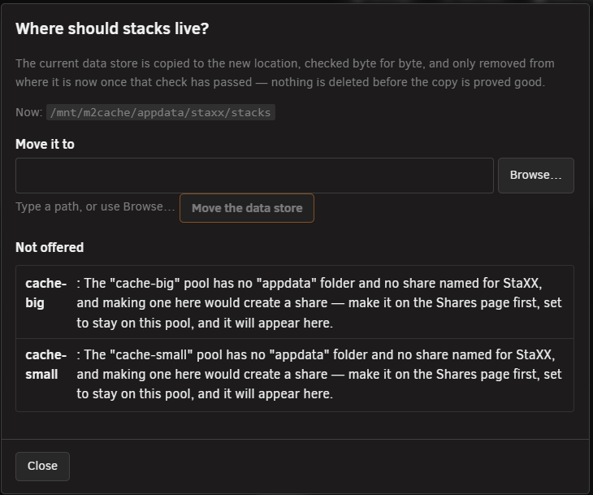
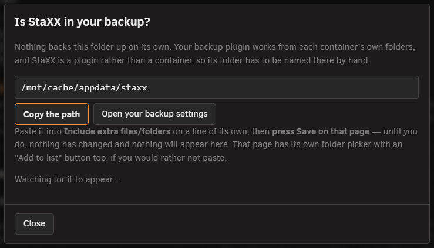
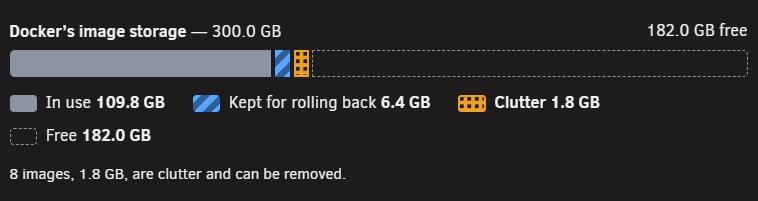
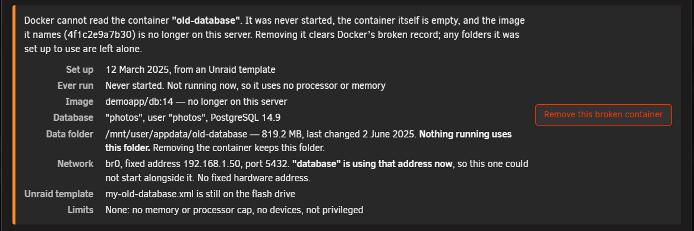
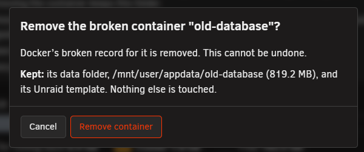

# Storage tab

<!-- index: 82 | the Storage tab: the data store, moving it, checking your backup, flash-drive copies, image clean-up and archived stacks. -->

The **Storage** tab, in [the settings panel](settings.md), holds where your stacks are kept, the
copies StaXX keeps for safety, and the tools for clearing out old images.

## Data store

| Setting | Choices | Default | What it does |
|---|---|---|---|
| Data store | A folder path | blank | The folder where StaXX keeps your stacks and the copies of ones you have removed. Type a path, pick one with the folder button, or use **Move the data store** to have StaXX move everything for you. See [file locations](where-things-live.md). |
| Protect me from myself | On / Off | On | With this setting on, the folder picker will not let you choose a store location that could result in the loss of your data. With it off, the picker presents every storage location on your system, whether or not it could lose your files. Even with it off, two places are never allowed: anywhere that is wiped when the server restarts, and the top level of a whole share such as appdata, where every folder inside it would be mistaken for a stack. |

### Data store links

Two links sit under the Data store box:

- **Move the data store** opens *Where should stacks live?*. It suggests a good place and explains
  any place it will not offer. The move copies everything to the new location, checks the copy is
  complete, and only then removes the original.

  

- **Check your backup** opens *Is StaXX in your backup?*, which checks whether the Appdata Backup
  plugin's list of extra files includes your data store folder. If it does not, copy the path shown,
  paste it into that list on a line of its own, and press **Save** on that page. Being listed is not
  the same as a backup having run; see the [Self-test tab](settings-self-test.md).

  

## Copies on the flash drive

| Setting | Choices | Default | What it does |
|---|---|---|---|
| Copies on the flash drive | Keep a copy of every compose file there / Do not write copies | Keep a copy | With this on, every time you save, start or update a stack here, its file is copied to the flash drive if it has changed. Unraid already backs up the flash drive, and each copy is dated from when the file last changed. If the data store were ever lost, StaXX offers to bring every stack back from these copies — see [if the data store is lost](recovery-and-redundancy.md). With it off, no copies are written. |
| Keeping the copies current | On a schedule / Live | On a schedule | How a change made outside StaXX — the file edited by hand and the container recreated at a command line — still reaches the copy above. **On a schedule** compares every stack with its copy once an hour and rewrites the ones that differ; a change made this way can be up to an hour behind. **Live** keeps a small process running that refreshes a stack's copy the moment its container is recreated, however that was done, at the cost of one process that runs all the time; a daily sweep still runs as a backstop. Only means anything while the setting above is on. |

## Unused image management

| Setting | Choices | Default | What it does |
|---|---|---|---|
| Scan stored images | — | — | Pressing **Scan stored images** shows a bar of **Docker's image storage**, split into **In use**, **Kept for rolling back**, **Clutter** and **Free**. Under the bar is the clutter, grouped by where it came from, with the space each image takes. Every image in the list starts ticked. Untick any you want to keep, then press the **Remove** button. The copies kept for rolling back sit under **Kept so you can roll back**; press it to open that list. If a container can no longer be read, its details appear at the top with a **Remove this broken container** button. It asks you to confirm, and leaves the container's data folder where it is. |
| Keep the images | Yes / No — remember the version numbers only | Yes | With this on, earlier versions stay on the server, so rolling back is instant. With it off, only their version numbers are kept, and rolling back downloads that version again, which only works while the source still has it. |
| Warn when image storage is this full | 50 to 99% | 85% | When there is clutter to clear and Docker's image storage is this full, a notice appears on the stack list. |
| Or when clutter is this old | 1 to 365 days | 30 days | When any clutter has gone unused for this many days, a notice appears on the stack list, however much space is free. |

### Scan stored images

Press **Scan stored images** to open the window.

The bar at the top shows how Docker's image storage is used. The line under it says how much of it
is clutter.

Untick any image you want to keep, then press the **Remove** button at the foot of the window. Press
**Kept so you can roll back** to see the copies kept for rolling back.

If a container can no longer be read, its details appear at the top of the window: when it was set
up, whether it ever ran, its image, its data folder, its network address and its limits. Press
**Remove this broken container** to remove it.

Confirm to remove it. Its data folder and its Unraid template stay where they are.

## Archived stacks

| Setting | Choices | Default | What it does |
|---|---|---|---|
| Archived stacks | — | — | Shows the zip of every stack you have removed, with its date and size. Nothing here can be changed. See [removing a stack](removing-a-stack.md). |

## Save refusals

| What it says | What to do |
|---|---|
| The data store cannot be moved in the same save as another setting | Change the store's location on its own, or use **Move the data store**, which copies everything first. |
| The data store cannot be reached right now, so this cannot be saved | Wait for the pool holding the data store to finish starting. Until then, only the store's location and the two menu settings can be changed. |
| The data store must be somewhere under /mnt/ | Choose a location on one of your shares or drives. |
| It would be created on a filesystem that lives in memory | Choose a share or a real drive; that location is wiped every time the server restarts. |
| That is the whole of the share, and every folder in it would be read as a stack | Use a folder inside the share instead — the message names the exact path to use. |
| The new location already holds something | Choose an empty folder, or a path that does not exist yet. |

## Terms used here

Any word you are not sure of is in the [glossary](../glossary.md).

Back to [the StaXX guide](README.md).
