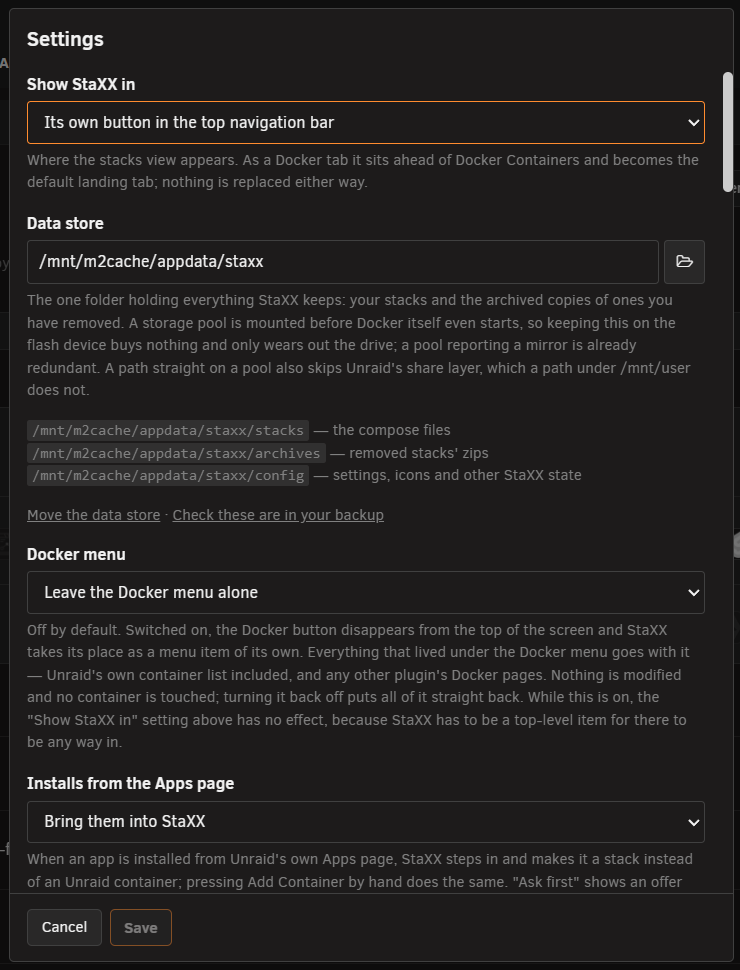
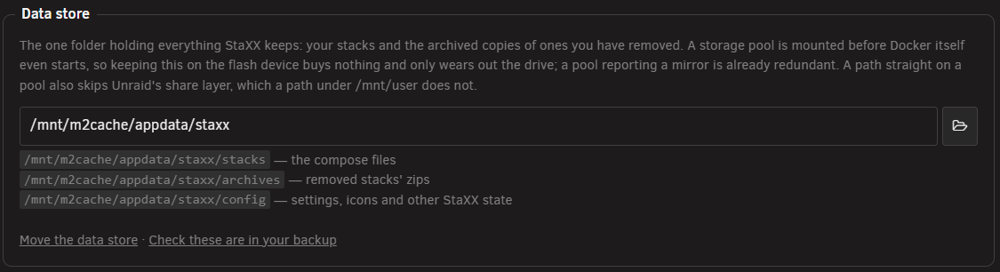
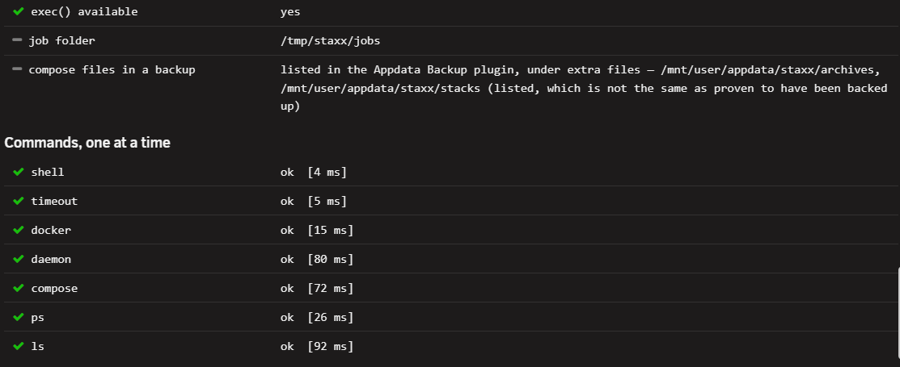

# Settings

<!-- index: 80 | every setting behind the cog, group by group, plus the self-test and the first-run screen. -->

Press **Settings**, the cog above your stack list, to open this panel. Unraid's own Settings →
Utilities page is now just a signpost to it.

## Using the panel

1. Change what you want. **Save** stays dead until something actually changes.
2. Press **Save**. Everything is checked first. One bad value refuses the whole save — nothing is
   half-changed.
3. **Cancel** throws your changes away. Closing with something unsaved asks first.

Some settings need the page to reload — where StaXX appears, and where the data store is. StaXX
reloads for you and says so.

## Top group

| Setting | Choices | Default | What it does |
|---|---|---|---|
| Show StaXX in | A tab under the Docker menu / Its own button in the top bar | Docker tab | As a tab it sits ahead of Docker Containers and is the tab you land on. Has no effect while Docker menu (below) is on. |
| Data store | A folder path | blank | The one folder holding your stacks and their archives. See [file locations](where-things-live.md). |
| Docker menu | Leave the Docker menu alone / Replace it with StaXX | Off | Replacing it takes everything under it with it, including Unraid's own container list. Nothing is changed underneath; turning it off puts it straight back. |
| Installs from the Apps page | Bring them into StaXX / Ask first / Leave them to Unraid | Bring them into StaXX | What happens when you install something from Unraid's own Apps page. Turning it off restores Unraid's own install route; nothing already installed changes. See [adding an app](installing-an-app.md). |
| Container icons | Download them automatically / Do not download anything | On | Off, containers with no icon get a coloured tile with their initials. The only thing sent out, when on, is the name of the icon being asked for. |
| Keep icons with the stack | Record them in the file / Work them out each time | On | Writes the icon's name into the stack's file and saves a copy of the picture beside it, so the stack looks the same on any server. An icon you named yourself is never touched. |
| StaXXCrypt hashing container | Only while hashing / Keep it running | Only while hashing | The container behind [making a password hash](passwords-and-hashes.md). Kept running, hashing is near-instant; on demand it costs nothing idle but takes a couple of seconds per hash. |

| Image documentation | Read it automatically / Do not look anything up | On | Whether adding an image reads its own documentation to build a fuller starting file. Only runs the moment you add something, never in the background. The only thing sent out is the image's name. |
| Where stacks may live | Guide me / Get out of the way | Guide me | Guide me hides and refuses risky locations when choosing a folder — a single array disk, an unassigned or network drive, a share bound for the array. Get out of the way shows everything and warns instead. **Refused either way:** a location that lives in memory, and a whole share as the stacks folder — every folder in it would be read as a stack. |
| Container shells | Allow opening a shell / Do not allow shells | On | Off **refuses every shell on the server**, not just the tab. There is no way round it from the page. |

The **Choose a folder** button sits beside the Data store box — a small folder icon. Press it to
browse the server instead of typing a path.

<!-- SHOT: settings-data-store-row | close-up | the Data store text box with the "Choose a folder" folder-icon button beside it, highlight box around that button -->

Two links sit under the data store box:

- **Move the data store** opens *Where should stacks live?*. It suggests a place on a storage
  pool and lists anywhere it declined to offer, with the reason next to it. The move copies
  everything, **checks it byte for byte, and only then removes the original** — nothing is
  deleted before the copy is proved good. A failed move leaves your data exactly where it was.

  <!-- SHOT: settings-move-dialog | full frame | the "Where should stacks live?" dialog open, showing the suggested pool location and the "Move the data store" button -->

- **Check these are in your backup** opens *Add these folders to your backup*, which says whether
  these folders are named in the Appdata Backup plugin. Being named is not the same as having been
  backed up — see the self-test below.

  <!-- SHOT: settings-backup-dialog | full frame | the "Add these folders to your backup" dialog open, showing its found-in-the-list or not-listed message -->

Keeping the store on the flash drive is possible through a separate, quieter button. It makes you
tick a box first: flash wears out with use, and it is the least redundant place in the machine.

## Image updates

This group is explained fully in [checking for updates](updates.md). What the panel decides:

<!-- SHOT: settings-image-updates | full frame | the Image updates group of the settings panel — "Check for image updates" through "Remove old images automatically" -->

| Setting | Choices | Default | What it does |
|---|---|---|---|
| Check for image updates | Never / Every day / Once a week | Every day | Off means nothing is ever looked up. |
| Time of day to check | A 24-hour time | 04:00 | When the daily or weekly check runs. |
| Watch the publisher's own examples | Look, during the same check / Do not look | On | Whether the check also asks GitHub if the image's own project publishes an example file — never Docker Hub, so it never spends the update-checking allowance. |
| What to do with what is found | Just show it on the row / Wait for you to press Update / Install it by itself | Wait for you to press Update | A stack or a single service can override this in its own file. |
| Delay before installing | 0 to 720 hours | 24 | Only used by "Install it by itself" — how long an update counts down on its row first. |
| Only install during a quiet time | Yes / No | Yes | An update whose delay runs out outside quiet hours waits for them to open. |
| Quiet time starts / ends | A 24-hour time | 03:00 / 05:00 | The quiet window. It may run past midnight. |
| Notify me | Never / When a check finds something / That, and again once installed | Never | One message per check or queue, never one per container. |
| Previous versions to keep | 0 to 5 | 2 | How many older image versions stay on disk so an update can be undone. See [version history](going-back.md). |
| Remove old images automatically | No / Yes, once a week | No | Only ever removes an image nothing is running and no roll-back still needs. |
| Registry questions | — a report, nothing to set | — | What each registry has actually been asked, this hour and today, and what — if anything — it cost. Worth a look whenever a `could not check` pill keeps turning up; see [checking for updates](updates.md#docker-hubs-limit). |

## Docker Hub sign-in

A username, an access token, and a list of registries you run yourself — used only when checking
your images for updates. **Without signing in, Docker Hub allows this server about ten of those
checks an hour; signed in, about a hundred.**

<!-- SHOT: settings-docker-hub | full frame | the Docker Hub sign-in group, showing the username field and the "registries you run yourself" field — scroll or crop so the access token field is out of frame; the stored token must never appear in a picture -->

| Setting | What it does |
|---|---|
| Docker Hub username | Your Docker Hub account name. Leave blank to stay signed out. |
| Docker Hub access token | Make it in Docker Hub's own account settings, under Security → Personal access tokens, with the **read-only, public repositories** permission. StaXX only ever asks an image its current version, so a leaked token could look but never change or delete anything. It is kept in StaXX's own settings file inside the data store, readable only by the administrator account. Leave both boxes blank to sign out. |
| Registries you run yourself | Naming a registry here makes StaXX trust that machine's own certificate, or talk to it with **no encryption at all** if it has none. Only ever name a registry you run yourself. Several are separated by commas. A password is never sent to a registry reached without encryption. Left blank, nothing beyond the ordinary public internet is trusted. |

## Other tools on the panel

- **Add missing StaXX fields to every stack** reads every stack and offers to add its icon, links
  and description fields as commented placeholders. It shows what would be added before writing
  anything, and never changes what is already in a file.
- **Archived stacks** — a read-only list of the zips of stacks you have removed, with dates and
  sizes.
- **The hashing container's own state** — whether it is built and running, which hash formats it
  has actually proven it can make, and buttons to Build, Recreate or Rebuild it. A newer recipe is
  only ever a notice; nothing rebuilds until you press the button.

## First-run screen

Before a data store is chosen, the stack list is replaced by one notice: **No data store has been
chosen yet.** Two buttons sit under it — **Choose a data store**, which opens the same *Where
should stacks live?* dialog as the settings panel's own link, and **Go to Settings**.

The dialog suggests a place on a storage pool and lists anything it will not offer, with the reason
next to it. If the machine has no pool it can reach, it says so and offers the safer of the two
remaining choices instead. Typing your own path shows what StaXX can tell about it — free space,
and a warning if it goes through Unraid's share layer rather than a pool directly.

<!-- SHOT: settings-first-run | full frame | the "No data store has been chosen yet" notice with its two buttons, before any store is picked -->

## Self-test

**Self-test**, the button beside Settings, answers "why did nothing happen?" with facts, in two
stages.

**First, everything answerable without running a command** — where the stacks live, whether that
folder exists and is writable, free space, how many stacks and folders there are, how many are
waiting to be reviewed, and whether Docker and compose are on disk. This stage cannot hang, which is
the point: it is what you reach for *when* Docker is hanging.

**Then the commands, one at a time** — a trivial command, the time-limit tool, the Docker client,
the Docker daemon, compose, listing containers, listing projects. They run in order on purpose: the
last line printed is the last thing that worked, so a stall shows exactly where it happened.

Where something genuinely cannot be seen — the stacks folder is on a pool that has not mounted yet,
say — the answer is **UNKNOWN**, not nought. "0 stacks" while the array is down would be a healthy
nothing dressed up as a fact.

**The backup line needs care.** It reports whether your compose files are *named in* the Appdata
Backup plugin's list of extra files. **Being listed is not the same as having been backed up.**
Whether a backup has ever run, finished, or reached a destination that still exists is something
StaXX cannot see. If the line says the folders are not listed, act on that straight away; if it
says they are, whether you really have a backup is still your call.

## Save refusals

| What it says | Why |
|---|---|
| The data store cannot be moved in the same save as another setting | The other settings live inside the store, so moving it and changing them at once cannot be done coherently. Change the location on its own, or use the move link, which copies everything first. |
| The data store cannot be reached right now, so this cannot be saved | The store is on a pool that has not finished starting. Only the store's location and the two menu settings can be changed until it comes back. |
| The data store must be somewhere under /mnt/ | It has to be a real share or disk. Choose a location there instead. |
| It would be created on a filesystem that lives in memory | Such a path looks normal right up to the reboot that empties it. Put the store on a share, or a drive that is actually mounted. |
| That is the whole of the share, and every folder in it would be read as a stack | Pointed at appdata, every container's own config folder would appear as a stack. Use a folder inside the share instead — the message names the exact path to use. |
| The new location already holds something | A move needs somewhere empty. Choose an empty folder, or a path that does not exist yet. |
| Settings were saved, but applying them failed | Your settings did save. The small step that puts menu changes into effect failed. Reboot the server to finish applying them. |

## What this never does

- It never changes any of Unraid's own files. Replacing the Docker menu hides it; turning that off
  puts it back exactly as it was.
- It never saves some of your changes and refuses others. One bad value saves nothing.
- It never sends anything about this server, its containers or its settings out, beyond an icon's
  name, an image's name, or a watched project's address.
- It never deletes your data to make room for a move. The copy is proved good first.
- It never certifies that you have a backup — only that a folder is, or is not, on a list.

## Not built yet

- Exporting or importing your settings.
- Resetting them all to how they started.
- A record of what you changed and when.

## Terms used here

Any word you are not sure of is in the [glossary](../glossary.md).
