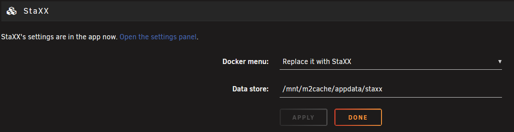
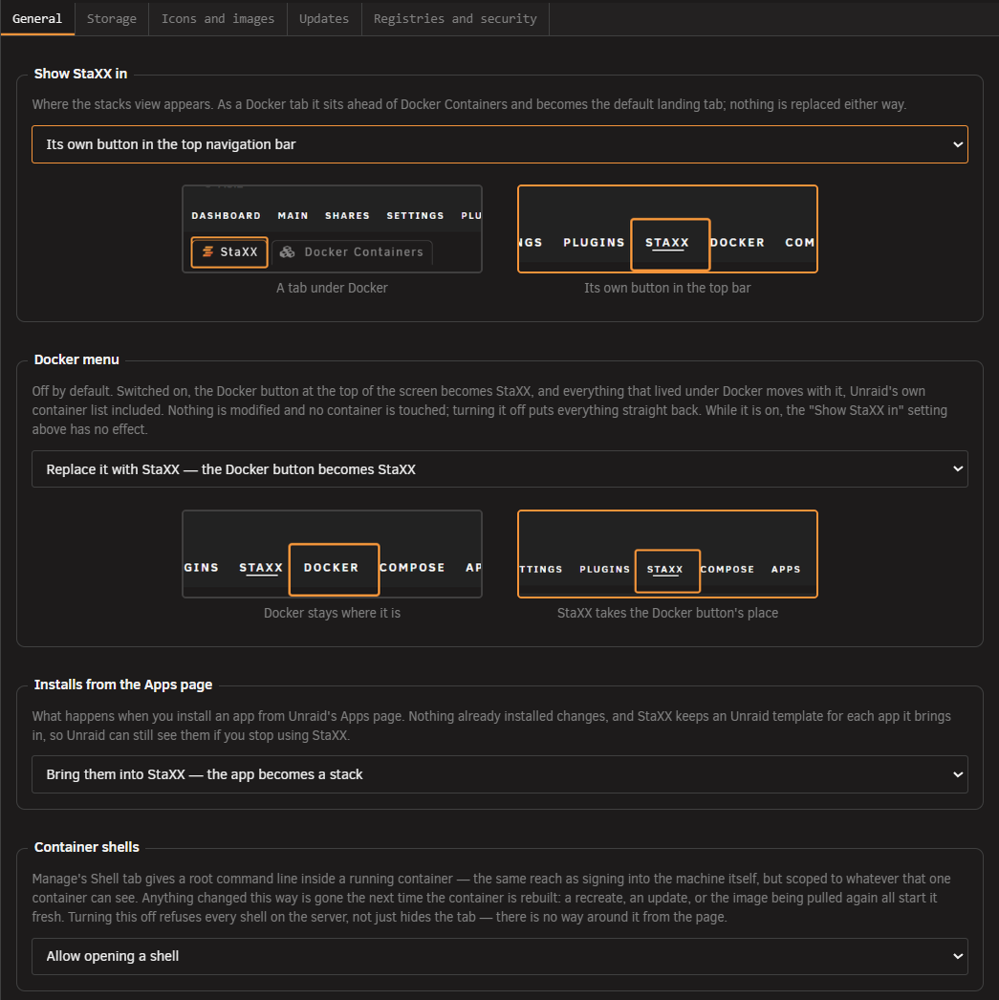

# Settings

<!-- index: 80 | every setting behind the cog, group by group, plus the self-test and the first-run screen. -->

Press **Settings**, the cog above your stack list, to open this panel. Unraid's own Settings →
Utilities → StaXX page keeps two of the settings as a way back.

## The page under Unraid's Settings

Under Unraid's **Settings → Utilities** there is still a StaXX entry. It holds two settings on
purpose, and they are the way back if StaXX's own page will not open:

| Setting | What it undoes |
|---|---|
| Docker menu | Set it back to **Leave it alone** and Unraid's own Docker page returns, with StaXX as a tab under it. This is how to undo the takeover from outside StaXX. |
| Data store | Point it at the right folder if the store has been moved or the path is wrong, and the stack list comes back. |

Press **Apply** to save. Everything else lives in the panel.

## Using the panel

1. Change what you want. **Save** only lights up once you have changed something.
2. Press **Save**. Everything is checked first. If any value is wrong, nothing is saved, so you are never left with half your changes applied.
3. **Cancel** throws your changes away. Closing with something unsaved asks first.

Some settings need the page to reload — where StaXX appears, and where the data store is. StaXX
reloads for you and says so.

## General tab

| Setting | Choices | Default | What it does |
|---|---|---|---|
| Show StaXX in | A tab under the Docker menu / Its own button in the top bar | A tab under Docker | With StaXX as a tab, it appears under Docker ahead of Unraid's own container list and is the tab you land on. With it as a button, it gets its own place in the top bar. This choice does nothing while Docker menu, below, is set to replace. |
| Docker menu | Leave the Docker menu alone / Replace it with StaXX | Leave it alone | With this on, the Docker button at the top of every Unraid page is replaced by a StaXX button, and Unraid's own Docker pages disappear from the menu, so you manage your containers through StaXX instead. With it off, the Docker button and its pages come back exactly as Unraid made them, and StaXX appears wherever Show StaXX in puts it. Your containers themselves are never touched either way; only the menu changes. The setting is greyed out while Show StaXX in is set to a tab, because there is then no button for it to replace. |
| Installs from the Apps page | Bring them into StaXX / Ask first / Leave them to Unraid | Bring them into StaXX | Bring them in turns each app you install from Unraid's Apps page into a stack; Ask first stops to ask each time; Leave them to Unraid keeps Unraid's own install route. Nothing already installed changes either way. See [adding an app](installing-an-app.md). |
| Container shells | Allow opening a shell / Do not allow shells | Allow opening a shell | With this on, you can open a command line inside a running container from its Manage tab. With it off, no container on this server can be opened that way from StaXX at all. |

## Storage tab

| Setting | Choices | Default | What it does |
|---|---|---|---|
| Data store | A folder path | blank | The folder where StaXX keeps your stacks and the copies of ones you have removed. Type a path, pick one with the folder button, or use **Move the data store** to have StaXX move everything for you. See [file locations](where-things-live.md). |
| Protect me from myself | On / Off | On | With this setting on, the folder picker will not let you choose a store location that could result in the loss of your data. With it off, the picker presents every storage location on your system, whether or not it could lose your files. Even with it off, two places are never allowed: anywhere that is wiped when the server restarts, and the top level of a whole share such as appdata, where every folder inside it would be mistaken for a stack. |
| Copies on the flash drive | Keep a copy of every compose file there / Do not write copies | Keep a copy | With this on, every time you save a stack a copy of its file is also written to the flash drive, which Unraid already backs up. If the data store were ever lost, you would still have the definition of everything you run. StaXX only writes these copies; it never reads them back on its own. With it off, no copies are written. |
| Archived stacks | — | — | Shows the zip of every stack you have removed, with its date and size. Nothing here can be changed. See [removing a stack](removing-a-stack.md). |

Two links sit under the Data store box:

- **Move the data store** opens *Where should stacks live?*. It suggests a good place and explains any place it will not offer. The move copies everything to the new location, **checks the copy is complete, and only then removes the original**. If anything goes wrong, your data stays exactly where it was.

  

- **Check these are in your backup** opens *Add these folders to your backup*, which tells you whether the Appdata Backup plugin is set to include these folders. Being included is not the same as a backup having run; see the self-test below.

  

## Icons and images tab

| Setting | Choices | Default | What it does |
|---|---|---|---|
| Container icons | Download them automatically / Do not download anything | Download automatically | With this on, StaXX finds and downloads an icon for each container, either matched by the container's name or from a web address you give it. Each icon is downloaded once and kept. With it off, nothing is downloaded: icons already saved keep working, and any container without one shows a coloured tile with its initials. |
| Image documentation | Read it automatically / Do not look anything up | Read it automatically | With this on, when you add an image StaXX reads the page its publisher wrote about it, and uses that to start you with a fuller file, to fill in the stack's description, category, author and links, and to offer a health check if the publisher provides one. This happens only when you add or open a stack, and only the image's name is sent. With it off, you start from a bare four-line file and nothing leaves the server. |
| Watch the publisher's own examples | Look, during the same check / Do not look | Look | With this on, during the update check StaXX also looks at the example set-up file the image's publisher keeps on GitHub, so it can later point out a setting the publisher has added that your stack does not have. It asks GitHub, not Docker Hub, so it costs nothing from your Docker Hub allowance, and only the project's address leaves your server. With it off, no examples are looked at. |
| StaXX fields | — | — | Pressing **Add missing StaXX fields to every stack** checks each stack for its icon, links and description, and offers to add blank lines for any that are missing, ready for you to fill in. It shows what would be added before writing anything, and never changes what a file already says. These are the `x-unraid` fields: a few extra lines StaXX keeps in a compose file for its own use, such as the icon and the description, which Docker itself ignores, so the file still runs anywhere. |

## Updates tab

This tab is explained fully in [checking for updates](updates.md).

| Setting | Choices | Default | What it does |
|---|---|---|---|
| Check for image updates | Never / Every day / Once a week | Every day | How often StaXX asks each image's publisher whether a newer version exists. The check only ever tells you; nothing is downloaded or restarted by it. Set to Never, it never asks. |
| Time of day to check | A 24-hour time | 04:00 | The time the daily or weekly check runs. The middle of the night is a good choice, since a check uses a little of the server's effort. |
| What to do with what is found | Just show it on the row / Wait for you to press Update / Install it by itself | Wait for you to press Update | What happens when a newer version is found. Just show it marks the row and leaves the rest to you. Wait for you to press Update marks the row and offers an Update button. Install it by itself installs the update once the delay below has passed. A stack can set its own answer in its file, and that wins over this one. |
| Delay before installing | 0 to 720 hours | 24 | How long an update waits, counting down on its row, before it installs itself. This and the three quiet-time settings only appear when the setting above is Install it by itself. |
| Only install during a quiet time | Yes / No | Yes | With this on, an update whose countdown ends outside the quiet hours waits until they begin, so nothing installs in the middle of the day. With it off, it installs the moment the countdown ends. |
| Quiet time starts / ends | A 24-hour time | 03:00 / 05:00 | The hours during which updates may install themselves. The window can run past midnight into the next day. |
| Notify me | Never / When a check finds something / That, and again once installed | Never | When StaXX sends you an Unraid notification: never, when a check finds something waiting, or that and again once an update has installed. One message per check, never one per container. |
| Previous image releases to keep | 0 to 5 | 2 | How many older versions of each image stay on disk after an update, so you can put one back. See [version history](recovery-and-redundancy.md). |
| Remove old images automatically | No / Yes, once a week | No | With this on, once a week StaXX removes downloaded images that nothing is running and that are no longer kept for putting back. It never removes anything else. With it off, old images stay until you remove them yourself. |
| Update-check activity | — | — | Shows, for each place StaXX asks about updates, how many times it has asked this hour and today, how many of those counted against that place's limit, and a note where something looks wrong. Look here when a row keeps saying `could not check`. See [checking for updates](updates.md#docker-hubs-limit). |

## Registries and security tab

| Setting | What it does |
|---|---|
| Docker Hub username | Signs StaXX in to Docker Hub when it checks your images for updates. Signed out, Docker Hub allows this server about ten checks an hour; signed in, about a hundred. Leave it blank to stay signed out. |
| Docker Hub access token | The second half of signing in. Make one in Docker Hub's own account settings, under Security → Personal access tokens, choosing the **read-only, public repositories** permission. That is all checking needs, so even a leaked token could only look, never change or delete anything. It is stored in StaXX's settings inside the data store, where only the server's administrator can read it. Leave both boxes blank to sign out. |
| Registries you run yourself | If you run your own image registry at home, naming it here lets StaXX check it for updates even though it has no public security certificate, or none at all. Only ever name a machine you control. Type its address the way it appears in an image name and press Add; remove one with its cross. A password is never sent to a registry reached without encryption. |
| StaXXCrypt hashing container | With Keep it running, making a password hash is instant. With Only while hashing, the container is started when you need it and stopped after, so it uses nothing in between, but each hash takes a couple of seconds longer. Under the dropdown you can see whether the container is built and running, which password formats it has proved it can make, the recipe number, a plain list of what is inside it, and a **Show the recipe** link that reveals exactly how it is built for anyone who wants to check. The recipe number is a fingerprint of that recipe: change one line of it and the number changes, so you can see at a glance that the container running now was built from the recipe StaXX ships today. When an update to StaXX brings a new recipe, the number changes, the container is rebuilt from it, and the old one is removed. See [making a password hash](passwords-and-hashes.md). |

## Self-test

**Self-test**, the button beside Settings, answers "why did nothing happen?" with facts, in two
stages.

**First, everything answerable without running a command** — where the stacks live, whether that
folder exists and is writable, free space, how many stacks and folders there are, how many are
waiting to be reviewed, and whether Docker and compose are on disk. This stage cannot hang, which is
the point: it is what you reach for *when* Docker is hanging.

**Then the commands, one at a time** — the simplest possible command, then each piece Docker depends on in turn, then Docker itself, then listing your containers and stacks. They run in order on purpose: the
last line printed is the last thing that worked, so a stall shows exactly where it happened.

Where something genuinely cannot be seen — the stacks folder is on a pool that has not mounted yet,
say — the answer is **UNKNOWN** rather than 0, because "0 stacks" while your drives are not yet mounted would look like a real answer when it is not.

**The backup line needs care.** It reports whether your compose files are *named in* the Appdata
Backup plugin's list of extra files. **Being listed is not the same as having been backed up.**
Whether a backup has ever run, finished, or reached a destination that still exists is something
StaXX cannot see. If the line says the folders are not listed, act on that straight away; if it
says they are, whether you really have a backup is still your call.

## Save refusals

| What it says | Why |
|---|---|
| The data store cannot be moved in the same save as another setting | Your other settings are kept inside the data store, so it cannot be moved and changed at the same time. Change the location on its own, or use the move link, which copies everything first. |
| The data store cannot be reached right now, so this cannot be saved | The store is on a pool that has not finished starting. Only the store's location and the two menu settings can be changed until it comes back. |
| The data store must be somewhere under /mnt/ | It has to be on one of your shares or drives. Choose a location there instead. |
| It would be created on a filesystem that lives in memory | That location is wiped every time the server restarts, and your stacks would go with it. Choose a share or a real drive. |
| That is the whole of the share, and every folder in it would be read as a stack | Pointed at appdata, every container's own config folder would appear as a stack. Use a folder inside the share instead — the message names the exact path to use. |
| The new location already holds something | A move needs somewhere empty. Choose an empty folder, or a path that does not exist yet. |
| Settings were saved, but applying them failed | Your settings did save. The small step that puts menu changes into effect failed. Reboot the server to finish applying them. |

## What this never does

- It never changes any of Unraid's own files. Replacing the Docker menu hides it; turning that off
  puts it back exactly as it was.
- It never saves some of your changes and refuses others. One bad value saves nothing.
- It never sends anything about this server, its containers or its settings out, beyond an icon's
  name, an image's name, or a watched project's address.
- It never deletes your data to make room for a move. The copy is proved good first.
- It never certifies that you have a backup — only that a folder is, or is not, on a list.

## Not built yet

- Exporting or importing your settings.
- Resetting them all to how they started.
- A record of what you changed and when.

## Terms used here

Any word you are not sure of is in the [glossary](../glossary.md).

Back to [the StaXX guide](README.md).
