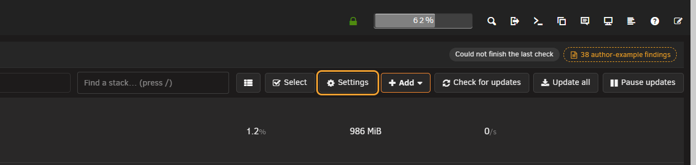
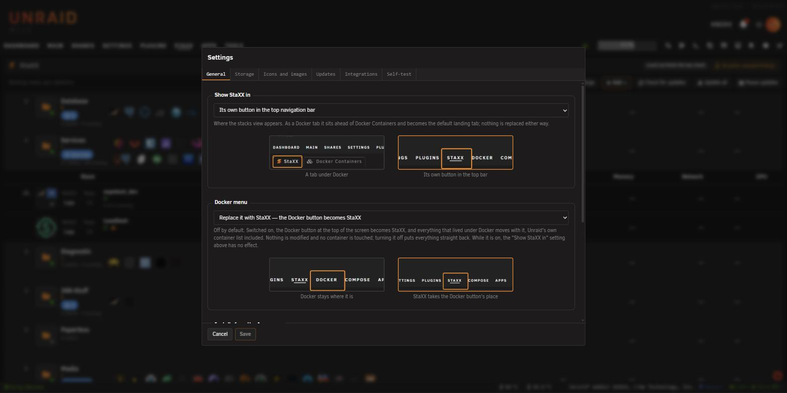
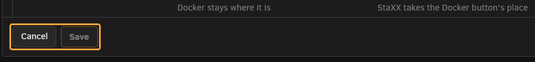

# Settings

<!-- index: 80 | how to open the settings panel, what its seven tabs are, and how to save or cancel a change. -->

[StaXX guide](README.md) › Settings

Press **Settings**, the cog above your stack list, to open this panel. If StaXX's own page will not
open, see [If you cannot reach StaXX](where-things-live.md#if-you-cannot-reach-staxx).

The panel has seven tabs:

- [General](settings-general.md) — where StaXX appears, installing apps, and container access.
- [Storage](settings-storage.md) — where your stacks are kept, flash-drive copies, and unused images.
- [Icons and images](settings-icons-and-images.md) — container icons and image documentation.
- [Updates](settings-updates.md) — checking for and installing image updates.
- [Integrations](settings-integrations.md) — Docker Hub, your own registries, and password hashing.
- [Self-test](settings-self-test.md) — a health check for StaXX and Docker.
- [About](settings-about.md) — details about this copy of StaXX.

## Using the panel

1. Change what you want. **Save** lights up once you have changed something.
2. Press **Save**. If any value is wrong, nothing is saved.
3. **Cancel** throws your changes away. Closing with something unsaved asks first.

Some settings need the page to reload — where StaXX appears, and where the data store is. StaXX
reloads for you and says so.

## Terms used here

Any word you are not sure of is in the [glossary](../glossary.md).

Back to [the StaXX guide](README.md).
