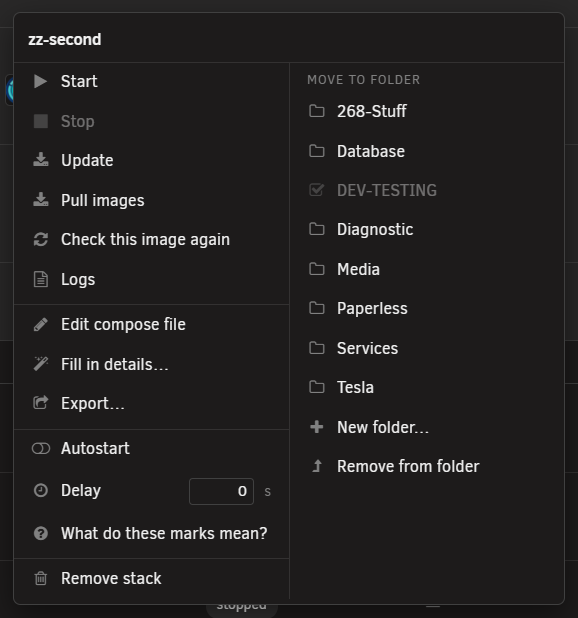
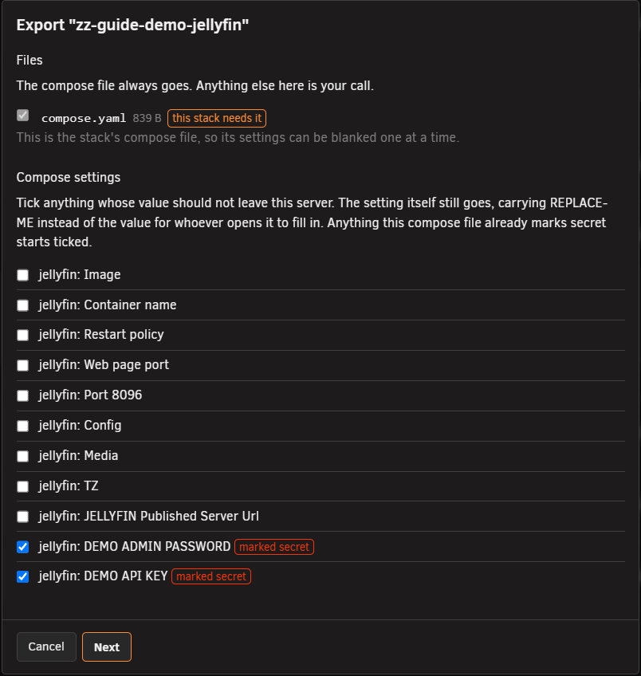
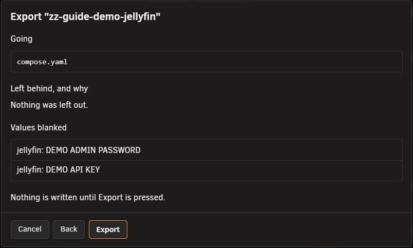
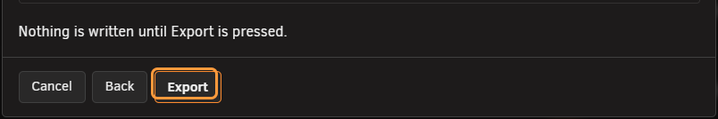
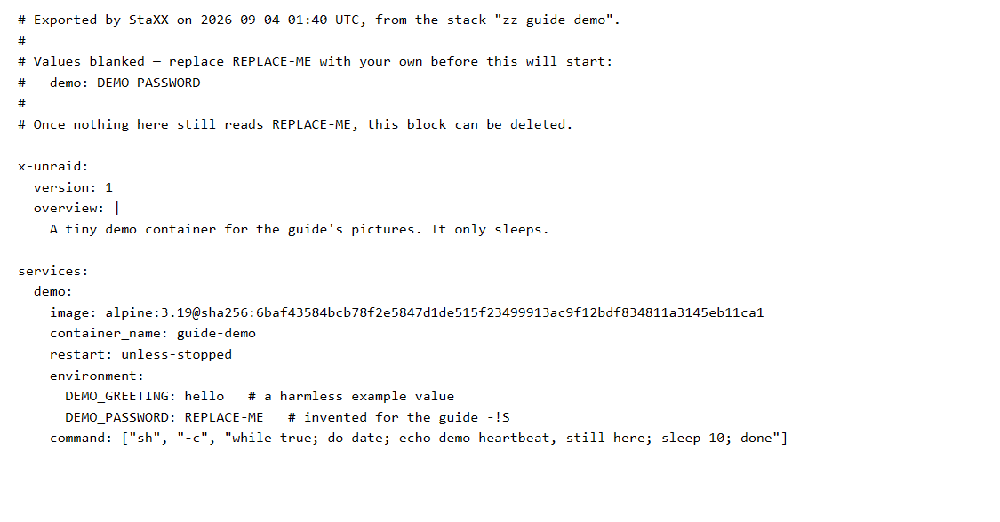
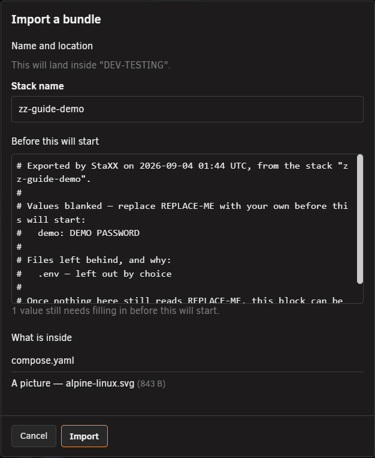

# Export and import a stack

<!-- index: 70 | how Export blanks your passwords and paths out of a copy, what it refuses to send, and what the other person has to fill in. -->

Your compose file holds things that belong only to you: passwords, keys, your own folder paths.
**Export** makes a copy with those taken out, and leaves your own stack untouched.

## 1. Open the menu

Right-click a stack's row and choose **Export…**. See [the stack list](the-stack-list.md) for the
rest of that menu.

## 2. Choose what goes

The first screen lists every file in the stack's folder.

| Kind | What happens |
|---|---|
| Compose file | Always goes. Cannot be unticked. Its settings can be blanked one at a time. |
| `.env` file | Same as the compose file — names and values, so it can be blanked entry by entry. |
| Other text file | Must be read on screen before it can be ticked. |
| Icon | Ticked already, if the stack has one. Untick it to leave it out. |
| Refused | Keys, certificates, anything not text, anything too large, folders, links. Listed with the reason. No tick. |

A file the compose file needs is marked. That mark never turns a refused file into an allowed one.

**Reading a file:** lines that look like they carry something private are marked. This only ever
means "look here". It never means the rest of the file is safe. The judgement stays with you.

### Blanking values

Below the file list is every setting in the compose file. Anything the file already marks as
secret — see [marking a value sensitive](hiding-your-values.md) — is ticked for you. Paths start
unticked; whether a folder name gives something away is your call.

Tick the `.env` file and its entries join the list, all ticked.

## 3. Check what is about to leave

Press **Next**. Nothing is written yet.

| Section | Shows |
|---|---|
| Going | Every file that will leave. |
| Left behind, and why | Every file staying, with a reason. |
| Values blanked | Every setting that will be replaced. |

This screen also marks the values you ticked as secret **in your own stack too**. It only marks
compose settings — a `.env` file has nowhere to keep that mark.

## 4. Press Export

| What you sent | What you get |
|---|---|
| Just the compose file | Downloads as plain text — paste it anywhere. |
| More than one file | Downloads as a single `.staxx` file — an ordinary zip, rename it to `.zip` to look inside. |

This is how you hand a stack over. The person who receives it can drop the file straight onto their
own stack list to bring it in — see [Import a bundle](#import-a-bundle) below.

## The exported file

A blanked value becomes `REPLACE-ME` — never a value that looks real. Replace every `REPLACE-ME`
value before you start the stack; StaXX names which settings still need one.

A note is written into the compose file itself, as comments at the top: what it is, when it was
made, which stack it came from, every value blanked, and every file left behind and why. No machine
name, no username, no address. Delete the note once nothing still reads `REPLACE-ME`.

Everything else survives untouched — comments, blank lines, the order you wrote it in. It is your
real file with holes punched in it, not one rebuilt from scratch.

The person who receives it fills those holes in through [the stack editor](the-stack-editor.md).
For a value that needs a real password, see [making a password or passphrase](passwords-and-hashes.md).

## The icon

An icon lives in a hidden folder tucked inside the stack, alongside every earlier saved copy of the
compose file, including the passwords those old copies still hold. Export takes only the picture
your compose file names from that folder; nothing else in it leaves.

## Import a bundle

Drag a `.staxx` file onto the stack list and drop it. Drop it on a folder to land there; drop it on
a stack to join that stack's folder; drop it anywhere else to land at the top level.

Nothing is written on drop. You get a preview first — what it holds, where it will land, what it
will be called, and the sender's note listing every value to fill in. Press **Import** and the stack
appears, stopped, still holding its `REPLACE-ME` values.

If the name is already used, choose another. Every part of a bundle is checked before anything is
unpacked, and anything outside the shapes StaXX allows is refused, with a reason. Nothing in a
bundle can reach outside the new stack's own folder, and nothing it claims about its own past is
believed.

To do it by hand instead, make a new stack and paste the compose text in.

## Terms used here

Any word you are not sure of is in the [glossary](../glossary.md).

Back to [the StaXX guide](README.md).
