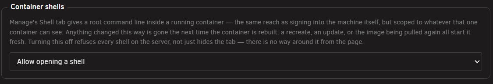

# The Manage tab

<!-- index: 35 | what the Manage tab is for, how to open it, and what each of its three panes — log, shell and file browser — does and refuses to do. -->

Manage gives you a live console for one running container: its log, a real command line inside it, and a look at its files. Open it from a stack's **Logs** button on the list, or from the **Manage** tab in [the stack editor](the-stack-editor.md) once a stack is open. A **Logs** item against one particular container opens Manage with that container already picked; the stack's own **Logs** button opens on **All**.

## The short version

1. Open a stack, or click its **Logs** button on the list.
2. Along the top, pick a container — or **All** to watch every log at once.
3. Use the **Log**, **Shell** and **Files** panes below to watch, type, or browse.
4. Close the editor when you are done. Anything open here closes with it.

## The three panes

| Pane | What it is for |
|---|---|
| Log | Watching what the container prints, live. |
| Shell | A real command line, running as root, inside the container. |
| Files | Browsing, opening, editing and managing files the container can see. |

<!-- SHOT: the-manage-tab-whole | full frame | the whole Manage tab open, with the container picker along the top and all three panes — Log, Shell and Files — visible side by side -->

## The container picker

<!-- SHOT: the-manage-tab-picker | close-up | the row of container tabs along the top of Manage, including the All tab, a running light beside a container's name, and its CPU/memory reading -->

Along the top sits one tab per container in the stack, plus **All**. Each container's tab carries a light for its state, a warning mark if it is doing something other than plainly running or plainly stopped, and its CPU and memory reading. Picking **All** merges every container's log into one view; there is no shared shell or file browser for the whole stack, so Shell and Files ask you to pick one container first.

Beside the tabs sits a switch, and five buttons — **Stop**, **Start**, **Restart**, **Recreate**, **Update** — that act on either this one container or the whole stack, depending on which way the switch is set.

## The Log pane

Reading follows the container's own output as it arrives, keeping up to 4,000 lines before quietly dropping the oldest and saying so once. A few controls sit above it:

| Control | Does |
|---|---|
| Live / Paused | Following stops the moment you scroll up, and the button starts it again. |
| Jump to latest | Scrolls straight to the newest line and resumes following. |
| Search | Highlights what matches, or hides everything else once **Filter** is also on. |
| Timestamps | Hides the time compose stamps on every line, without removing it. |
| Wrap | Turns long lines onto more than one line, or lets them run off the side. |
| Copy visible | Copies exactly what the pane shows right now. |
| Download all | Loads the whole log into a box you can select and copy. StaXX cannot hand your browser a file to save, so this is the nearest thing. |
| Show environment | Prints this container's environment variables into the pane, marked as StaXX's own line rather than something the container said. |

## The Shell pane

Shell gives you a genuine command line inside the running container, working as root. Type into it as you would any terminal — arrow keys, Ctrl-C, Ctrl-L, Tab and the rest all work, and pasting is read straight off your clipboard.

Know what this is: it has the same reach as signing into the machine itself, only scoped to whatever this one container can see. Anything you change this way is gone the next time the container is rebuilt — an update, a recreate, or simply the image being pulled again all start it fresh, so a real fix belongs in the compose file, not typed here.

The first time you open a shell on this server, a notice explains this and asks you to confirm it — once per server, never once per container.

A program that wants a full screen — nano, htop, or anything like them — cannot be shown in this pane. It offers a plain notice and a **Send Ctrl-C** button instead; open Unraid's own terminal for that kind of program. Once a session has ended — the container stopped, or the shell process itself exited — the pane says so and offers **Reconnect** for a fresh one.

Shell only works while the **Container shells** setting, in Settings, is switched on. Turning it off refuses every shell on the server outright, not merely hides the tab — there is no way around it from the page.

## The Files pane

<!-- SHOT: the-manage-tab-files | close-up | the Files pane open on a folder listing, showing the toolbar, a folder marked as coming from the server, and the Open/Download/O-P/Rename/Delete buttons on a row -->

Files browses whatever this one container can see — its own filesystem, exactly as it is right now. A folder marked with a house symbol is one this container's compose file actually mounts from your server; anything else lives inside the container only, and is gone the next time it is rebuilt.

| Action | Does |
|---|---|
| Open a folder | Click its name to step into it; **Up** and the path itself step back out. |
| Config folder | Jumps straight to this container's first server-mounted folder, when it has one. |
| New folder | Makes one in the folder you are looking at. |
| Open | Reads a text file into a box here, editable, with **Save** to write it back. |
| Download | Shows the file's contents read-only, to select and copy. Like the log's Download all, it cannot save a file onto your computer. |
| Upload | Reads one file from your own computer and copies it in, up to 256 KiB. |
| Rename | Asks for a new name and renames it in place. |
| Delete | Asks first, then removes the file — or, for a folder, everything inside it too. |
| O/P | Asks for an owner, permissions, or both, and sets them — reaching through a whole folder at once. |

A binary file opens read-only, its contents shown as raw text StaXX cannot make sense of, since there is nothing here that could edit and save one back correctly.

## Resizing the panes

Drag the line between Log and the other two panes, or the line between Shell and Files, to give one more room. Double-click either line for an even split, or select it and use the arrow keys. Collapse a pane by clicking its heading — except on a narrow window, where a row of tabs picks one pane at a time instead.

## Refusals you may see

| Message | Means |
|---|---|
| "Shell access to containers is turned off in Settings." / "Container file access is turned off in Settings, under the same switch as the shell." | The **Container shells** setting is off. Turn it on to use either pane. |
| "This stack was imported and has not been reviewed yet…" | The stack is under its review lock. Open it and clear the lock first. |
| "That container is not running, so there is nothing to open a shell into." / "No running container for service…" | Start the container before opening a shell or browsing its files. |
| "No service called…in this stack." | The container this pane wants no longer exists in the compose file. |
| "That is not a valid absolute path." | Something asked for a path outside what Files allows. |
| "…is over the 256 KiB limit…" | A file is too large to read, write or upload here. |
| "Refusing to delete the container's whole filesystem." | Files will not let you delete `/`. |

## What this never does

- It never changes the stack's compose file. Nothing here writes to it.
- It never reaches outside a container's own view — a folder not marked as coming from your server lives only inside that container, for only as long as the container does.
- It never keeps a shell running once you close the editor. Every open session closes with it.
- It never hands you a real file to save onto your computer. Open, Download and Download all all put a file's contents into a box to select and copy instead.
- It never asks the shell warning more than once per server.

## Not built yet

- Uploading more than one file at a time — the Files pane takes one file per click.
- Downloading a whole folder at once, rather than one file's contents at a time.
- Dragging a file from your computer straight onto the pane, rather than using the Upload button.
- Searching inside a folder listing, the way the Log pane can search what it has printed.

## Terms used here

Any word you are not sure of is in the [glossary](../glossary.md).
