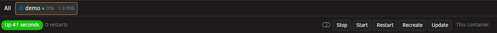
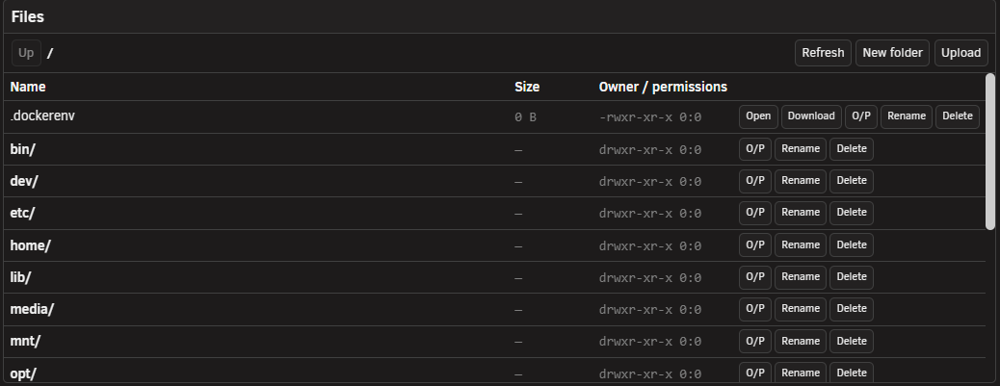

# The Manage tab

<!-- index: 35 | what the Manage tab is for, how to open it, and what each of its three panes — log, shell and file browser — does and refuses to do. -->

Manage gives you a live console for one running container: its log, a real command line inside it, and a look at its files. Open it from a stack's **Logs** button on the list, or from the **Manage** tab in [the stack editor](the-stack-editor.md) once a stack is open. A **Logs** item against one particular container opens Manage with that container already picked; the stack's own **Logs** button opens on **All**.

## The short version

1. Open a stack, or click its **Logs** button on the list.
2. Along the top, pick a container — or **All** to watch every log at once.
3. Use the **Log**, **Shell** and **Files** panes below to watch, type, or browse.
4. Close the editor when you are done. Anything open here closes with it.

## The three panes

| Pane | What it is for |
|---|---|
| Log | Watching what the container prints, live. |
| Shell | A real command line, running as root, inside the container. |
| Files | Browsing, opening, editing and managing files the container can see. |

## The container picker

Along the top sits one tab per container in the stack, plus **All**. Each container's tab carries a light for its state, a warning mark if it is doing something other than plainly running or plainly stopped, and its CPU and memory reading. Pick **All** to merge every container's log into one view. Pick one container to use **Shell** or **Files**.

Beside the tabs sits a switch, and five buttons — **Stop**, **Start**, **Restart**, **Recreate**, **Update** — that act on either this one container or the whole stack, depending on which way the switch is set.

If the stack's compose file declares any **profiles** — optional parts of the stack that only start when switched on — a **Profiles** line sits directly beneath that button row, one switch per profile. A service tagged with a profile that is off will not start.

## The Log pane

Reading follows the container's own output as it arrives, keeping up to 4,000 lines before dropping the oldest and saying so once. A few controls sit above it:

| Control | What it does |
|---|---|
| Live / Paused | Scrolling up stops following; press the button to start it again. |
| Jump to latest | Scrolls straight to the newest line and resumes following. |
| Search | Highlights what matches, or hides everything else once **Filter** is also on. |
| Timestamps | Hides the time compose stamps on every line, without removing it. |
| Wrap | Turns long lines onto more than one line, or lets them run off the side. |
| Copy visible | Copies exactly what the pane shows right now. |
| Download all | Loads the whole log into a box you can select and copy from. |
| Show environment | Prints this container's environment variables into the pane, marked as StaXX's own line rather than something the container said. |

## The Shell pane

Shell is Unraid's own terminal, the same one its **Console** button opens, sitting inside this pane rather than in a pop-up window. It gives you a genuine command line inside the running container, running as root. Type into it as you would any terminal; full-screen programs such as nano, htop or mc all work properly, with their own colours, redraws and cursor movement.

It has the same reach as signing into the machine itself, scoped to whatever this one container can see. Make a lasting fix in the compose file, not here: an update, a recreate, or the image being pulled again all start the container fresh, and anything typed in Shell is gone with it.

The first time you open a shell on this server, a notice explains this and asks you to confirm it — once per server, not once per container.

When a session ends, whether the container stopped or the shell process exited, press **Reconnect** to start a fresh one.

Turn on **Container shells**, under [Settings](settings.md), to use Shell or Files.

## The Files pane

Files browses whatever this one container can see: its own filesystem, exactly as it is right now. A folder marked with a house symbol is one this container's compose file mounts from your server; anything else lives inside the container only, and is gone the next time it is rebuilt.

| Action | What it does |
|---|---|
| Open a folder | Click its name to step into it; **Up** and the path itself step back out. |
| Config folder | Jumps straight to this container's first server-mounted folder, when it has one. |
| New folder | Makes one in the folder you are looking at. |
| Open | Reads a text file into a box here, editable, with **Save** to write it back. |
| Download | Shows the file's contents read-only, to select and copy from. |
| Upload | Reads one file from your own computer and copies it in, up to 256 KiB. |
| Rename | Asks for a new name and renames it in place. |
| Delete | Asks first, then removes the file — or, for a folder, everything inside it too. |
| O/P | Asks for an owner, permissions, or both, and sets them across a whole folder at once. |

A binary file opens read-only, its contents shown as raw text.

## Resizing the panes

Drag the line between Log and the other two panes, or the line between Shell and Files, to give one more room. Double-click either line for an even split, or select it and use the arrow keys. Collapse a pane by clicking its heading. On a narrow window, a row of tabs picks one pane at a time instead.

## Refusals you may see

| Message | What to do |
|---|---|
| "Shell access to containers is turned off in Settings." / "Container file access is turned off in Settings, under the same switch as the shell." | Turn on **Container shells**, under [Settings](settings.md). |
| "This stack was imported and has not been reviewed yet…" | Open the stack and clear its review lock first. |
| "That container is not running, so there is nothing to open a shell into." / "No running container for service…" | Start the container first. |
| "No service called…in this stack." | Pick a container that is still in the compose file. |
| "That is not a valid absolute path." | Give Files a path inside what it allows. |
| "…is over the 256 KiB limit…" | Use a file under 256 KiB. |
| "Refusing to delete the container's whole filesystem." | Files will not delete `/`. |

Nothing here writes to the stack's compose file. Open, Download and Download all put a file's contents into a box to select and copy; none of them saves a copy onto your own computer.

## Terms used here

Any word you are not sure of is in the [glossary](../glossary.md).

Back to [the StaXX guide](README.md).
