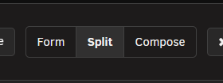
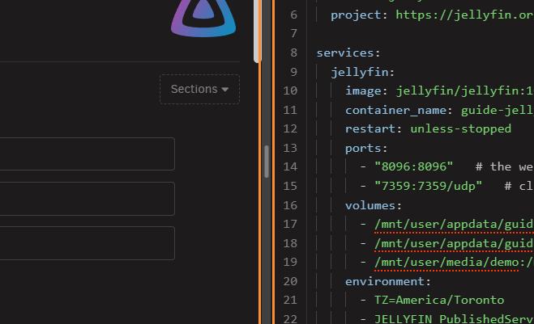
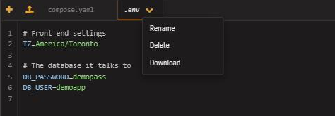
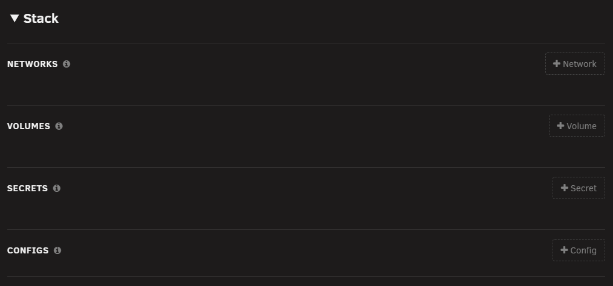
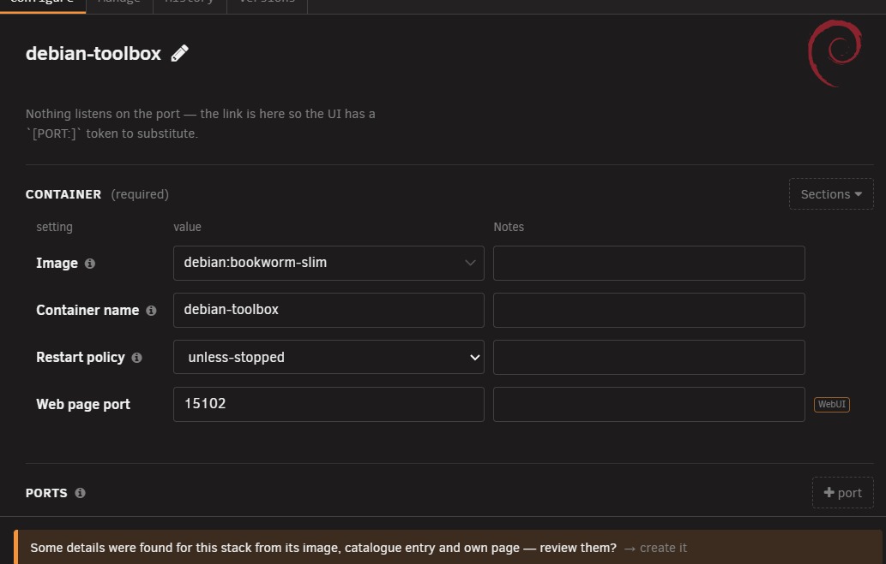
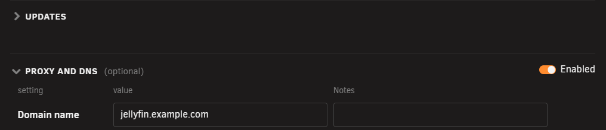
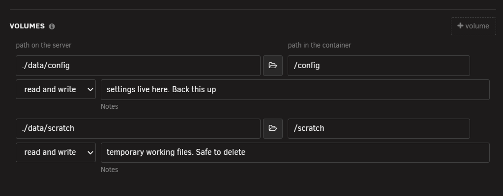

# The stack editor

<!-- index: 6 | a walk round the window that opens when you open a stack: the three ways to see the same file, the tabs, the form's sections, and the buttons along the bottom. -->

Open it by clicking [a stack's picture](the-stack-list.md) on the list, or by opening **Add** and
choosing **Add a blank stack**.
Clicking one service's own icon, rather than the stack's, opens the same window in Split view,
scrolled straight to that service.

## The header

| Part | What it does |
|---|---|
| Title | The stack's name, or **New stack** while making one. |
| Stack name box | The folder that holds this stack's file. Renaming it moves the folder. The folder it sits in, if any, is shown in grey beside it. |
| Sanitise | Hides every value marked sensitive. See [Sanitise mode](hiding-your-values.md). |
| Password | Opens the password generator, and a hashing tool beside it. See [password generator and hashing tool](passwords-and-hashes.md). |
| Fill in details | Looks up each container's icon, links, description and more from the image, its catalogue entry and its own page. |
| Outline | Jumps to a block or service inside the compose file. |
| Close | Closes the editor. |

## The three views

Three buttons switch how you see the same file.

| View | Shows |
|---|---|
| Form | Only the form. |
| Split | The form on one side, the raw compose file on the other. |
| Compose | Only the raw file, as text. |

In Split, drag the bar between the two panes to give one side more room, or double-click it to put
it back in the middle. Its position is remembered in your browser: the editor reopens where you
left it.

A file other than the compose file itself, such as a `.env` file, opens beside the form. With the
`.env` tab open, click a setting whose value uses one of its variables and the line that defines
that variable lights up, the same way the compose file's lines do.

Two orange buttons sit at the left of the file tab strip: **New file** adds a new, empty file to
the stack, and the upload button beside it adds a file from your computer. Every file's tab also
carries its own menu arrow. Press it to rename, download or delete that file.

## The four tabs

| Tab | What it holds |
|---|---|
| Configure | The form, the compose file, or both — the three views above. |
| Manage | A live console for the running container: a shell, a log, a file browser. |
| History | Earlier saved versions of this file. See [recovery and redundancy](recovery-and-redundancy.md). |
| Versions | Which build of each image has actually run, and a way to put an older one back. See [recovery and redundancy](recovery-and-redundancy.md). |

Turn Sanitise off to open History. Versions stays available with Sanitise on.

## The form, section by section

The form opens with a **Stack** section — settings that belong to the whole file, not to one
service — then one section per service.

| Group | For |
|---|---|
| Networks | Named networks declared for the whole stack to share. |
| Volumes | Named volumes declared for the whole stack to share. |
| Secrets | Secrets declared for the whole stack to share. |
| Configs | Configs declared for the whole stack to share. |

Each service then gets its own set of groups. Press a service's **Sections** button to choose which
of them to show; a tick marks each one already showing.

Press the arrow beside a section's heading, or the heading itself, to fold the section away. Press
it again to open it. Every section except **Container** folds. StaXX remembers which kinds of
section you folded, in this browser, so folding **Ports** folds it on every stack you open.

| Group | For |
|---|---|
| Container | The image, the name and how it restarts. Always shown — every service must have it. |
| Proxy and DNS | Shown only once Nginx Proxy Manager is set up in [Settings](settings.md). See [proxy and DNS](proxy-and-dns.md). |
| Networks | Which networks this service joins. |
| Ports | Which ports it publishes. On by default. |
| Volumes | Folders and files it shares with the server. On by default. |
| Variables | Environment variables. On by default. |
| Devices | Hardware devices handed to it. On by default. |
| Labels | Docker labels. On by default. |
| Health check | How Docker decides the container is working. |
| Resource limits | CPU and memory limits. |
| Build | Building the image here instead of pulling it. |
| Depends on | Which other services must start first. |
| Secrets | Secrets this service can read. |
| Configs | Configs this service can read. |
| Profiles | Which profiles start this service. |
| DNS servers | DNS servers to use instead of the server's own. |
| Extra permissions | Linux capabilities added. |
| Dropped permissions | Linux capabilities removed. |
| Internal ports | Ports open to other containers only, not published. |
| Variable files | Files environment variables are read from. |
| Logging | How this service's logs are kept. |
| Advanced | Anything else the file sets, with no better home. Always shown. |

## What sits on a row

| Part | What it is |
|---|---|
| Note under a box | A sentence explaining what the file already says, or a warning about it. |
| Help mark | A small circled "i" beside a label. Click it for a sentence about that setting. |
| Remove | A cross at the end of a row. Removes that one entry. |
| Reorder grip | On a port row only. Drag it, or focus it and use the up and down arrow keys, to change the order ports are tried in. |
| "more settings" fold | A row's own extra, less common settings, folded away until opened. |
| Pickers | A small button beside a box, for choosing a value instead of typing it: **Choose a folder** browses the server, **Choose a timezone** picks one from a map, **Choose a device** lists the server's own devices. |

## The buttons along the bottom

| Button | What it does | Needs |
|---|---|---|
| Tidy this file | Tidies the layout of the compose file without changing what it means. See [editing a stack](editing-a-stack.md). | Sanitise off, and the compose file open. |
| Undo | Puts back the last change this button covers — adding or removing an entry. | Sanitise off, the compose file open, and a change to undo. |
| Save | Writes the file. | Sanitise off. |
| Save and start | Writes the file, then starts the stack. | Sanitise off, every required field filled in, no `REPLACE-ME` placeholder left, and a working Compose and Docker on the server. |

## On a phone or a narrow window

Below desktop width the editor rearranges itself rather than shrinking:

| Part | What changes |
|---|---|
| Header | Two lines: the title and the stack name, then the tools. On a phone, **Close** sits in the top-right corner. |
| Views | Use the **Show the compose file** switch at the top of the Configure tab to swap the form for the raw file and back. |
| Notes | Advice — the details-found offer and the "author's published example also sets…" lines — folds into one line at the foot reading *N notes*. Tap it to read them, and the cross to fold them away again. Warnings that need an answer, such as a folder that does not exist yet, stay in full. |

## Messages you may see

| Message | Wording | Meaning |
|---|---|---|
| Sanitise banner | "Sanitised for screenshots. Values marked sensitive are hidden and nothing can be changed. Turn Sanitise off to make edits." | Sanitise is on. See [Sanitise mode](hiding-your-values.md). |
| Conversion banner | "This install came in from Unraid's Apps page. StaXX has converted it to a stack below — save it to install the app." | This stack just arrived converted from an Unraid install, a reinstall, or an existing container being brought in. |
| Required-field bar | Names the blank field, e.g. "…And 2 other rows need attention." | Fill in the named field. Click the bar to jump to it. |
| Missing-file bar | '"filename" is named in this compose file but is not in this stack. Create it, or add it with the + button above.' | Create the named file, or add it with the **+** button above. |
| Make-paths bar | '"path" is named in this compose file but does not exist on the server yet. Create it.' | Click the bar to create the named folder on the server. |
| Folder-in-use caution | '"path" already has files in it. Starting this stack would point it at whatever is already there — check that is what you mean before starting it.' | Check the named folder before starting a new stack that points at it. |
| Network not found | 'This server has no network called "eth0.2". The nearest is "br0.2".' under a network marked as already existing, with a **Use br0.2** button beside it. | Press the button to rename the network, in its declaration and in every service that uses it, as one undoable edit — or point the service at a different network yourself. |

A network that another stack created shows up in the network dropdown too, marked "created by the
&lt;name&gt; stack", and can be picked like any other. If that other stack is later removed, choose a
different network for this one.

## Terms used here

Any word you are not sure of is in the [glossary](../glossary.md).

Back to [the StaXX guide](README.md).
