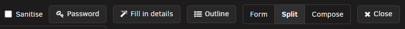
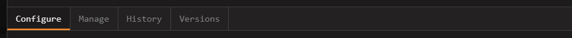
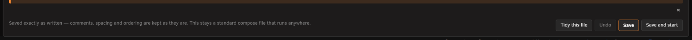

# The stack editor

<!-- index: 6 | a walk round the window that opens when you open a stack: the three ways to see the same file, the tabs, the form's sections, and the buttons along the bottom. -->

This is the window that opens when you click [a stack's picture](the-stack-list.md) on the list, or press **Add stack**. This page walks it part by part.

## The header

| Part | What it does |
|---|---|
| Title | The stack's name, or **New stack** while making one. |
| Stack name box | The folder that holds this stack's file. The hint underneath it reads: "The folder that holds this stack's compose file. Renaming it moves the folder." |
| Sanitise | Hides every value marked sensitive, so a screenshot does not leak them. See [Sanitise mode](hiding-your-values.md). |
| Password | Opens the password generator, and a hashing tool beside it. See [password generator and hashing tool](passwords-and-hashes.md). |
| Fill in details | Looks up this stack's icon, links, description and more from the image, its catalogue entry and its own page. |
| Outline | Jumps to a block or service inside the compose file. |
| Close | Closes the editor. |

## The three views

<!-- SHOT: the-stack-editor-views | close-up | the Form, Split and Compose buttons, with Split pressed -->

Three buttons switch how you see the same file.

| View | Shows |
|---|---|
| Form | Only the form. |
| Split | The form on one side, the raw compose file on the other. |
| Compose | Only the raw file, as text. |

Split is the normal view on a wide window, and Form on a narrow one. Split's button is not shown at all on a narrow window — there is no room for two panes side by side. Opening a file that is not the compose file itself (a `.env` file, say) always shows it beside the form, never in place of it, so Form on its own is not offered while one is open.

## The four tabs

| Tab | What it holds |
|---|---|
| Configure | The form, the compose file, or both — the three views above. |
| Manage | A live console for the running container: a shell, a log, a file browser. |
| History | Earlier saved versions of this file. See [going back](going-back.md). |
| Versions | Which build of each image has actually run, and a way to put an older one back. See [going back](going-back.md). |

History is switched off while Sanitise is on. An old version holds the real values, not the hidden ones, so showing it would defeat Sanitise. Versions stays on — an image name is not a value you wrote, so Sanitise has nothing to hide there.

## The form, section by section

<!-- SHOT: the-stack-editor-stack-section | full frame | the Stack section open at the top of the form, above the first service, showing its Networks, Volumes, Secrets and Configs groups -->

The form opens with a **Stack** section — settings that belong to the whole file, not to one service — then one section per service.

| Group | For |
|---|---|
| Networks | Named networks declared for the whole stack to share. |
| Volumes | Named volumes declared for the whole stack to share. |
| Secrets | Secrets declared for the whole stack to share. |
| Configs | Configs declared for the whole stack to share. |

<!-- SHOT: the-stack-editor-service-section | full frame | one service's section with the Sections button pressed and its picker open, showing several groups ticked on -->

Each service then gets its own set of groups. Most are hidden until you switch them on with that service's **Sections** button — a picker lists all of them, with a tick beside each one already showing.

| Group | For |
|---|---|
| Container | The image, the name and how it restarts. Always shown — this is the one group every service must have. |
| Networks | Which networks this service joins. |
| Ports | Which ports it publishes. On by default. |
| Volumes | Folders and files it shares with the server. On by default. |
| Variables | Environment variables. On by default. |
| Devices | Hardware devices handed to it. On by default. |
| Labels | Docker labels. On by default. |
| Health check | How Docker decides the container is working. |
| Resource limits | CPU and memory limits. |
| Build | Building the image here instead of pulling it. Switches on by itself when the file already has one. |
| Depends on | Which other services must start first. |
| Secrets | Secrets this service can read. |
| Configs | Configs this service can read. |
| Profiles | Which profiles start this service. |
| DNS servers | DNS servers to use instead of the server's own. |
| Extra permissions | Linux capabilities added. |
| Dropped permissions | Linux capabilities removed. |
| Internal ports | Ports open to other containers only, not published. |
| Variable files | Files environment variables are read from. |
| Logging | How this service's logs are kept. |
| Advanced | Anything else the file sets, with no better home. Always shown. |

## What sits on a row

<!-- SHOT: the-stack-editor-row-parts | close-up | one field row showing a note underneath it, the info-circle help mark beside its label, and the remove cross at the end -->

| Part | What it is |
|---|---|
| Note under a box | A sentence explaining what the file already says, or a warning about it. |
| Help mark | A small circled "i" beside a label. Click it for a sentence about that setting. |
| Remove | A cross at the end of a row. Removes that one entry. |
| Reorder grip | On a port row only. Drag it, or focus it and use the up and down arrow keys, to change the order ports are tried in. |
| "more settings" fold | A row's own extra, less common settings, folded away until opened. |
| Pickers | A small button beside a box, for choosing a value instead of typing it: **Choose a folder** browses the server, **Choose a timezone** picks one from a map, **Choose a device** lists the server's own devices. |

## The buttons along the bottom

| Button | What it does | Unavailable when |
|---|---|---|
| Tidy this file | Tidies the layout of the compose file without changing what it means. See [editing a stack](editing-a-stack.md). | Sanitise is on, or a non-compose file is open. |
| Undo | Puts back the last change this button covers — adding or removing an entry. | Sanitise is on, a non-compose file is open, or there is nothing to undo. |
| Save | Writes the file. | Sanitise is on. |
| Save and start | Writes the file, then starts the stack. | Sanitise is on, a required field is still blank, a `REPLACE-ME` placeholder remains, or the server has no working Compose or Docker. |

## Messages you may see

| Message | Wording | Meaning |
|---|---|---|
| Sanitise banner | "Sanitised for screenshots. Values marked sensitive are hidden and nothing can be changed. Turn Sanitise off to make edits." | Sanitise is on. See [Sanitise mode](hiding-your-values.md). |
| Conversion banner | "This install came in from Unraid's Apps page. StaXX has converted it to a stack below — save it to install the app." | This stack just arrived converted from an Unraid install, a reinstall, or an existing container being brought in. |
| Required-field bar | Names the blank field, e.g. "…And 2 other rows need attention." | A required field is still empty. Click the bar to jump to it. |
| Missing-file bar | '"filename" is named in this compose file but is not in this stack. Create it, or add it with the + button above.' | The file refers to a file that is not in this stack's folder. |
| Make-paths bar | '"path" is named in this compose file but does not exist on the server yet. Create it.' | A folder the file wants does not exist yet on the server. Click it to create the folder. |
| Folder-in-use caution | '"path" already has files in it. Starting this stack would point it at whatever is already there — check that is what you mean before starting it.' | You are making a new stack, and a folder it names already holds something. |

## What this never does

- It never starts the stack just because you pressed Save — only Save and start does that.
- It never lets you edit while Sanitise is on. Turn it off first.
- It never creates a missing file or folder on its own. Every bar for one is a button, not an automatic fix.
- It never looks up a stack's details without you asking, beyond the offer bar — nothing is written until you accept it.

## Terms used here

Any word you are not sure of is in the [glossary](../glossary.md).
