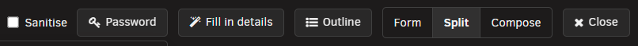
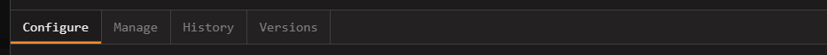
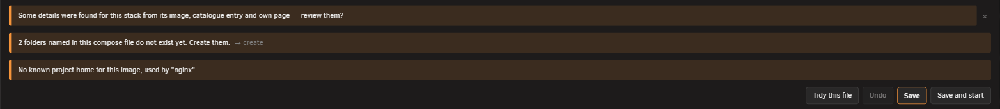

# The stack editor

<!-- index: 6 | a walk round the window that opens when you open a stack: the header row across the top, its four tabs, and the buttons along the bottom. -->

[StaXX guide](README.md) › The stack editor

Open it by clicking [a stack's picture](the-stack-list.md) on the list, or by opening **Add** and
choosing **Add a blank stack**.
Clicking one service's own icon, rather than the stack's, opens the same window in Split view,
scrolled straight to that service.

## The header

| Part | What it does |
|---|---|
| Title | The stack's name, or **New stack** while making one. |
| Stack name box | The folder that holds this stack's file. Renaming it moves the folder. The folder it sits in, if any, is shown in grey beside it. |
| Sanitise | Hides every value marked sensitive. See [Sanitise mode](hiding-your-values.md). |
| Password | Opens the password generator, and a hashing tool beside it. See [password generator and hashing tool](passwords-and-hashes.md). |
| Fill in details | Looks up each container's icon, links, description and more from the image, its catalogue entry and its own page. |
| Outline | Jumps to a block or service inside the compose file. |
| Form, Split, Compose | Switches between the three ways of seeing this stack's file. See the [Configure tab](editor-configure.md). |
| Close | Closes the editor. |

## The four tabs

| Tab | What it holds |
|---|---|
| Configure | The form, the compose file, or both. See the [Configure tab](editor-configure.md). |
| Manage | A live console for the running container: a shell, a log, a file browser. See the [Manage tab](the-manage-tab.md). |
| History | Earlier saved versions of this file. See the [History tab](editor-history.md). |
| Versions | Which build of each image has actually run, and a way to put an older one back. See the [Versions tab](editor-versions.md). |

Turn Sanitise off to open History. Versions stays available with Sanitise on.

## The buttons along the bottom

| Button | What it does | Needs |
|---|---|---|
| Tidy this file | Tidies the layout of the compose file without changing what it means. See [editing a stack](editing-a-stack.md). | Sanitise off, and the compose file open. |
| Undo | Puts back the last change this button covers — adding or removing an entry. | Sanitise off, the compose file open, and a change to undo. |
| Save | Writes the file. | Sanitise off. |
| Save and start | Writes the file, then starts the stack. | Sanitise off, every required field filled in, no `REPLACE-ME` placeholder left, and a working Compose and Docker on the server. |

## On a phone or a narrow window

Below desktop width the editor rearranges itself rather than shrinking:

| Part | What changes |
|---|---|
| Header | Two lines: the title and the stack name, then the tools. On a phone, **Close** sits in the top-right corner. |
| Views | Use the **Show the compose file** switch at the top of the Configure tab to swap the form for the raw file and back. |
| Notes | Advice — the details-found offer and the "author's published example also sets…" lines — folds into one line at the foot reading *N notes*. Tap it to read them, and the cross to fold them away again. Warnings that need an answer, such as a folder that does not exist yet, stay in full. |

## Messages you may see

| Message | Wording | Meaning |
|---|---|---|
| Sanitise banner | "Sanitised for screenshots. Values marked sensitive are hidden and nothing can be changed. Turn Sanitise off to make edits." | Sanitise is on. See [Sanitise mode](hiding-your-values.md). |
| Conversion banner | "This install came in from Unraid's Apps page. StaXX has converted it to a stack below — save it to install the app." | This stack just arrived converted from an Unraid install, a reinstall, or an existing container being brought in. |
| Required-field bar | Names the blank field, e.g. "…And 2 other rows need attention." | Fill in the named field. Click the bar to jump to it. |
| Missing-file bar | '"filename" is named in this compose file but is not in this stack. Create it, or add it with the + button above.' | Create the named file, or add it with the **+** button above. |
| Make-paths bar | '"path" is named in this compose file but does not exist on the server yet. Create it.' | Click the bar to create the named folder on the server. |
| Folder-in-use caution | '"path" already has files in it. Starting this stack would point it at whatever is already there — check that is what you mean before starting it.' | Check the named folder before starting a new stack that points at it. |
| Network not found | 'This server has no network called "eth0.2". The nearest is "br0.2".' under a network marked as already existing, with a **Use br0.2** button beside it. | Press the button to rename the network, in its declaration and in every service that uses it, as one undoable edit — or point the service at a different network yourself. |

A network that another stack created shows up in the network dropdown too, marked "created by the
&lt;name&gt; stack", and can be picked like any other. If that other stack is later removed, choose a
different network for this one.

## Terms used here

Any word you are not sure of is in the [glossary](../glossary.md).

Back to [the StaXX guide](README.md).
