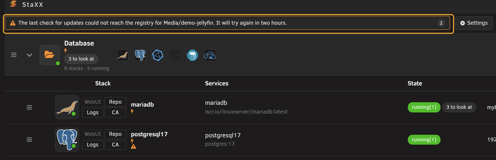
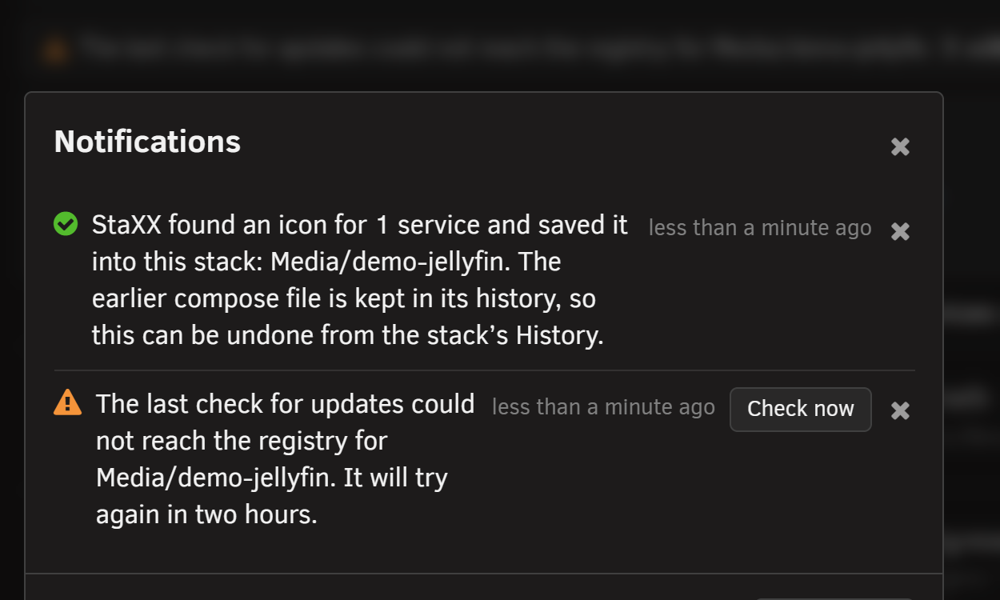
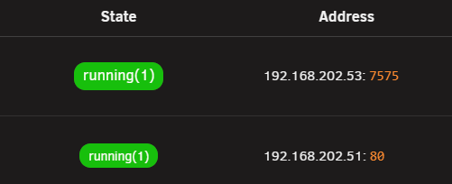
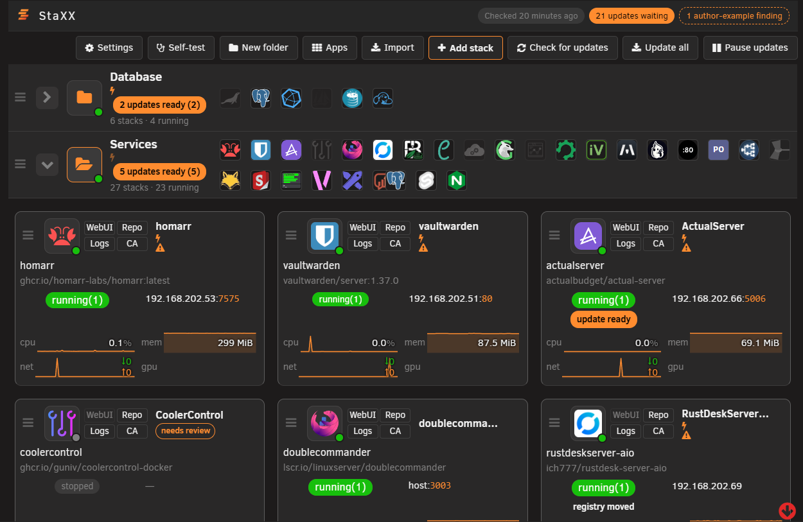
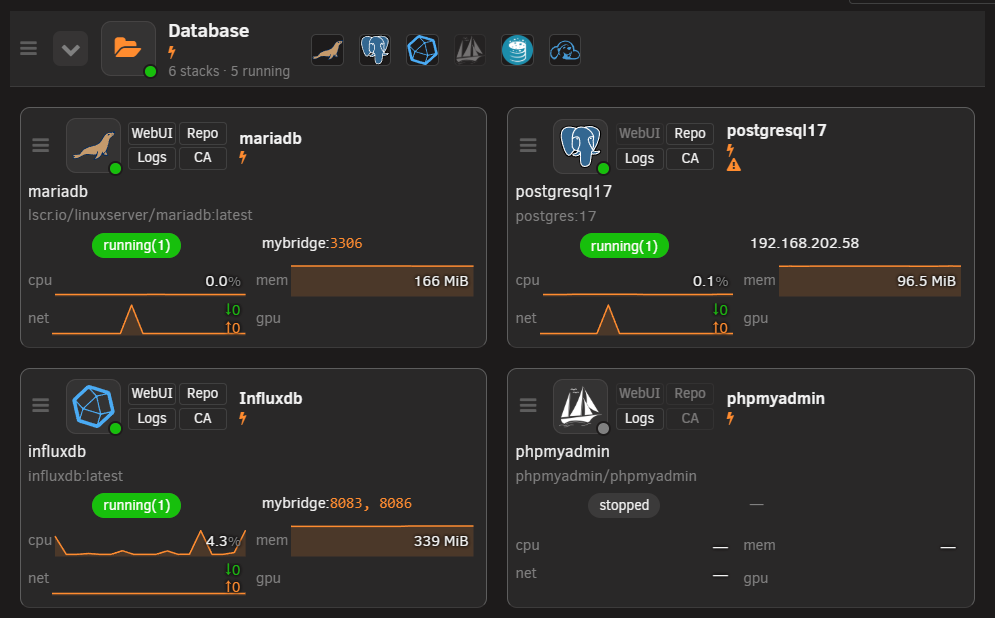
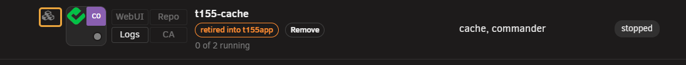
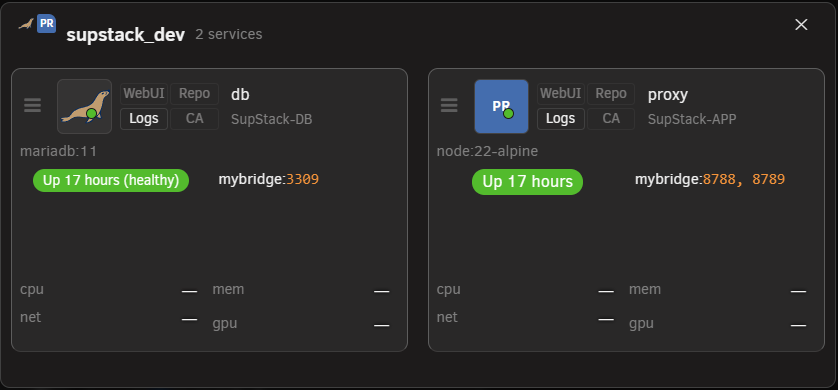
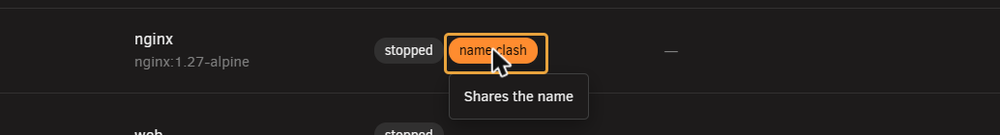
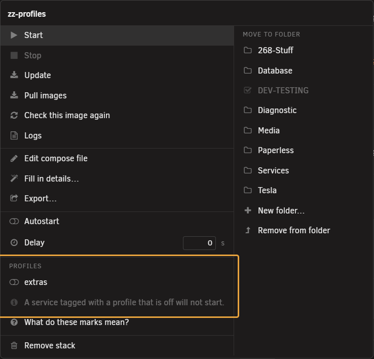
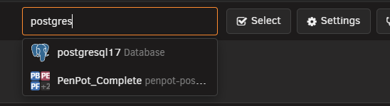

# The stacks page

<!-- index: 5 | a walk round the page you land on: every button along the top, every part of a row, and every item in the menus. -->

This is the screen you land on. It lists every stack, one row each. This page walks it top to
bottom, part by part.

## The buttons along the top

| Button | What it does |
|---|---|
| Settings | Opens the StaXX settings page. |
| New folder | Creates a folder to group stacks in. |
| Apps | Opens the catalogue of ready-made apps. |
| Import | Brings in a container or project StaXX does not manage yet. |
| Add stack | Starts a new, empty stack. |
| Check for updates | Checks every image against its registry, right now. |
| Update all | Installs every update currently waiting. |
| Pause updates | Freezes every update countdown on the page. Press again to say **Resume updates**. |

## Notifications

A line to the left of that button row carries any message StaXX has for you: a check that could not
run, an update that failed, an icon it found and saved on your behalf. It stays empty until there is
something to say, and shows a count when more than one is waiting. Press it to open the full list.

Each entry can carry a button of its own for wherever it points, and a small **×** to dismiss it.
StaXX remembers what you have dismissed in this browser for a week before showing it again. A few
messages, such as Docker not running, cannot be dismissed and clear themselves once the problem is
fixed.

## The title bar

At the right end of the title bar, next to "StaXX", small tags say how the last check went. See
[update checking](updates.md) for what a check does.

| Tag | Meaning |
|---|---|
| Never checked / Checked N ago / Could not finish the last check | Whether a check has run yet, and how it went. |
| N updates waiting | How many services have something newer. Not shown when there is nothing waiting. |
| N author-example finding(s) | The author's own published example does something different somewhere. Press it to see where. |

## The columns

The column titles sit directly above each folder's own stacks, not once at the top of the whole
list. The loose stacks below the last folder get a row of titles of their own too.

| Column | What it shows |
|---|---|
| Stack | The stack's name, its icon, and its state marks. |
| Services | The service names inside it, or an error if the file will not read. |
| State | Running or stopped, plus any update or restart mark. |
| Address | Where the stack answers — an address, or a network name. |
| CPU | Processor use, with a small graph. |
| Memory | Memory use, with a small graph. |
| Network | Network traffic, with a small graph. |
| GPU | A coloured badge (Intel, AMD or NVIDIA) for a stack whose file asks for a graphics card, plus a use figure and small graph while it is running. The badge stays even when the stack is stopped. The column only appears when a stack on the page has one. |
| Ports | The ports Docker is actually forwarding, plus the one a service's web page answers on. A stack with its own network address, or on host networking, shows none. |

## On a tablet or a phone

Below desktop width, the list becomes cards instead of a table. Each card carries a stack's icon,
name, state, address and its little graphs. A folder becomes a heading over its own row of cards
rather than a row of its own. How many cards sit across depends on the width: three on a tablet held
sideways or a small laptop, two on a tablet held upright, one on a phone.

On a phone, a card's four small buttons take a line of their own at a size a finger can hit, with
the state chips on the line beneath them.

The folder heading changes shape here too. Its name, its update marker and its "N stacks, N running"
line take the full width, with the icons of the apps inside it on their own line underneath rather
than in a column beside them.

A stack running more than one service shows a cubes button in its corner. Tap it to see those
services as cards of their own.

## Stack row parts

| Example | Part | What it does |
|---|---|---|
|  | Drag handle | Drag the row to move it. Greyed out when there is nothing to move it against. |
|  | App picture | Click it to open the stack for editing. The dot on its corner is green when the stack is running, red when a container inside says it is unwell. |
|  | Four chips | Shortcuts out to the app and its project. See the table below. |
|  | Name | The folder this stack lives in, which is also its name. The small bolt under it means it starts when the server boots. |

Two more parts are not on every row. An arrow left of the app picture opens and closes the container
list, on a stack holding more than one container. A line under the name says how many of them are
running.

To open a stack's menu, right-click its row.

### The four chips

| Chip | Opens |
|---|---|
| WebUI | The app's own web page. Available only when the app has one and is running. |
| Logs | This stack's log output. Always available, even when stopped. |
| Repo | The project's own page, when known. |
| CA | The support or discussion thread for the app, when known. |

## Row marks

Three of these are the same orange triangle. What tells them apart is where it sits and what it says
when you hover it. See [row marks and icons](marks.md) for the full key.

| Example | Mark | Meaning |
|---|---|---|
|  | Drawing pin, under the name | One or more services is held at one exact build. Hover it to see which. |
|  | Orange triangle, under the name | Either the stack was imported and its original has changed since, or a service is on a network that gives it its own address, so the ports in its file do nothing. Hover it to see which. |
|  | Orange triangle, under the image name | The file asks for a different image than the one running. Restart to apply it. |
|  | Red triangle in place of the app picture | Compose cannot read this stack's file, or there is no file at all. |
|  | needs review | Imported and not checked over yet. It will not start on its own. |
|  | waiting to confirm | Just switched over from an older container. Press it to say whether the app works. |

## The State column

| Example | Meaning |
|---|---|
|  | Running. The wording comes straight from Docker. |
|  | Running, but the app inside says it is not working. |
|  | Running. Its own check has not finished deciding yet. |
|  | Not running. |
|  | Never started from the file yet. |
|  | A command is running on this row. It also says Starting, Stopping, Removing or Rebuilding, or, on a first start, Downloading image…, while the image itself is still being fetched. |
|  | The last command failed. Click it to see what happened. |

An amber **name clash** pill appears here when a stack's folder shares a name with another stack
elsewhere in your store. Hover it to see the other folder's name; the stack that is actually running
keeps its real state here. Rename one of the two stacks, or remove the one you no longer use. Give
every new stack a name not already used elsewhere in your store: StaXX refuses to create, rename,
move or import one under a name already in use.

Beside it, an update pill, shown only when there is something to report:

| Example | Wording | Meaning |
|---|---|---|
|  | "update ready", or an old and new version, or a version and "new build" | An update is ready. Press it to install. |
|  | "N updates ready" | More than one service here has one waiting. |
|  | rebuild ready | Built here, and its base image has moved on. |
|  | built here | Built on this server. Nothing to compare it to. |
|  | not installed | Named in the file but never pulled. |
|  | tag withdrawn | This tag no longer exists at the registry. |
|  | registry moved | The image now lives somewhere else. |
|  | N to look at | The author's own example does something different here. |
|  | could not check | The last check failed. |

Hover an update pill, or tab onto it with the keyboard, for a small card with more detail: the
version running now, the version on offer, when it was last checked, when it is next due, and why
it is checked that often.

A chip reading **Restart to apply** appears when the file has been saved but not yet restarted.

## The row menu

Right-click the row to open it. Items appear in this order, and only when they apply, in two
columns: what you can do to the stack on the left, where it lives on the right.

| Group | Items |
|---|---|
| Waiting to confirm only | It works, It does not work |
| Needs review only | Take over and start, Clear the lock only |
| Running stack | Take over and start (only if something outside StaXX holds its name), Start/Restart, Stop, Update, Pull images, Check this image again |
| If an update is waiting | Resume the countdown or Cancel the countdown, Skip this version, What changed |
| If a tag was withdrawn | Fix the tag… |
| Always | Logs |
| Has a file | Edit compose file, Fill in details…, Export… |
| Has no file | Start a compose file here |
| Folders | Move to folder (a list), New folder…, Remove from folder (if filed) |
| Boot | Autostart (on/off switch), Delay |
| Updates | Updates (Default/Manual/Automatic), then a Notifications box with three switches, New image, Image installed and Installation failed, each on or off, starting at the server's own answers until you change one. See [choosing how a container updates](update-policy.md). |
| Profiles | One switch per profile the file declares. See below. |
| Reference | What do these marks mean? |
| Last | Remove stack |

### Profiles

A file can group optional services into a **profile**, off unless you switch it on. When a file
declares one or more, a **Profiles** group appears under Autostart and Delay: one switch per
profile, off by default, with a note underneath saying a service tagged with a profile that is off
will not start.

Switch one on and StaXX includes it the next time you start, stop, restart, update or recreate the
stack.

### A service's own menu

Right-click a service row inside an expanded stack for a menu scoped to that one container. Most
items match the stack menu above, at container scope, plus two of its own:

| Item | What it does |
|---|---|
| Rebuild | Only for a container built here, once its base image has moved on. Pulling will not fetch that, so it has to be built again. |
| Test web page | Fetches the service's own web page, right now, and says whether it answered. |

Autostart and Delay work the same way here as on the stack menu, but apply to this one service only.

## Folders

A folder row shows totals for everything filed inside it in place of its own Services, State and
Address, plus small icons for every stack it holds.

Click its picture to open the folder menu.

| Item | What it does |
|---|---|
| Start everything | Starts every stack in the folder. |
| Stop everything | Stops every stack in the folder. |
| Check this folder | Checks every image in the folder for updates. |
| Update this folder | Installs every update waiting in the folder. |
| Rename folder | Renames it in place. |
| Delay | How long to wait before the next thing starts. |
| Delete folder | Deletes the folder. Stacks inside are moved back to the top level first, not deleted. |

## Acting on several stacks at once

Press **Select** on the button row to switch the list into selection mode. Every stack row and every
folder header gains a switch at its left edge, the same on/off glyph used for Autostart elsewhere.
Switching a folder on or off switches every stack inside it; a folder with only some of its stacks on
shows its switch on but dimmed.

A row of buttons slides open under **Select** once something is chosen: **Start**, **Stop**,
**Restart**, **Check for updates**, **Update**, **Updates…** and **Notifications…**.

**Updates…** and **Notifications…** open a small window under that row with the same controls the
editor has. Choose **Default**, **Manual** or **Automatic** for when updates install, or switch any of
the three notifications on or off, leaving the rest as they are, then press **Apply**. The choice is
written to every service in every chosen stack, and the window reports how many stacks changed and
names any that refused.

Press a button and each chosen stack runs on its own row, exactly as it does anywhere else on the
page. One stack failing does not stop the rest, and the bar keeps a running tally as they finish,
then a final line naming anything that failed.

It runs the stacks in the order shown on the list. Put a stack that another depends on, such as a
database before the app that uses it, earlier in the list, or start them one at a time.

Press **Select** again, or the Escape key, to leave selection mode. Every switch clears; nothing is
remembered between visits.

### Finding a stack by name

A search box sits on the button row, reading *Find a stack… (press /)*. Press **/** anywhere on the
page, outside a text box, to jump straight to it.

Type part of a name and a dropdown opens beneath the box: one line per match, showing the stack's
icon and name, its folder in grey, and, when the match was not the stack's own name, the service,
container or image that matched instead. Press Enter to open the first match, use the arrow keys to
move between them, or click one directly. Any of these opens that stack for editing, the same as
clicking its picture. Escape closes the dropdown and clears the box.

The list itself does not change while you search. When nothing matches, the dropdown says **Nothing
called that**.

## Broken stacks

| Example | What it means |
|---|---|
|  | This folder has no compose file. Click the red button to start one. |
|  | The file exists but will not parse. The message underneath says why. |

Fix the file and save it to bring either row back to normal.

Give a stack a network that exists on this server before you start it. If it names one marked as
already existing that this server does not have, StaXX shows the missing network's name and the
nearest one you do have, for example:

*This stack needs a network called "eth0.2", and this server has no network by that name. The
nearest is "br0.2". Open the stack and change its network, then try again.*

**Pull images** still works. The editor offers the same fix as a button. See
[the stack editor](the-stack-editor.md#messages-you-may-see).

## Terms used here

Any word you are not sure of is in the [glossary](../glossary.md).

Back to [the StaXX guide](README.md).
