# The stacks page

<!-- index: 5 | a walk round the page you land on: every button along the top, every part of a row, and every item in the menus. -->

This is the screen you land on. It lists every stack, one row each. This page walks it top to
bottom, part by part.

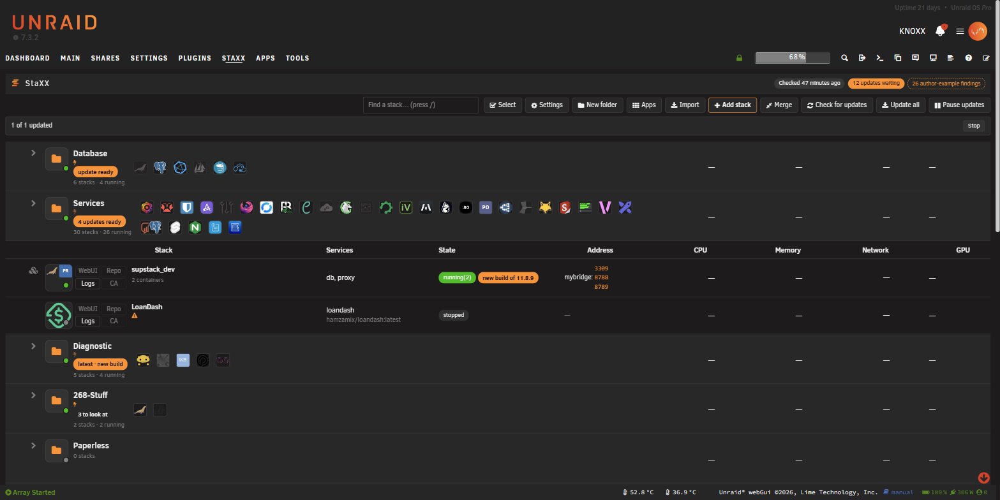

## The buttons along the top

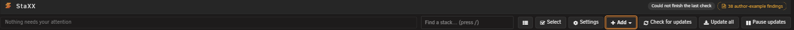
| Button | What it does |
|---|---|
| Settings | Opens the StaXX settings page. |
| Self-test | Runs a quick health check on StaXX itself. |
| New folder | Creates a folder to group stacks in. |
| Apps | Opens the catalogue of ready-made apps. |
| Import | Brings in a container or project StaXX does not manage yet. |
| Add stack | Starts a new, empty stack. |
| Check for updates | Checks every image against its registry, right now. |
| Update all | Installs every update currently waiting. |
| Pause updates | Freezes every update countdown on the page. Press again to say Resume updates. |

## Update summary and machine strip

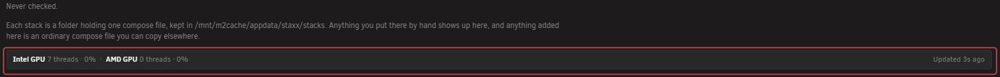
A line says when updates were last checked, and how many are waiting. It reads **Never checked**
until the first check runs. See [update checking](updates.md) for what a check does.

Below it, a hint names the folder your stacks are kept in. Anything you drop there by hand shows up
here too.

A strip of machine figures follows: GPU use, and how fresh the numbers are — **Updated Ns ago**, or
**Figures are Ns old** if the collector has fallen behind.

## The columns

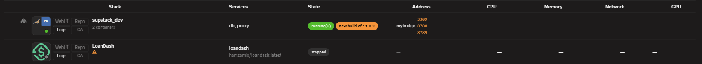
| Column | What it shows |
|---|---|
| Stack | The stack's name, its icon, and its state marks. |
| Services | The service names inside it, or an error if the file will not read. |
| State | Running or stopped, plus any update or restart mark. |
| Address | Where the stack answers — an address, or a network name. |
| CPU | Processor use, with a small graph. |
| Memory | Memory use, with a small graph. |
| Network | Network traffic, with a small graph. |
| GPU | Graphics use, with a small graph. The column only appears when a stack on the page has a graphics card handed to it. |

## Stack row parts

| Example | Part | What it does |
|---|---|---|
| 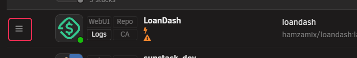 | Drag handle | Drag the row to move it. Greyed out when there is nothing to move it against. |
| 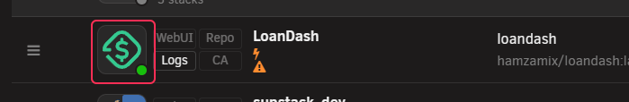 | App picture | Click it to open the stack for editing. The dot on its corner is green when the stack is running, red when a container inside says it is unwell. |
| 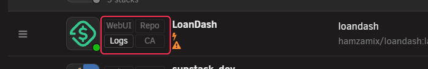 | Four chips | Shortcuts out to the app and its project. See the table below. |
| 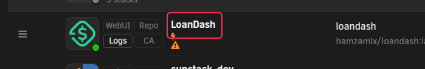 | Name | The folder this stack lives in, which is also its name. The small bolt under it means it starts when the server boots. |

Two more parts are not on every row. An arrow left of the app picture opens and closes the container
list, on a stack holding more than one container. A line under the name says how many of them are
running.

To open a stack's menu, right-click its row.

### The four chips

| Chip | Opens |
|---|---|
| WebUI | The app's own web page, when it has one and is running. Greyed out otherwise, with a reason. |
| Logs | This stack's log output. Always available, even when stopped. |
| Repo | The project's own page, when known. |
| CA | The support or discussion thread for the app, when known. |

## Row marks

Three of these are the same orange triangle. What tells them apart is where it sits and what it says
when you hover it. See [row marks and icons](marks.md) for the full key.

| Example | Mark | Meaning |
|---|---|---|
| 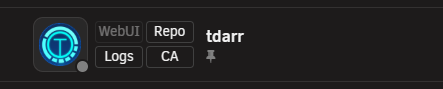 | Drawing pin, under the name | One or more services is held at one exact build. Hover it to see which. |
| 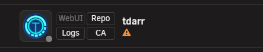 | Orange triangle, under the name | Either the stack was imported and its original has changed since, or a service is on a network that gives it its own address, so the ports in its file do nothing. Hover it to see which. |
| 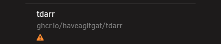 | Orange triangle, under the image name | The file asks for a different image than the one running. Restart to apply it. |
| 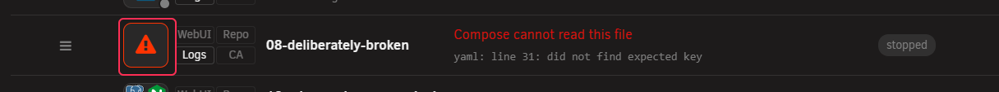 | Red triangle in place of the app picture | Compose cannot read this stack's file, or there is no file at all. |
| 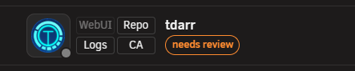 | needs review | Imported and not checked over yet. It will not start on its own. |
| 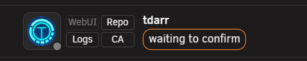 | waiting to confirm | Just switched over from an older container. Press it to say whether the app works. |

## The State column

| Example | Meaning |
|---|---|
| 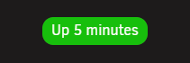 | Running. The wording comes straight from Docker. |
| 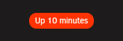 | Running, but the app inside says it is not working. |
| 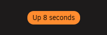 | Running. Its own check has not finished deciding yet. |
|  | Not running. |
| 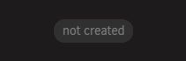 | Never started from the file yet. |
|  | A command is running on this row. It also says Starting, Stopping, Removing or Rebuilding. |
| 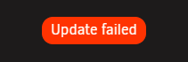 | The last command failed. Click it to see what happened. |

Beside it, an update pill, when there is something to say. Nothing at all is shown when nothing
newer was found, or when nothing has been checked yet.

| Example | Wording | Meaning |
|---|---|---|
| 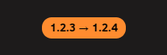 | "update ready", or an old and new version, or a version and "new build" | An update is ready. Press it to install. |
| 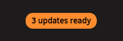 | "N updates ready" | More than one service here has one waiting. |
|  | rebuild ready | Built here, and its base image has moved on. |
|  | built here | Built on this server. Nothing to compare it to. |
| 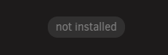 | not installed | Named in the file but never pulled. |
| 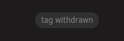 | tag withdrawn | This tag no longer exists at the registry. |
|  | registry moved | The image now lives somewhere else. |
| 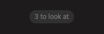 | N to look at | The author's own example does something different here. |
| 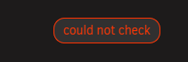 | could not check | The last check failed. |

A chip appears when the file has been saved but not yet restarted. Nothing is broken until you press
it.

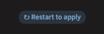

## The row menu

Click the app picture to open it. Items appear in this order, and only when they apply.

| Group | Items |
|---|---|
| Waiting to confirm only | It works, It does not work |
| Needs review only | Take over and start, Clear the lock only |
| Running stack | Take over and start (only if something outside StaXX holds its name), Start/Restart, Stop, Update, Pull images, Check this image again |
| If an update is waiting | Resume the countdown or Cancel the countdown, Skip this version, What changed |
| If a tag was withdrawn | Fix the tag… |
| Always | Logs |
| Has a file | Edit compose file, Fill in details…, Export… |
| Has no file | Start a compose file here |
| Folders | Move to folder (a list), New folder…, Remove from folder (if filed) |
| Boot | Autostart (on/off switch), Delay |
| Reference | What do these marks mean? |
| Last | Remove stack |

## Folders

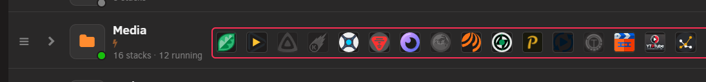

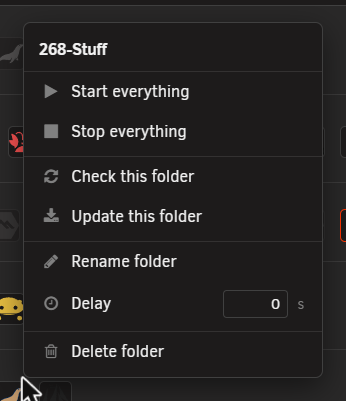
A folder row has no Services, State or Address of its own — those columns show totals for everything filed inside it instead. In their place it shows small icons for every stack it holds, so a collapsed folder still shows what is inside.

Click its picture to open the folder menu.

| Item | What it does |
|---|---|
| Start everything | Starts every stack in the folder. |
| Stop everything | Stops every stack in the folder. |
| Check this folder | Checks every image in the folder for updates. |
| Update this folder | Installs every update waiting in the folder. |
| Rename folder | Renames it in place. |
| Delay | How long to wait before the next thing starts. |
| Delete folder | Deletes the folder. Stacks inside are moved back to the top level first, not deleted. |

## Broken stacks

| Example | What it means |
|---|---|
| 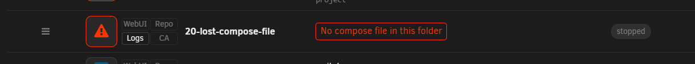 | This folder has no compose file. Click the red button to start one. |
|  | The file exists but will not parse. The message underneath says why. |

Neither row can be started until it is fixed. Fixing it and saving brings the row back to normal.

## What this never does

- It never starts, stops or updates anything without you pressing a button for it.
- It never invents a web page, project link or support thread for an app it does not recognise.
- It never restarts a container on its own just because a health check fails.
- It never deletes a folder's stacks when the folder itself is deleted.

## Terms used here

Any word you are not sure of is in the [glossary](../glossary.md).
