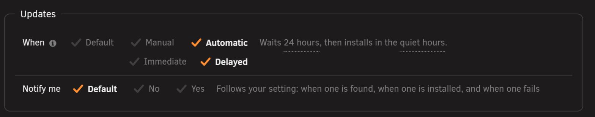
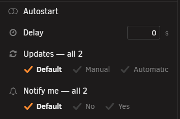
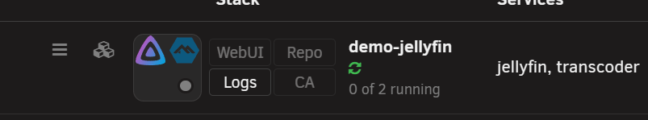

# Choosing how a container updates

<!-- index: 15 | letting one container update itself, or wait for you, and whether it is mentioned in update messages — set on its own page or from its row. -->

Every container can have its own answer to two questions: does StaXX install a newer version for
it on its own, and is it mentioned when StaXX tells you about updates? Left alone, both follow your
server-wide setting in [Settings](settings.md#updates-tab). Set them here to make one container
behave differently from the rest.

You can change both from a container's own page in the editor, or straight from its row on
[the stacks page](the-stack-list.md) without opening anything.

## The short version

1. Open a stack and its container, or press the row's own menu — either way you reach the same two
   choices.
2. Set **When** to **Manual** to keep pressing Update yourself, or **Automatic** to let StaXX install
   a newer version on its own.
3. With Automatic, choose **Immediate** to install the moment an update is found, or **Delayed** to
   wait for the server's own delay and quiet hours.
4. Set **Notify me** to **Yes** or **No** to decide whether this container is named in an update
   message, whatever the rest of the server does.

## Setting it from a container's own page

Open the stack, then the container inside it, and look for the **Updates** box just below its
container settings.

| Row | Choices | What it does |
|---|---|---|
| When | Default, Manual, Automatic | Default leaves this container following your server-wide setting. Manual means you press Update yourself. Automatic lets StaXX install a newer version without being asked. |
| Immediate / Delayed | shown only when When is Automatic | Immediate installs the moment an update is found. Delayed waits for the server's own delay, counted from [Settings](settings.md#updates-tab), and for the quiet hours if you have them switched on. |
| Notify me | Default, No, Yes | Default follows your server-wide notification settings. No means this container is never named in an update message, whatever else is on. Yes means it is named in whichever messages your server sends. It cannot make a message happen that your server-wide settings have switched off altogether. |

A short note beside each row says what is actually going to happen right now, in plain words — for
example "Waits 24 hours, then installs in the quiet hours." Press the bold words inside a note to
jump straight to the server setting they are talking about.

This box only sets the one container whose page you have open. There is no separate place to set a
whole stack from inside the editor — use the row menu for that instead.

## Setting it from the row menu

Open a container's own menu, or a stack's menu, from [the row menu](the-stack-list.md#the-row-menu).
Both carry the same **Updates** and **Notify me** rows, with the same choices as the editor.

- Opening a **container's** menu sets that container alone.
- Opening a **stack's** menu sets every container inside it at once, and says so on the label —
  "Updates — all 6", for example. A stack holding only one container just says "Updates".
- If the containers in a stack do not all agree, no option shows a tick for that row. Choosing one
  anyway sets every container in the stack to it.

A choice made this way takes effect straight away. Nothing needs saving.

## Two containers that cannot use this

**Pinned to one exact build.** A pinned container is fixed and will never move, so nothing here can
change what happens to it. The rows still show, but pressing them does nothing until you unpin the
container — a link at the top of the box does that for you. See
[pinning](recovery-and-redundancy.md) for what it means to pin a container.

**Built on this server, from your own recipe.** These rows work normally, but Automatic means
something slightly different: instead of watching a registry for a newer build, StaXX watches the
image the recipe is built from, and rebuilds this container when that moves.

## The mark for a container that updates itself

A green circular-arrows mark under a container's name on [the stacks page](the-stack-list.md) means
that container will install an update on its own the moment it qualifies to — whether that came
from its own setting or simply from following the server's. A pinned container never carries this
mark, however its own setting is set, because a pinned build can never move.

## What this never does

- It never installs anything by itself unless When is set to Automatic, on that container or on the
  server as a whole.
- It never mentions a container in an update message that its own Notify me setting says No for,
  whatever the server-wide setting says. Yes works the other way round but only within the messages
  your server is already sending: it names the container in those, and cannot switch a whole kind of
  message back on.
- It never changes what a pinned container is doing. The rows are shown so you can see what would
  happen, not because they take effect.

## Not built yet

- Setting a whole stack's policy in the editor itself, rather than from its row menu. The file
  format already supports it; nothing offers it here yet.

## Terms used here

Any word you are not sure of is in the [glossary](../glossary.md).

Back to [the StaXX guide](README.md).
