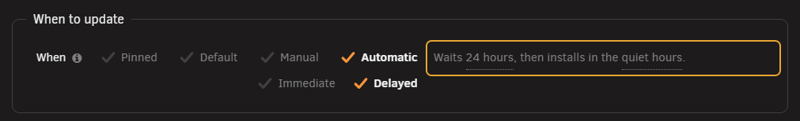
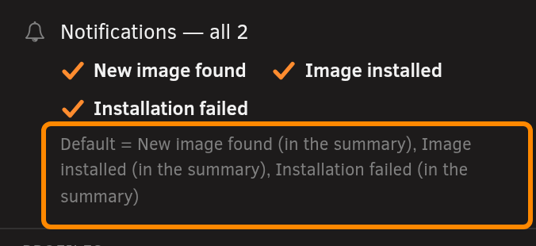
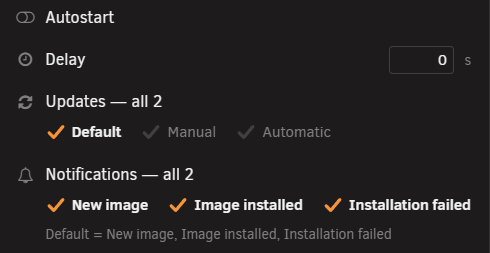
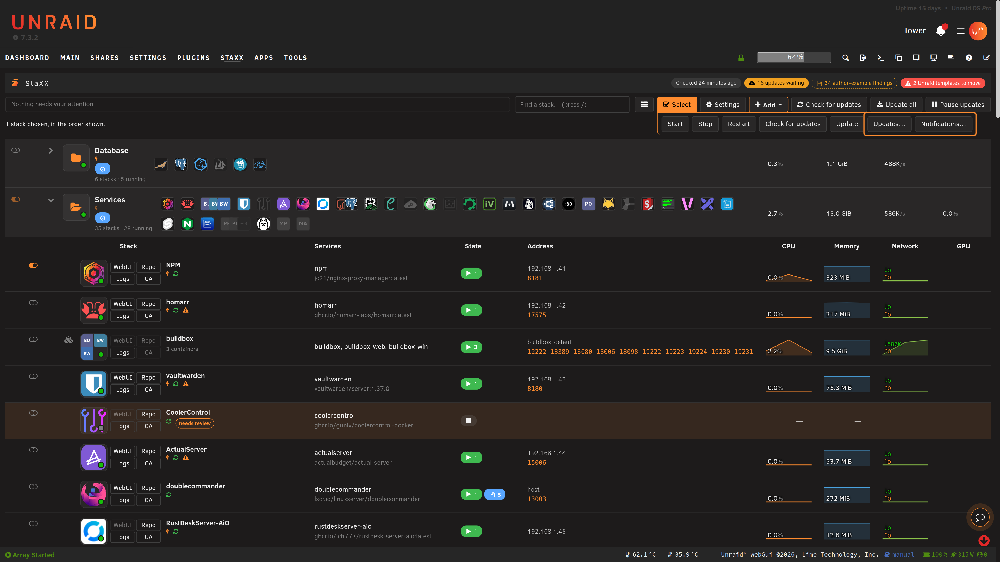
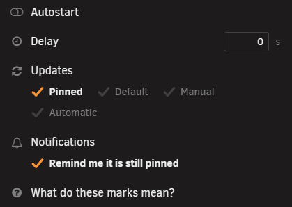
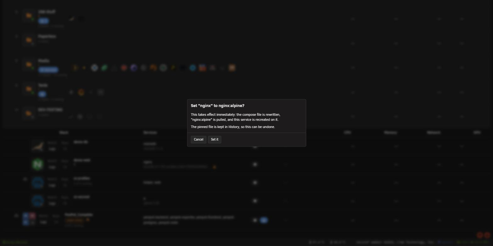
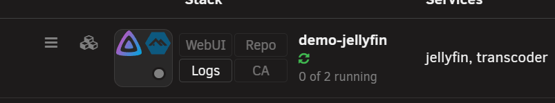

# Choosing how a container updates

<!-- index: 15 | letting one container update itself, or wait for you, and whether it is mentioned in update messages — set on its own page or from its row. -->

Every container can have its own answer to two questions: does StaXX install a newer version for
it on its own, and which of StaXX's update messages does it show up in? Left alone, both follow your
server-wide setting in [the Updates tab](settings-updates.md). Set them here to make one container
behave differently from the rest.

Change both from a container's own page in the editor, or straight from its row on
[the stacks page](the-stack-list.md) without opening anything.

## The short version

1. Open a stack and its container, or press the row's own menu — either way you reach the same two
   choices.
2. Set **When** to **Manual** to keep pressing **Update** yourself, or **Automatic** to let StaXX
   install a newer version on its own.
3. With **Automatic**, choose **Immediate** to install the moment an update is found, or **Delayed**
   to wait for the server's own delay and quiet hours.
4. In the **Notifications** box, leave all three switches alone to follow the server, or flip any
   one of them to decide all three for this container yourself.

## From a container's own page

Open the stack, then the container inside it, and find the **When to update** box below its container
settings.

| Row | Choices | What it does |
|---|---|---|
| When | **Pinned**, **Default**, **Manual**, **Automatic** | **Pinned** fixes this container to the exact build it is running right now, and StaXX never checks it for an update again. **Default** leaves this container following your server-wide setting. **Manual** means you press **Update** yourself. **Automatic** lets StaXX install a newer version without being asked. |
| Immediate / Delayed | shown only when When is **Automatic** | **Immediate** installs the moment an update is found. **Delayed** waits for the server's own delay, set in [the Updates tab](settings-updates.md), and for the quiet hours where you have them switched on. |

Choosing **Pinned** asks you to confirm before it writes anything. It refuses, with a sentence saying
why, when there is nothing fixed to point at: the image is built here from your own recipe, or has
never been downloaded to this server.

A short note beside the **When** row states what is actually going to happen right now, in plain
words — for example "Waits 24 hours, then installs in the quiet hours." Press the bold words inside
the note to jump straight to the server setting it names.

Below the **When to update** box sits a **Notifications** box. It holds the same three messages as
the [Updates tab](settings-updates.md#notifications) in Settings: **New image found**, **Image
installed** and **Installation failed**, each on (an orange tick) or off (a red cross). They start
out matching Settings. Leave all three alone and this container follows Settings, however you change
it later. Flip any one of them and all three become this container's own from then on. A note
beneath the switches reads "Default = …", naming the messages Settings has on and when each is sent:
straight away or in the summary.

These switches turn a message on or off for this container only. When it is sent follows Settings.
Turn on a message here that Settings has off, and this container's message is sent straight away. A
note under the switches says so.

This box sets only the one container whose page you have open. To set a whole stack at once, use its
row menu instead.

## From the row menu

Open a container's own menu, or a stack's menu, from [the row menu](the-stack-list.md#the-row-menu).
Both carry the same **Updates** row and the same three **Notifications** switches, working the same
way as in the editor.

- Opening a container's menu sets that container alone, and its **Updates** row offers **Pinned**
  first, the same as the editor.
- Opening a stack's menu sets every container inside it at once, and says so on the label —
  "Updates — all 6", for example. A stack holding only one container just says "Updates", and its
  menu offers **Pinned** too — a single-service stack is the stack. A stack with more than one
  container offers only **Default**, **Manual** and **Automatic**: pinning several containers to
  their own separate builds is not a choice a single click can make.
- Choose an option in a stack's menu to set every container in the stack to it, even where they did
  not already match.

A choice made this way takes effect straight away. Nothing needs saving, except choosing **Pinned**
or releasing a pin, both of which confirm first — see below.

## From Select

Turn on **Select** and tick the stacks you want to change, then press **Updates…** or
**Notifications…** in the button row that appears.

- **Updates…** offers the same **When** choice as a container's own page — **Default**, **Manual**
  or **Automatic** (not **Pinned**: this window can set several services at once, and a pin fixes
  each one to its own build, which is not something one click can decide for all of them), with
  **Immediate** or **Delayed** underneath once you choose **Automatic**. Press **Apply to N stacks**
  to set every service in every ticked stack at once. A service already pinned to a build is left
  exactly as it is, with no message.
- **Notifications…** offers the same three switches as a container's own page. Press
  **Apply to N stacks** to set them for every service in every ticked stack. When the chosen stacks
  hold a pinned service, a fourth switch, **Still pinned**, sets the weekly reminder
  for the pinned services only.

## Containers that need an extra step

**Pinned to one exact build.** Choosing **Pinned** fixes a container to the exact build it is
running right now, after a window asks you to confirm it.

A pinned container's **Notifications** box holds one switch, **Still pinned**, in
place of the other three. With it on, the weekly list of pinned containers in the
[summary](updates.md#the-summary) includes this one while it stays pinned. With it off, the list leaves it out. It starts on.

From then on, clicking **Default**, **Manual** or **Automatic** on that same container does not set
it straight away — it opens a small window listing the tags that image offers instead. Pick one,
confirm that it takes effect immediately, and StaXX downloads that build and recreates the container
on it, setting the choice you clicked.

[The Versions tab](editor-versions.md) offers the same tag list through its own **Release this
pin**. Either way, the container is put back on whichever of Default, Manual or Automatic it had
before it was pinned.

**Built on this server, from your own recipe.** These rows work as normal, but **Automatic** means
something slightly different: StaXX watches the image the recipe is built from, and rebuilds this
container when that image moves.

## The self-update mark

A green circular-arrows mark under a container's name on [the stacks page](the-stack-list.md) shows
that it will install an update on its own the moment one qualifies, whether that came from its own
setting or from following the server's. A pinned container never carries this mark.

Set **When** and **Notifications** the way you want them, and the choice applies straight away —
watch for the mark on the row to confirm a container will update itself.

## Terms used here

Any word you are not sure of is in the [glossary](../glossary.md).

Back to [the StaXX guide](README.md).
