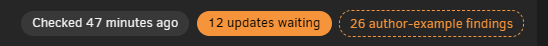
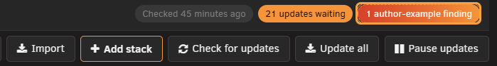
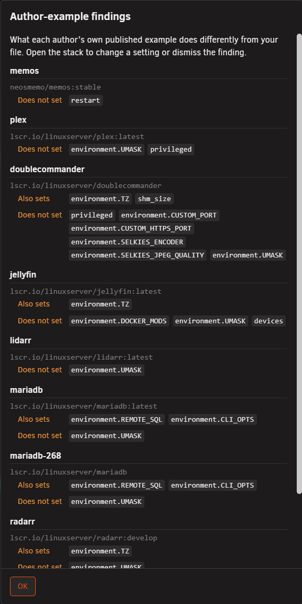
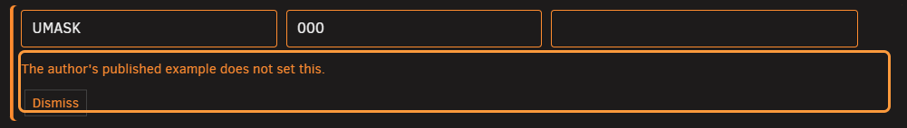
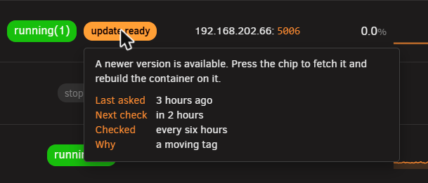
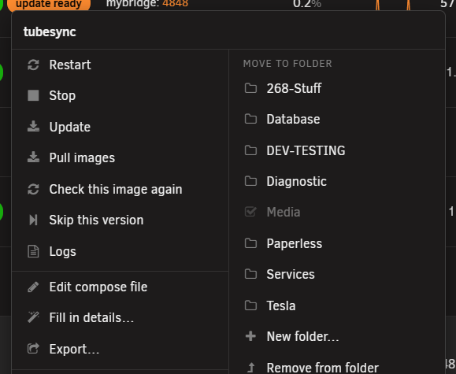
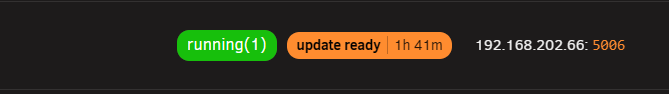
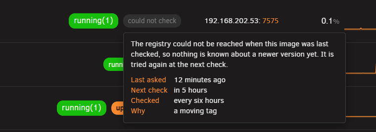

# Update checking

<!-- index: 10 | answers what a check does, why images are asked about at different rates, what N to look at means, and how the countdown to an automatic install works. -->

## The update check

A check asks each image's registry one question: is a newer build published under the same tag?
Nothing is downloaded. Nothing restarts. The answer sits until you press the pill or the countdown
finishes.

Checking happens on the schedule you set, and whenever you press **Check for updates**. It never
happens just because you opened [the stacks page](the-stack-list.md) — looking at the list costs
nothing.

## Check cadence

A check pass runs every hour, on its own, and only asks about the images that are due — most images
sit that pass out. The daily or weekly choice in [settings](settings.md#image-updates) is when StaXX
instead takes a full look at everything, whether it was due or not. That changes what the setting
means: choosing "Once a week" does not mean each image is only ever asked once a week — how often a
given image is asked is decided by the table below, running every hour. The weekly choice only sets
when the once-over of the whole lot happens.

A registry only answers so many questions an hour. StaXX spends that allowance where the answer is
most likely to have changed, and saves it where it almost never has. Checking costs your Docker Hub
allowance nothing at all — StaXX only asks for the build's headers, and Hub does not count that.
What spends the allowance is downloading an image, not asking about one.

| Image | Asked about |
|---|---|
| Pinned to one exact build | Never. Pulling it could only fetch that same build again. |
| A moving tag — `latest`, `main`, `master`, `develop`, `nightly`, `edge`, `stable`, `beta`, `dev`, or no tag at all | Roughly every six hours. |
| A plain version number | Roughly once a week. A numbered release does not quietly change under that same number. |
| Anything else | Roughly once a day. |
| Changed twice in the last fortnight | Every six hours, whatever its tag looks like. |
| Sat still for over three months | Its gap between checks doubled. |
| A check that keeps failing | Every six hours until it has failed five times running, then once a day. |

Nothing is ever asked about more than four times a day, or left longer than a fortnight between
checks.

An image you haven't actually downloaded to this server yet isn't asked about at all — there's
nothing on your machine to compare a registry's answer against, so StaXX waits until it's here.

Turning the schedule off in [settings](settings.md#image-updates) stops all of this. Left on, these
rules only decide which images get asked during a pass — not whether a pass happens at all.

## Author example findings

This is not about a newer build. It means the app's own publisher has put out an example compose
file that sets, or drops, something your file does not.

StaXX only looks for this on a moving tag — a pinned build is never checked. It reads the example
straight from the publisher's own GitHub project, never from Docker Hub, so looking does not spend
any of your registry allowance. A setting that merely holds a different *value* is not a finding —
only a setting the example adds or drops entirely is.

### Following one up

1. Press the **author-example finding** chip in the title bar. A small window lists every finding:
   the stack, the service, its image, and what the example does differently.

   

2. Open that stack. The finding sits under the setting it concerns, with a **Dismiss** button.

   

3. Change the setting if the example has a point, or press **Dismiss** to keep yours. Dismissing
   stops StaXX asking about it again until the author changes the example once more. It takes
   effect straight away — nothing needs saving.
4. Once every finding is dismissed or acted on, the chip leaves the title bar.

A finding with no matching field — the example sets something your form has no place for — sits in a
note at the top of the form instead, with the same button.

## Update pill wordings

The State column shows a pill for the container itself — see [the State column](the-stack-list.md#the-state-column). Beside it, when there is something to report, sits an update pill. Nothing is
shown there when nothing was found, or nothing has been checked yet.

| Wording | Meaning |
|---|---|
| `update ready`, an old and new version, or a version and "new build" | Something newer is on offer. Press it to fetch and install. |
| `N updates ready` | More than one service in this stack has an update waiting. |
| `rebuild ready` | Built here, and the image it builds from has moved on. |
| `built here` | Built on this server. There is no registry to compare it to. |
| `not installed` | Named in the file, but never pulled. |
| `tag withdrawn` | This tag no longer exists at the registry. |
| `registry moved` | The image is now published somewhere else. |
| `N to look at` | The author's own published example does something this file does not. |
| `could not check` | The last check failed. Hover the pill for why. |

## Hovering the pill

Rest your mouse on an update pill — or tab onto it with the keyboard — and a small card opens in the
page's own style. A sentence at the top repeats what the pill means, and underneath it a short table
lists whatever StaXX knows: the version currently running and the version on offer, when it was
last asked, when it is next due, how often it is checked, and why. A row is left out entirely,
rather than shown empty, when there is nothing to put in it.

## Update items on the row menu

A stack's own menu — and a single container's, within a stack — carries these items alongside
Update and Pull images. See [the row menu](the-stack-list.md#the-row-menu) for how to open it.

| Item | What it does | When it appears |
|---|---|---|
| Check this image again | Asks the registry about this image right now, ignoring the cadence table. | Always. |
| Skip this version | Turns down the one new build currently waiting, without cancelling any that come after it. | Once an update is waiting. |
| Cancel the countdown | Stops this one waiting update from installing itself. | Once its countdown is actually running. |
| Resume the countdown | Lets a cancelled countdown carry on. | Once you have cancelled it. |
| What changed | Opens the publisher's own notes for the waiting update, in a new tab. | Once StaXX knows where those notes are. |
| Fix the tag… | Opens the editor on the image box, ready to replace a tag that no longer exists. | Once the pill says a tag has been withdrawn. |

## The countdown

A countdown only appears when [settings](settings.md#image-updates) has "What to do with what is
found" set to install it by itself. It starts the moment the new build was first seen — reloading
the page does not restart it.

The clock can keep ticking even when nothing is actually about to install. When that happens the row
says why:

| Reason shown | What to do |
|---|---|
| Automatic updates are paused for every stack | Turn the pause switch back on. |
| This update was cancelled here | Press the pill again to let it run. |
| This stack was imported and has not been reviewed yet | Review the stack. |
| This stack is being edited right now | Finish editing and save. |
| This stack is stopped | Start it. |
| Waiting for the quiet window | Wait — it opens at the time you chose. |

- **Cancel the countdown** stops one waiting update from installing itself. Press the pill again to
  change your mind, or choose **Resume the countdown** from the row menu.
- **Skip this version** turns down one particular new build without cancelling future ones.
- **Rolling back** puts a service back on the build it ran before, and remembers the declined version
  so it is never offered again as new. See [recovery and redundancy](recovery-and-redundancy.md).
- **Pinning** fixes a service to one exact build for good. A pinned build is never asked about — see
  the cadence table above.

See [Update items on the row menu](#update-items-on-the-row-menu) above for exactly when each of
these appears.

## Pause and update all

| Button | What it does |
|---|---|
| Check for updates | Checks every image right now, ignoring the cadence table. |
| Update all | Installs every update currently waiting, across every stack. |
| Pause updates | Freezes every countdown on the page. Press again — it now reads Resume updates — to let them run. |

A folder has the same two actions for just what is inside it — see [folders](the-stack-list.md#folders).

## Docker Hub's limit

Docker Hub only lets one address download so many images an hour — about a hundred from a server
that has not signed in, and about two hundred signed in with an access token. Add the token under
[settings](settings.md#docker-hub-sign-in).

A check spends none of that. StaXX only asks Docker Hub for a build's headers — never the build
itself — and Hub does not count that against you. The allowance is spent by actually downloading an
image: installing an update, or anything else on your network that pulls through the same address.

When a registry refuses to answer, the pill says `could not check`. Hovering it says why: too many
questions asked recently, the repository no longer at that address, an unreachable registry, or
simply no answer at all. A check that keeps failing eventually says how long it has been failing, so
you can judge whether it is worth trying again.

Being refused by Docker Hub now means something else spent the download allowance on your address —
one of your own pulls, or another machine on the same network — since checking itself costs nothing.
StaXX tries again within the hour rather than waiting for the next scheduled pass. **Settings →
[Image updates](settings.md#image-updates)** shows what each registry has actually been asked and
what, if anything, it cost — worth a look if `could not check` keeps turning up. See
[Hovering the pill](#hovering-the-pill) above for when that image was last asked, when it is next
due, and why.

## Terms used here

Any word you are not sure of is in the [glossary](../glossary.md).

Back to [the StaXX guide](README.md).
