# Update checking

<!-- index: 10 | answers what a check does, why images are asked about at different rates, what N to look at means, how the countdown to an automatic install works, and what the update messages say. -->

## The update check

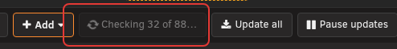
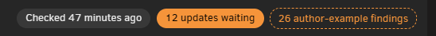

A check asks each image's registry one question: is a newer build published under the same tag?
Nothing is downloaded and nothing restarts. The answer sits until you press the pill or the
countdown finishes.

A check runs on the schedule you set, and whenever you press **Check for updates**. Opening
[the stacks page](the-stack-list.md) does not run one on its own.

## Check cadence

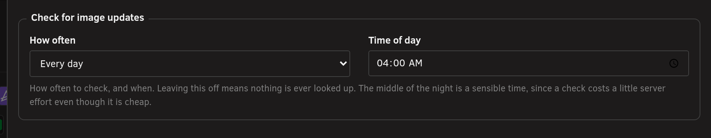

A pass runs every hour and asks only the images that are due. [The Updates tab](settings-updates.md)
sets how often StaXX gives every image a full look, whether due or not. How often one particular
image is asked follows the table below, checked every hour regardless of that setting.

Checking never spends any of your Docker Hub download allowance. StaXX asks only for a build's
headers, never the build itself, and only downloading an image spends the allowance.

| Image | Asked about |
|---|---|
| Pinned to one exact build | Never. A weekly reminder lists it while it stays pinned. |
| A moving tag: `latest`, `main`, `master`, `develop`, `nightly`, `edge`, `stable`, `beta`, `dev`, or no tag at all | Roughly every six hours. |
| A plain version number | Roughly once a week. |
| Anything else | Roughly once a day. |
| Changed twice in the last fortnight | Every six hours, whatever its tag looks like. |
| Sat still for over three months | Its gap between checks doubled. |
| A check that keeps failing | Every six hours until it has failed five times running, then once a day. |

Nothing is ever asked about more than four times a day, or left longer than a fortnight between
checks. An image not yet downloaded to your server is not asked about at all.

A version number such as `nginx:1.25.3` is only a label — its publisher can move it to a new build
later, most often a routine rebuild of the same underlying system, so checking it still makes sense.
Only **Pinned** (see [choosing how a container updates](update-policy.md)) fixes a service to one
exact build for good, which is why it is never checked at all.

Turning the schedule off in [the Updates tab](settings-updates.md) stops all of this. Left on, these
rules decide only which images get asked during a pass.

## Author example findings

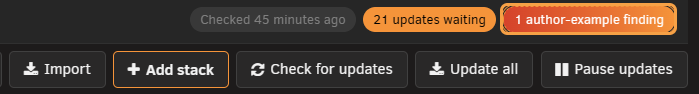

This is not about a newer build. It means the app's own publisher has put out an example compose
file that sets, or drops, something your file does not.

StaXX looks for this only on a moving tag; a pinned build is never checked. It reads the example
from the publisher's own GitHub project, not Docker Hub, so looking never spends any of your
registry allowance. A setting that merely holds a different value is not a finding; only a setting
the example adds or drops entirely is.

### Following one up

1. Press the **author-example finding** chip in the title bar. A window lists every finding, one
   block per stack: the image it runs, then the settings the author's example **also sets** and the
   ones it **does not set**, each named as a small chip.

   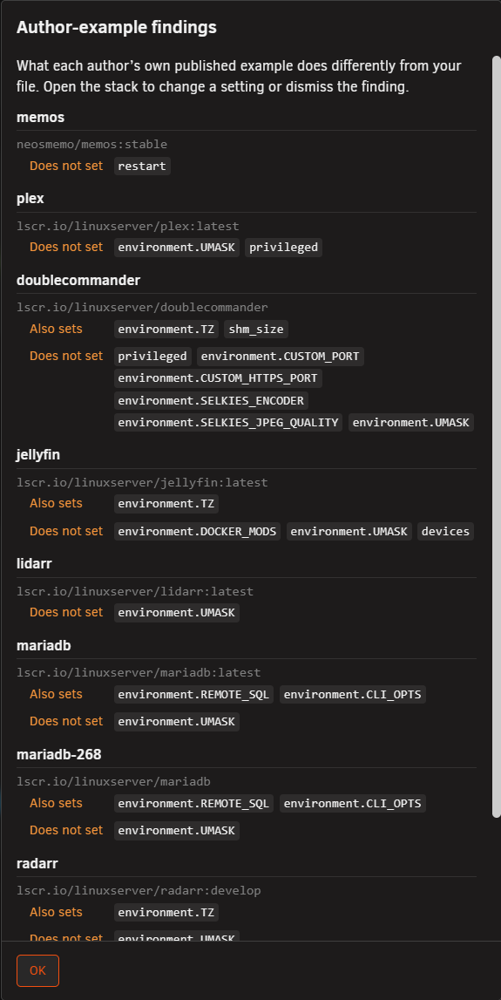

2. Open that stack. The finding sits under the setting it concerns, with a **Dismiss** button.

   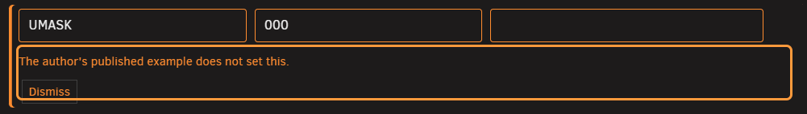

3. Change the setting if the example has a point, or press **Dismiss** to keep yours. Dismissing
   stops StaXX asking about it again until the author changes the example once more, and takes
   effect straight away.
4. Once every finding is dismissed or acted on, the chip leaves the title bar.

A finding with no matching field, where the example sets something your form has no place for, sits
in a note at the top of the form instead, with the same button.

## Update chips

Beside the state of each stack, an update chip appears when there is something to report. Each
chip, its colour and what to do about it is listed in [row marks and icons](marks.md#the-update-column).

Pressing an update pill never starts a stopped stack. On a stopped stack it fetches the new image
and waits for you to start it. Where only some of a stack's services are running, only those are
updated, and the stopped ones keep their pill until you next start them.

## Hovering the pill

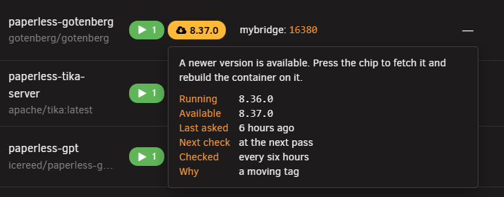

Rest your mouse on an update pill, or tab onto it with the keyboard, and a small card opens. A
sentence at the top repeats what the pill means, and a short table underneath lists whatever StaXX
knows: the version currently running and the version on offer, when it was last asked, when it is
next due, how often it is checked, and why. A row with nothing to put in it is left out.

## Update items on the row menu

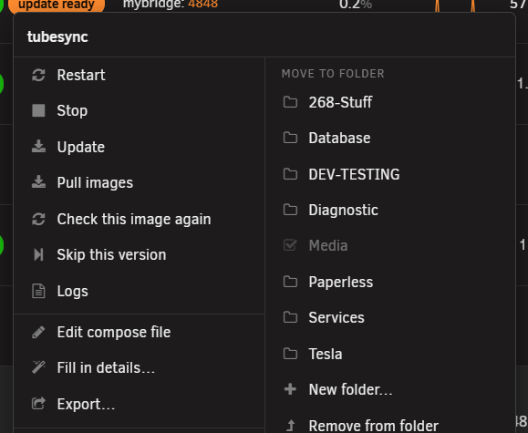

A stack's own menu, and a single container's within a stack, carries these items alongside
**Update** and **Pull images**. See [the row menu](the-stack-list.md#the-row-menu) for how to open
it.

| Item | What it does | When it appears |
|---|---|---|
| Check this image again | Asks the registry about this image right now, ignoring the cadence table. | Always. |
| Skip this version | Turns down the one new build currently waiting, without cancelling any that come after it. | Once an update is waiting. |
| Cancel the countdown | Stops this one waiting update from installing itself. | Once its countdown is actually running. |
| Resume the countdown | Lets a cancelled countdown carry on. | Once you have cancelled it. |
| What changed | Opens the publisher's own notes for the waiting update, in a new tab. | Once StaXX knows where those notes are. |
| Fix the tag… | Opens the editor on the image box, ready to replace a tag that no longer exists. | Once the pill says a tag has been withdrawn. |

## The countdown

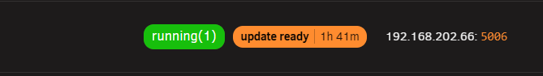

A countdown appears only when [the Updates tab](settings-updates.md) has **Updates** set to
**Automatic**, either for the whole server or for this one container from its own page or its row
menu; see [choosing how a container updates](update-policy.md). It starts the moment the new build
was first seen. Reloading the page does not restart it.

The clock can keep ticking even when nothing is actually about to install. When that happens the row
says why:

| Reason shown | What to do |
|---|---|
| Automatic updates are paused for every stack | Turn the pause switch back on. |
| This update was cancelled here | Press the pill again to let it run. |
| This stack was imported and has not been reviewed yet | Review the stack. |
| This stack is being edited right now | Finish editing and save. |
| This stack is stopped | Start it. |
| Waiting for the quiet window | Wait; it opens at the time you chose. |

- **Cancel the countdown** stops one waiting update from installing itself. Press the pill again to
  change your mind, or choose **Resume the countdown** from the row menu.
- **Skip this version** turns down one particular new build without cancelling future ones.
- **Rolling back** puts a service back on the build it ran before, and remembers the declined
  version so it is never offered again as new. See
  [the Versions tab](editor-versions.md).
- **Pinning** fixes a service to one exact build for good. Choose **Pinned** from the row menu or
  from the service's own **When to update** box to pin whatever build it is running right now; a
  pinned build is never asked about, see the cadence table above. The only way off a pin is picking a
  tag — in the image field, or in the tag-picker window reached from the row menu or from
  [the Versions tab](editor-versions.md).

See [Update items on the row menu](#update-items-on-the-row-menu) above for exactly when each of
these appears.

## Watching a pull happen

While a stack downloads a new image and restarts, the row itself shows what stage it is at. A line
across the top says how many of the image's layers are done and roughly how long is left, and two
bars underneath show the download and the unpacking, each with a percentage and how much of the
total has been handled so far. Once the container starts, the panel slides away and the row
underneath shows again, with its own controls back.

## Pause and update all

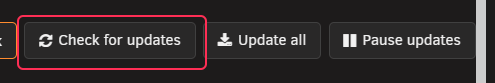
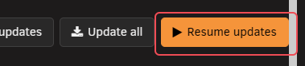

| Button | What it does |
|---|---|
| Check for updates | Checks every image right now, ignoring the cadence table. |
| Update all | Installs every update currently waiting, across every stack. |
| Pause updates | Freezes every countdown on the page. Press again, now reading **Resume updates**, to let them run. |

A folder has the same two actions for just what is inside it; see [folders](the-stack-list.md#folders).

While **Update all** is running, a progress line sits above the list, counting how many stacks are
done and naming the one it is updating now. Press **Stop** to end the run once that one stack has finished.

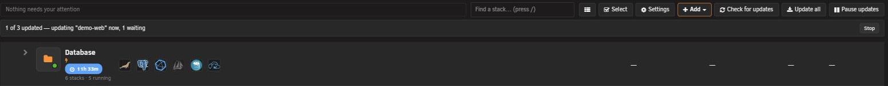

## Notifications

StaXX tells you about updates, and about apps that run into trouble, through Unraid's own notifications: the bell, email, and any other
service set up in Unraid. Email reaches you once it is set up in Unraid's own notification
settings. Choose which messages you get, and when, on [the Updates tab](settings-updates.md#notifications).

In the bell and on your phone, each message is a short title and one line naming the apps that matter,
such as "3 updated, 2 waiting. Failed: dbgate. Needs a look: plex." The email holds the full list.

| Message | Sent | What it shows |
|---|---|---|
| Update finished | When updates have installed or failed | Each app with its old and new version, its size on disk and the first lines of its release notes. A failed app says why in plain words. |
| Updates found | When a check finds a newer version | Each waiting app with the version it runs and the version on offer, and its release notes. |
| Summary | Once a day, or once a week, at the time you choose | Everything that waited for it: apps updated, failed and waiting, apps still pinned, anything the self-test found wrong, and the space old images take once that reaches 1 GB. |
| App keeps restarting | When an app restarts by itself 3 or more times within an hour | The app and how many times it restarted. |
| Health check failed | When an app's health check turns unhealthy | The app and how many checks in a row it failed. Once it is healthy again, the next summary says so. |
| App stopped by itself | When a running app stops with an error or runs out of memory | The app and the reason. An app you stop, or that StaXX or a backup stops, is not reported. |
| Docker has stopped answering | When Docker has not answered for 5 minutes in a row | How long it has been, and a line to check that **Enable Docker** is set to **Yes** in Unraid's Docker settings, or restart the server. |
| Docker is back | When Docker answers again after that message was sent | How long it was away, and that apps not set to start by themselves may need starting. |

An app whose first version number changes, such as 10.9 to 11.0, is marked **major version**.
Every message links to StaXX's update view.

### The summary

The summary goes out at the time you set. On a day with nothing to report, nothing is sent. Each
app in it shows a **Release notes** link, not the notes.

### Quiet hours

With **Quiet hours** on, a message that falls inside them waits, and arrives with the next message
or the summary. Failed updates, and app problems set to **Straight away**, are always sent straight away. The same goes for the two Docker messages.

### StaXX advanced email notifications

With this setting on, the email is StaXX's own, with each app's icon and coloured counts at the top.
The bell and any other services set up in Unraid still get every message, as plain text. With it
off, the email is plain text too.

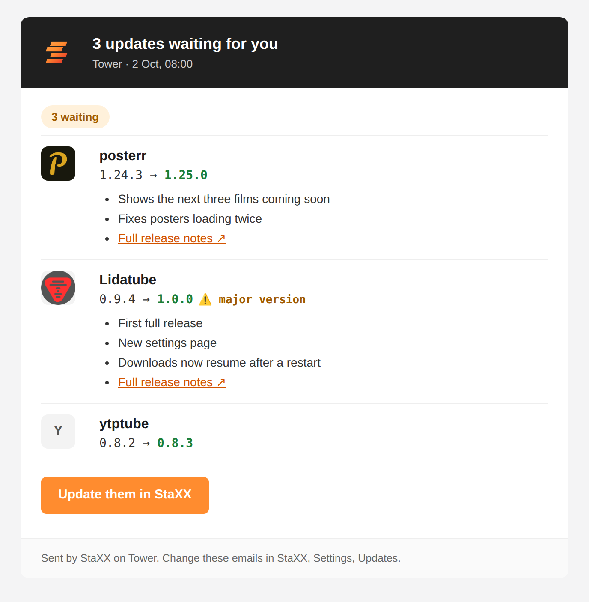

### Send a test message

Press **Send a test message** on the Updates tab to send one Update finished message now, built from
your latest updates. Its subject starts with **Test:**. It uses your saved settings, so save any
change first.

## Docker Hub's limit

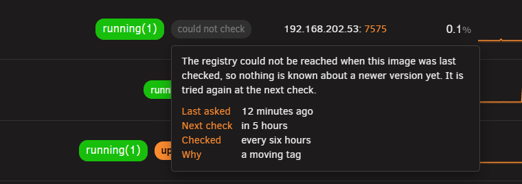

Docker Hub lets one address download only so many images an hour: about a hundred from a server
that has not signed in, and about two hundred signed in with an access token. Add the token under
[the Integrations tab](settings-integrations.md).

A check spends none of that. StaXX asks Docker Hub only for a build's headers, never the build
itself, and only downloading an image spends the allowance: installing an update, or anything else
on your network that pulls through the same address.

When a registry refuses to answer, the pill says `could not check`. Hovering it says why: too many
questions asked recently, the repository no longer at that address, an unreachable registry, or
simply no answer at all. A check that keeps failing eventually shows how long it has been failing.

A refusal from Docker Hub means something else spent the download allowance on your address, such
as one of your own pulls or another device on the same network. Checking itself never costs
anything. StaXX tries again within the hour rather than waiting for the next scheduled pass.
**[The Updates tab](settings-updates.md)** shows what each registry has actually been
asked and what, if anything, it cost, worth a look if `could not check` keeps turning up. See
[Hovering the pill](#hovering-the-pill) above for when that image was last asked, when it is next
due, and why.

## Terms used here

Any word you are not sure of is in the [glossary](../glossary.md).

Back to [the StaXX guide](README.md).
